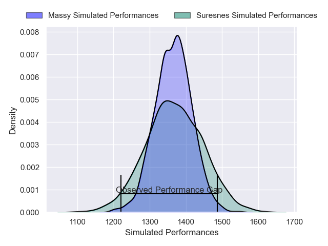
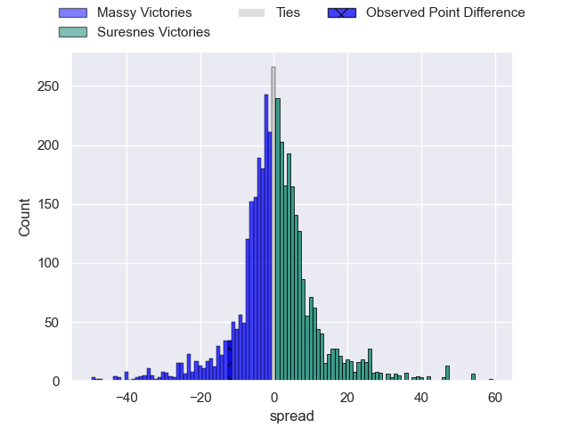
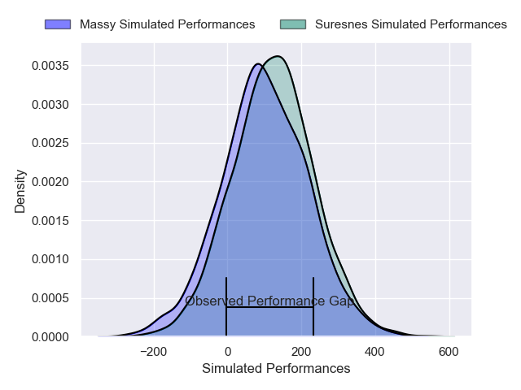
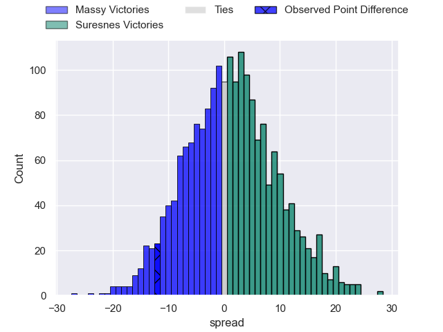

---  
layout: page  
title: Massy at Suresnes; 28-16  
date: 2025-03-22 18:00:00 -0500  
categories: "Nationale 24/25" match review  
---
# Massy at Suresnes; 28-16

# Club Level Predictions

The first set of predictions treats a club as the smallest object, as the club develops its members, organizes a gameplan, and deploys its players as needed for each match. This club model has a prediction of 0.509, which translates to predicting Suresnes to win by 0.3.

Our Over/Under is 36.5 - and combined with the spread above, we have a predicted scoreline of 18 to 19

Each club has a rating and a rating deviation (similar to a Glicko rating), and expected performances can be generated. This allows for simulated matches and spreads like the ones below.
## Projected Performances - Club Model

## Projected Spreads - Club Model

## Projected Results - Club Model

# Player Level Predictions

Treating teams instead as an entity made up of the currently active players, I have ratings for each player in an altogether different system. These can be combined to form team ratings once teamsheets are announced, weighting starters a bit higher than the reserves. After the match is played, players can be weighted by their minutes on the field, allowing for an accurate measure of the team's composition. With these compiled team ratings, we can make predictions, measure inaccuracy, and update the individual player ratings.
## Prediction without Player Minutes: Suresnes by 3.1

Massy by 0.4 on a neutral pitch

## Projected Performances - Player Model

## Projected Spreads - Player Model

## Projected Results - Player Model

|   Away Minutes | Away Player         |   Away Percentile |   Number |   Home Percentile | Home Player             |   Home Minutes |
|---------------:|:--------------------|------------------:|---------:|------------------:|:------------------------|---------------:|
|             67 | Siegfried Fisi'ihoi |             53.14 |        1 |             70.29 | Elias Coulibaly         |              8 |
|             80 | Pierre Trassoudaine |             93.38 |        2 |             75.61 | Gauthier Brute de Remur |             25 |
|             80 | Nicolas Ferrer      |             82.29 |        3 |             17.07 | Guiterembi Vickos       |             80 |
|             58 | Saba Pesvianidze    |             79.06 |        4 |             68.68 | Damien Bozic            |              8 |
|             53 | Koen Bloemen        |             16.62 |        5 |             23.73 | Yakine Mohamed Djebarri |             25 |
|             80 | Hugo Boutin         |             62.6  |        6 |              7.73 | Florian Desbordes       |             80 |
|             40 | Giani Gamba         |             56.11 |        7 |             57.82 | Wian Vosloo             |             80 |
|             31 | Simon Cowley        |             64.1  |        8 |             69.57 | Lakisipone Lee          |             80 |
|             25 | Julien Blanc        |             68.37 |        9 |             33.57 | Germain Roques De Borda |             58 |
|             80 | Christian Lacombe   |             10.73 |       10 |             54.29 | Tanguy Lacoste          |             27 |
|             50 | Ilian El Yahyaoui   |             67.37 |       11 |             93.01 | Faraj Fartass           |             22 |
|             13 | Luca Mignot         |             74.03 |       12 |             76.78 | Victor Barnier          |             13 |
|             17 | Tom Cusson          |             25.66 |       13 |             28.92 | Gauthier Wolf           |             67 |
|             56 | Giorgi Gogoladze    |             14.55 |       14 |              5.36 | Yohan Fournier          |             80 |
|             50 | Alexandre Borie     |             22.71 |       15 |              1.79 | Goulwen Gueho           |             80 |
|             80 | Nolan Pienaar       |             37.44 |       16 |             20.05 | Yanis Trabelsi          |             12 |
|             40 | Tijde Visser        |             68.6  |       17 |            nan    | Antoine Marty-Rybak     |             56 |
|             67 | Andrei Mahu         |             32.95 |       18 |             29.95 | Leandro Mario Assi      |             30 |
|             47 | Lucas Rubio         |             43.59 |       19 |             70.39 | Jean Chezeau            |             33 |
|             40 | Fernandez Correa    |              0.81 |       20 |             70.99 | Marvin Woki             |             40 |
|              0 | Anthony Favier      |            nan    |       21 |             72.41 | Jean-Baptiste Lachaise  |             80 |
|             50 | Arthur Seigneuret   |             76.88 |       22 |             10.9  | Thomas Lacroix          |             66 |
|             30 | Noa Rolnin          |            nan    |       23 |            nan    | nan                     |            nan |

