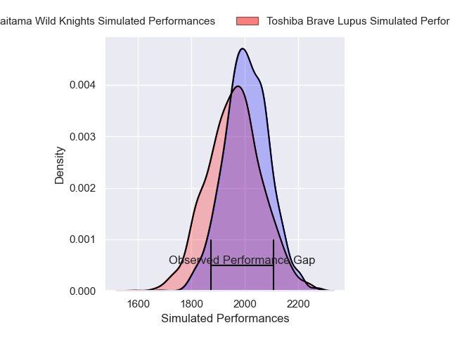
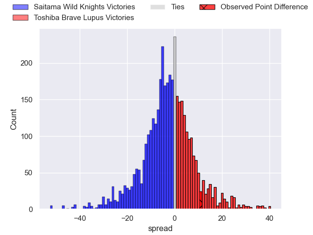
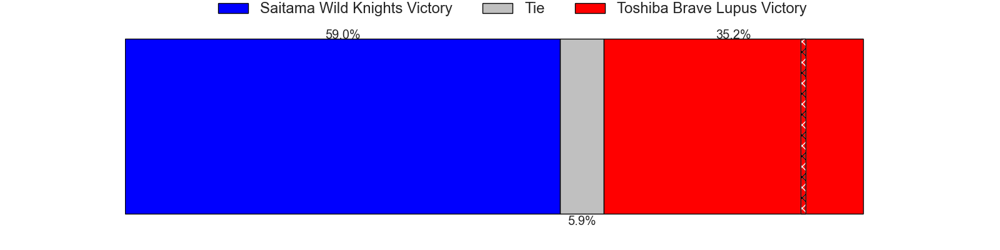
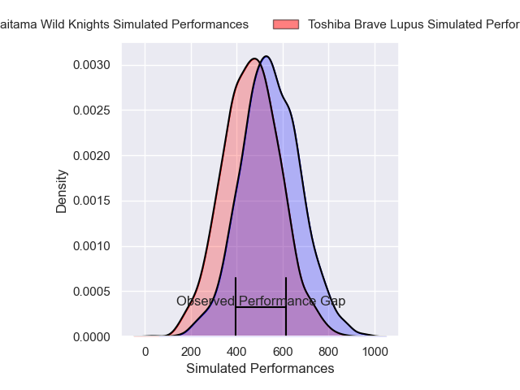
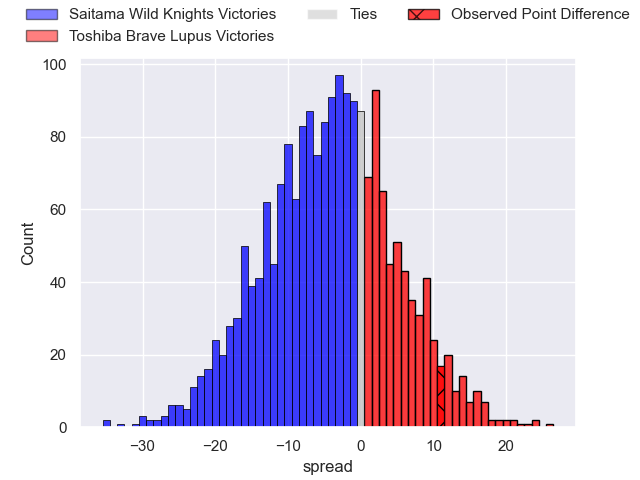
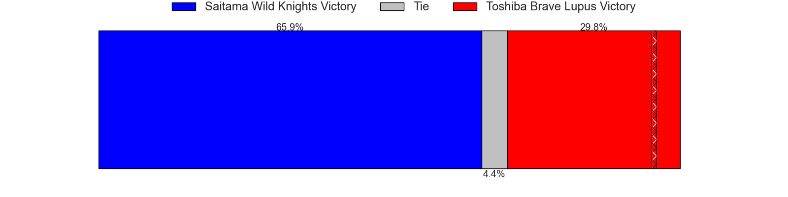

---  
layout: page  
title: Saitama Wild Knights at Toshiba Brave Lupus; 31-42  
date: 2025-03-22 18:00:00 -0500  
categories: "Japan Rugby League One 24/25" match review  
---
# Saitama Wild Knights at Toshiba Brave Lupus; 31-42

# Club Level Predictions

The first set of predictions treats a club as the smallest object, as the club develops its members, organizes a gameplan, and deploys its players as needed for each match. This club model has a prediction of 0.434, which translates to predicting Saitama Wild Knights to win by 2.4.

Our Over/Under is 81.5 - and combined with the spread above, we have a predicted scoreline of 42 to 40

Each club has a rating and a rating deviation (similar to a Glicko rating), and expected performances can be generated. This allows for simulated matches and spreads like the ones below.
## Projected Performances - Club Model

## Projected Spreads - Club Model

## Projected Results - Club Model

# Player Level Predictions

Treating teams instead as an entity made up of the currently active players, I have ratings for each player in an altogether different system. These can be combined to form team ratings once teamsheets are announced, weighting starters a bit higher than the reserves. After the match is played, players can be weighted by their minutes on the field, allowing for an accurate measure of the team's composition. With these compiled team ratings, we can make predictions, measure inaccuracy, and update the individual player ratings.
## Prediction without Player Minutes: Saitama Wild Knights by 0.8

Saitama Wild Knights by 5.1 on a neutral pitch

## Projected Performances - Player Model

## Projected Spreads - Player Model

## Projected Results - Player Model

|   Away Minutes | Away Player       |   Away Percentile |   Number |   Home Percentile | Home Player        |   Home Minutes |
|---------------:|:------------------|------------------:|---------:|------------------:|:-------------------|---------------:|
|             20 | Sho Furuhata      |             47.58 |        1 |             92.19 | Sena Kimura        |             13 |
|             80 | Atsushi Sakate    |             83.97 |        2 |             92.86 | Mamoru Harada      |             80 |
|             64 | Taiki Fujii       |             88.57 |        3 |             94.28 | Yuta Kokaji        |             16 |
|             80 | Esei Ha'angana    |             83.86 |        4 |             98.75 | Jacob Pierce       |             16 |
|             10 | Lood de Jager     |             97.6  |        5 |             91.35 | Warner Dearns      |             80 |
|             22 | Ben Gunter        |             95.9  |        6 |             96.37 | Shannon Frizell    |             28 |
|             20 | Shota Fukui       |             64.5  |        7 |             91.03 | Takeshi Sasaki     |             64 |
|             80 | Jack Cornelsen    |             96.96 |        8 |             97.36 | Michael Leitch     |             54 |
|             80 | Taiki Koyama      |             94.73 |        9 |             88.58 | Yuhei Sugiyama     |             80 |
|             60 | Kyohei Yamasawa   |             86.05 |       10 |            100    | Richie Mo'unga     |              3 |
|             80 | Marika Koroibete  |             95.79 |       11 |             63.73 | Futoshi Mori       |             80 |
|             20 | Damian de Allende |            100    |       12 |             84.11 | Taichi Mano        |             80 |
|             68 | Vince Aso         |             78.62 |       13 |             62.63 | Rob Thompson       |             80 |
|             80 | Koki Takeyama     |             98.76 |       14 |             73.78 | Jone Naikabula     |             12 |
|             80 | Ryuji Noguchi     |             97.01 |       15 |             94.02 | Takuro Matsunaga   |             52 |
|              0 | Asaeli Ai Valu    |             98.47 |       16 |             53.38 | Taufa Latu         |             28 |
|             70 | Craig Millar      |            nan    |       17 |             76.83 | Daigo Hashimoto    |             80 |
|             12 | Itsuki Onishi     |             95.54 |       18 |            nan    | Takahiro Ogawa     |             80 |
|             15 | Tom Parton        |             82.47 |       19 |             52.35 | Shohei Ito         |              0 |
|             65 | Liam Mitchell     |             89.82 |       20 |             93.23 | Michael Collins    |             80 |
|             60 | Tomoki Osada      |             38.85 |       21 |            nan    | Masataka Mikami    |             67 |
|             60 | Kenji Sato        |             44.25 |       22 |             49.62 | Yoshitaka Tokunaga |             52 |
|             80 | Yuta Takagi       |            nan    |       23 |            nan    | Shohei Toyoshima   |             80 |

