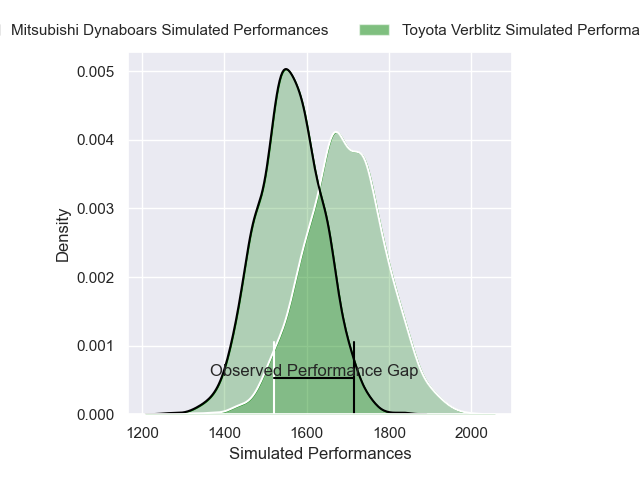
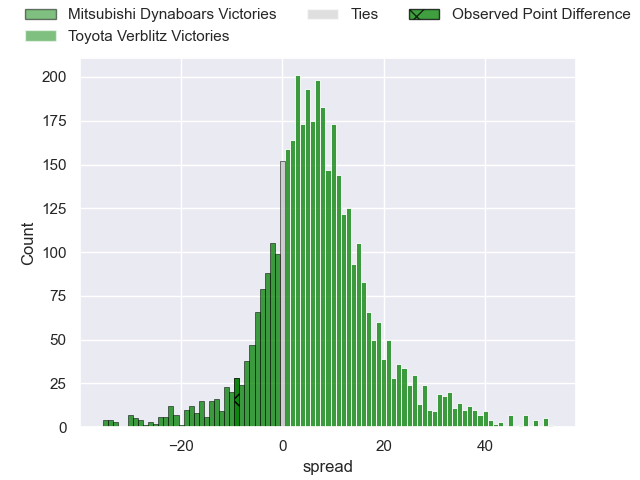
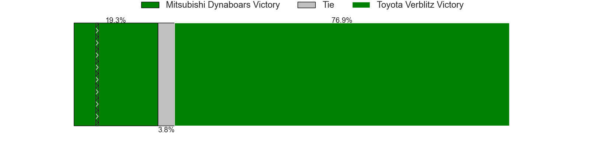
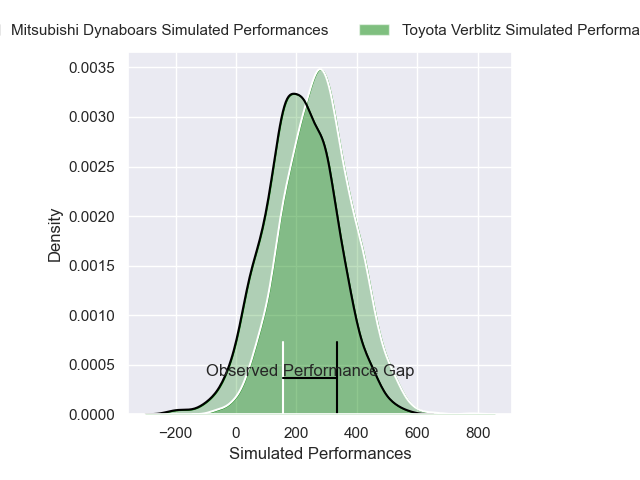
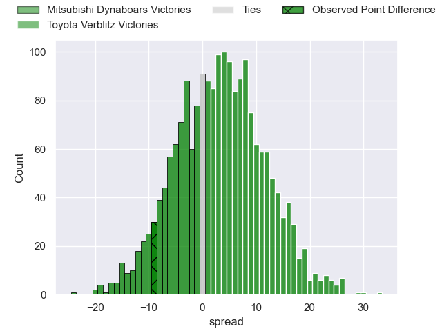
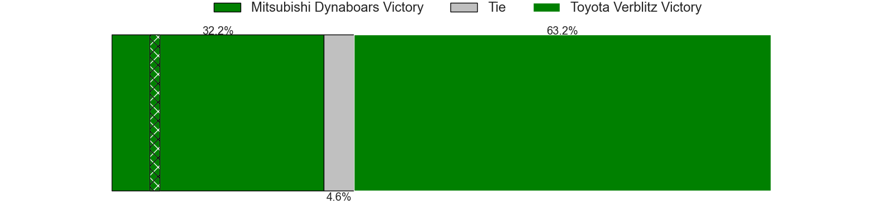

---  
layout: page  
title: Mitsubishi Dynaboars at Toyota Verblitz; 31-22  
date: 2025-03-22 18:00:00 -0500  
categories: "Japan Rugby League One 24/25" match review  
---
# Mitsubishi Dynaboars at Toyota Verblitz; 31-22

# Club Level Predictions

The first set of predictions treats a club as the smallest object, as the club develops its members, organizes a gameplan, and deploys its players as needed for each match. This club model has a prediction of 0.679, which translates to predicting Toyota Verblitz to win by 6.7.

Our Over/Under is 70.5 - and combined with the spread above, we have a predicted scoreline of 32 to 38

Each club has a rating and a rating deviation (similar to a Glicko rating), and expected performances can be generated. This allows for simulated matches and spreads like the ones below.
## Projected Performances - Club Model

## Projected Spreads - Club Model

## Projected Results - Club Model

# Player Level Predictions

Treating teams instead as an entity made up of the currently active players, I have ratings for each player in an altogether different system. These can be combined to form team ratings once teamsheets are announced, weighting starters a bit higher than the reserves. After the match is played, players can be weighted by their minutes on the field, allowing for an accurate measure of the team's composition. With these compiled team ratings, we can make predictions, measure inaccuracy, and update the individual player ratings.
## Prediction without Player Minutes: Toyota Verblitz by 4.9

Toyota Verblitz by 0.4 on a neutral pitch

## Projected Performances - Player Model

## Projected Spreads - Player Model

## Projected Results - Player Model

|   Away Minutes | Away Player               |   Away Percentile |   Number |   Home Percentile | Home Player       |   Home Minutes |
|---------------:|:--------------------------|------------------:|---------:|------------------:|:------------------|---------------:|
|             20 | Jun Morimoto              |             72.14 |        1 |             87.44 | Shogo Miura       |           12   |
|             20 | Yoshimitsu Yasue          |             71.43 |        2 |             43.21 | Ryusei Kato       |           80   |
|             68 | Khuthuzani Kingdom Mchunu |             64.17 |        3 |             76.97 | Genki Sudo        |           12   |
|             56 | Walt Steenkamp            |             75.02 |        4 |             43.23 | Josh Dickson      |           23   |
|             80 | Lewis Chessum             |             60.42 |        5 |             65.99 | Adre Smith        |           29   |
|             30 | Epineri Uluiviti          |              6.3  |        6 |             26.91 | Keito Aoki        |           72   |
|             36 | Masataka Tsuruya          |             95.04 |        7 |             99.52 | Michael Hooper    |           80   |
|             50 | Kyo Yoshida               |             68.36 |        8 |             45.03 | Ryusei Koike      |           80   |
|             80 | Kota Iwamura              |             73.99 |        9 |             94.9  | Aaron Smith       |           28.5 |
|             52 | Jack Stratton             |             93.13 |       10 |             70.17 | Matt McGahan      |           28   |
|             77 | Honeti Taumoha'apai       |             83.16 |       11 |             55.02 | Vatiliai Tuidraki |           80   |
|             60 | Charlie Lawrence          |             93.18 |       12 |             75.05 | Nicholas McCurran |           57   |
|             60 | Matt Vaega                |             31.57 |       13 |              0.41 | Siosaia Fifita    |           80   |
|             68 | Naco Joape                |             60.86 |       14 |             85.45 | Taichi Takahashi  |           80   |
|             80 | Kurt-Lee Arendse          |             98.8  |       15 |             11.95 | Dick Wilson       |           23   |
|             80 | Seung Hyok Lee            |             39.37 |       16 |             68.01 | Richie Gray       |           80   |
|             52 | Yuji Chae                 |            nan    |       17 |             40.98 | Shunsuke Asaoka   |           28   |
|             52 | Timote Tavalea            |             14.79 |       18 |             82.96 | Isaiah Mapusua    |           28.5 |
|             24 | James Grayson             |             40.77 |       19 |             18.98 | Kaito Shigeno     |           28   |
|             28 | Kanzo Schinckel           |             14.49 |       20 |             14.36 | Joseph Manu       |            8   |
|            nan | nan                       |            nan    |       21 |            nan    | Shinya Komura     |           44   |
|            nan | nan                       |            nan    |       22 |             29.39 | Ryunosuke Momoji  |           68   |
|            nan | nan                       |            nan    |       23 |            nan    | Taiga Kawasaki    |           80   |

