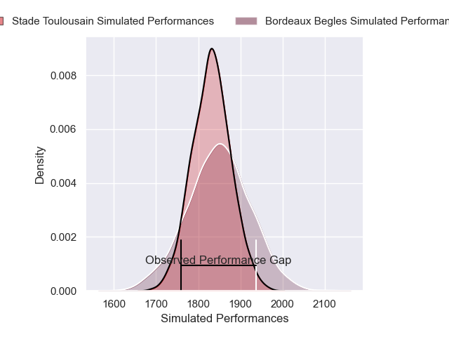
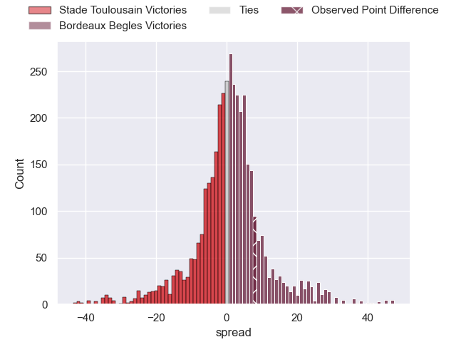
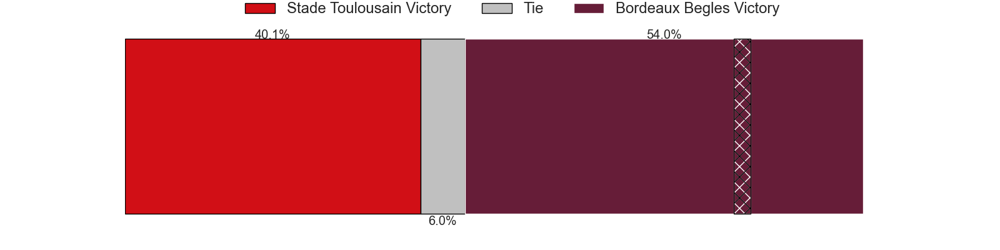
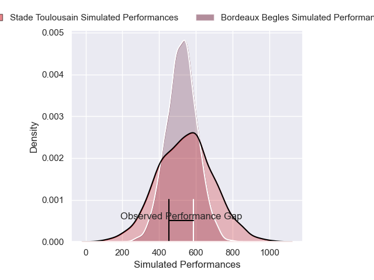
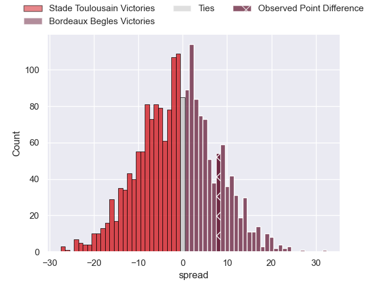
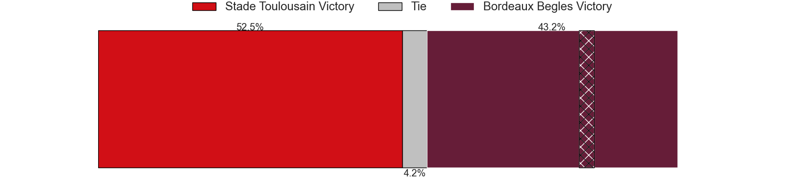

---  
layout: page  
title: Stade Toulousain at Bordeaux Begles; 24-32  
date: 2025-03-23 18:00:00 -0500  
categories: "Top 14 Orange 24/25" match review  
---
# Stade Toulousain at Bordeaux Begles; 24-32

# Club Level Predictions

The first set of predictions treats a club as the smallest object, as the club develops its members, organizes a gameplan, and deploys its players as needed for each match. This club model has a prediction of 0.526, which translates to predicting Bordeaux Begles to win by 0.9.

Our Over/Under is 57.5 - and combined with the spread above, we have a predicted scoreline of 28 to 29

Each club has a rating and a rating deviation (similar to a Glicko rating), and expected performances can be generated. This allows for simulated matches and spreads like the ones below.
## Projected Performances - Club Model

## Projected Spreads - Club Model

## Projected Results - Club Model

# Player Level Predictions

Treating teams instead as an entity made up of the currently active players, I have ratings for each player in an altogether different system. These can be combined to form team ratings once teamsheets are announced, weighting starters a bit higher than the reserves. After the match is played, players can be weighted by their minutes on the field, allowing for an accurate measure of the team's composition. With these compiled team ratings, we can make predictions, measure inaccuracy, and update the individual player ratings.
## Prediction without Player Minutes: Bordeaux Begles by 15.7

Bordeaux Begles by 3.8 on a neutral pitch

## Projected Performances - Player Model

## Projected Spreads - Player Model

## Projected Results - Player Model

|   Away Minutes | Away Player            |   Away Percentile |   Number |   Home Percentile | Home Player               |   Home Minutes |
|---------------:|:-----------------------|------------------:|---------:|------------------:|:--------------------------|---------------:|
|             67 | David Ainu'u           |             91.47 |        1 |             85.91 | Jefferson Poirot          |              3 |
|             69 | Guillaume Cramont      |             91.64 |        2 |             67.07 | Maxime Lamothe            |             29 |
|             62 | Joel Merkler           |             77.46 |        3 |             98.31 | Ben Tameifuna             |             35 |
|             69 | Efrain Elias           |             94.04 |        4 |             87.99 | Guido Petti               |             80 |
|             66 | Clement Verge          |             84.53 |        5 |             97.02 | Cyril Cazeaux             |             80 |
|             13 | Jack Willis            |             98.57 |        6 |             67.65 | Marko Gazzotti            |             30 |
|             56 | Leo Banos              |             92.56 |        7 |             91.13 | Pierre Bochaton           |              0 |
|              5 | Theo Ntamack           |             38.74 |        8 |             92.49 | Pete Samu                 |             11 |
|             80 | Naoto Saito            |              3.51 |        9 |             99.47 | Maxime Lucu               |             13 |
|             75 | Juan Cruz Mallia       |             99.79 |       10 |             97.64 | Matthieu Jalibert         |              0 |
|             62 | Matthis Lebel          |             99.14 |       11 |             73.4  | Louis Bielle-Biarrey      |             11 |
|             75 | Pita Ahki              |             73.63 |       12 |             86.76 | Rohan Janse van Rensburg  |             20 |
|             80 | Lucas Vigneres         |             63.75 |       13 |             80.45 | Nicolas Depoortere        |             26 |
|             80 | Nelson Epee            |             66.89 |       14 |             97.99 | Damian Penaud             |             80 |
|             80 | Matias Remue           |             67.73 |       15 |             97.61 | Romain Buros              |              0 |
|             16 | Matias Remue           |             67.73 |       15 |             97.61 | Romain Buros              |              0 |
|             80 | Thomas Lacombre        |             77    |       16 |             59.93 | Connor Sa                 |             14 |
|             80 | Benjamin Bertrand      |            nan    |       17 |             84.78 | Ugo Boniface              |              0 |
|             57 | Joshua Brennan         |             93.89 |       18 |             92.89 | Jonny Gray                |             18 |
|             80 | Alban Placines         |            nan    |       19 |             90.74 | Bastien Vergnes Taillefer |             18 |
|             80 | Mathis Castro-Ferreira |             69.17 |       20 |             76.81 | Mahamadou Diaby           |             29 |
|             11 | Simon Daroque          |            nan    |       21 |             97.22 | Arthur Retiere            |             69 |
|              0 | Celian Pouzelgues      |            nan    |       22 |             77.9  | Joey Carbery              |             50 |
|             80 | Malachi Hawkes         |            nan    |       23 |             84.22 | Sipili Falatea            |             80 |

