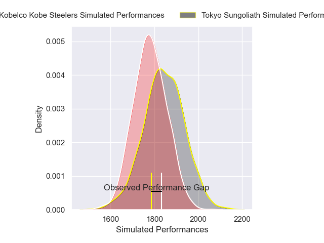
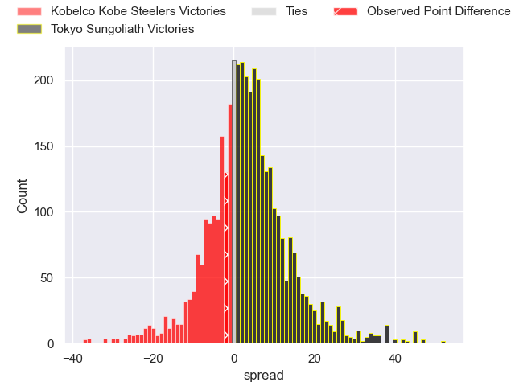
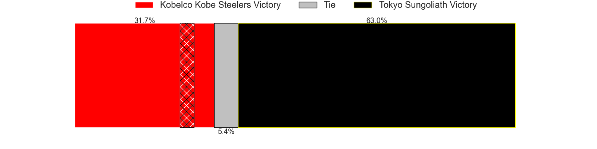
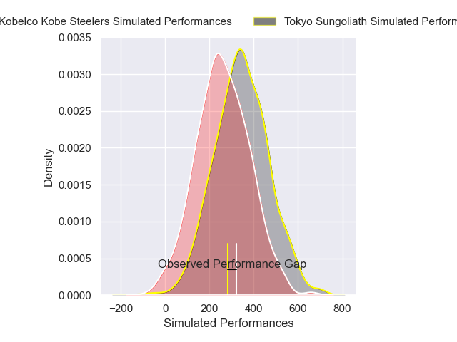
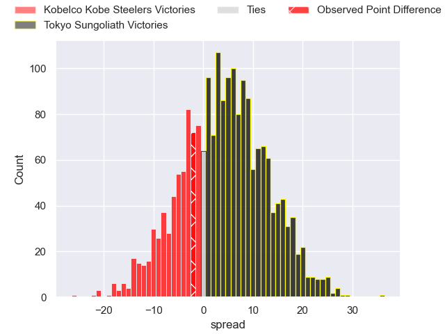
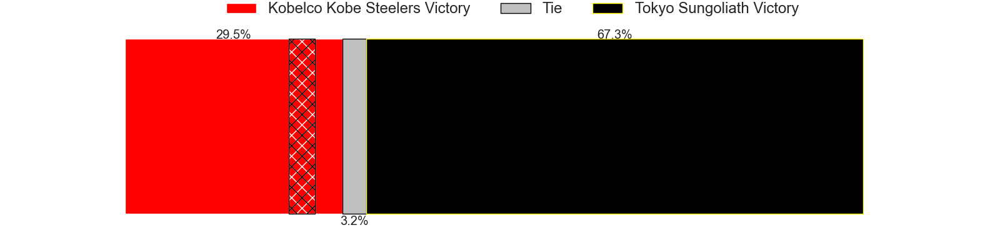

---  
layout: page  
title: Kobelco Kobe Steelers at Tokyo Sungoliath; 39-37  
date: 2025-03-23 18:00:00 -0500  
categories: "Japan Rugby League One 24/25" match review  
---
# Kobelco Kobe Steelers at Tokyo Sungoliath; 39-37

# Club Level Predictions

The first set of predictions treats a club as the smallest object, as the club develops its members, organizes a gameplan, and deploys its players as needed for each match. This club model has a prediction of 0.587, which translates to predicting Tokyo Sungoliath to win by 3.1.

Our Over/Under is 62.5 - and combined with the spread above, we have a predicted scoreline of 30 to 33

Each club has a rating and a rating deviation (similar to a Glicko rating), and expected performances can be generated. This allows for simulated matches and spreads like the ones below.
## Projected Performances - Club Model

## Projected Spreads - Club Model

## Projected Results - Club Model

# Player Level Predictions

Treating teams instead as an entity made up of the currently active players, I have ratings for each player in an altogether different system. These can be combined to form team ratings once teamsheets are announced, weighting starters a bit higher than the reserves. After the match is played, players can be weighted by their minutes on the field, allowing for an accurate measure of the team's composition. With these compiled team ratings, we can make predictions, measure inaccuracy, and update the individual player ratings.
## Prediction without Player Minutes: Tokyo Sungoliath by 3.9

Kobelco Kobe Steelers by 1.1 on a neutral pitch

## Projected Performances - Player Model

## Projected Spreads - Player Model

## Projected Results - Player Model

|   Away Minutes | Away Player          |   Away Percentile |   Number |   Home Percentile | Home Player       |   Home Minutes |
|---------------:|:---------------------|------------------:|---------:|------------------:|:------------------|---------------:|
|           67   | Shigure Takao        |             74.55 |        1 |             38.76 | Kenta Kobayashi   |             28 |
|           52   | George Turner        |             99.67 |        2 |             78.15 | Kosuke Horikoshi  |             72 |
|           80   | Hiroshi Yamashita    |             94.44 |        3 |             12.69 | Kan Nakano        |             64 |
|            0   | Gerard Cowley-Tuioti |             85.04 |        4 |             14.96 | Trevor Hosea      |             80 |
|           28.5 | Brodie Retallick     |            100    |        5 |             94.7  | Sam Jeffries      |             26 |
|           60   | Tiennan Costley      |             83.69 |        6 |             71.98 | Ryuga Hashimoto   |             52 |
|           80   | Solomone Funaki      |             62.7  |        7 |             71.23 | Kanji Shimokawa   |             60 |
|           28.5 | Waisake Raratubua    |             63.71 |        8 |             70.66 | Sione Lavemai     |             20 |
|           36   | Atsushi Hiwasa       |             92.23 |        9 |             18.48 | Yutaka Nagare     |             80 |
|           80   | Bryn Gatland         |             93    |       10 |             28.81 | Mikiya Takamoto   |             70 |
|           28   | Kenta Matsunaga      |             39.11 |       11 |             99.91 | Cheslin Kolbe     |             22 |
|           12   | Seungsin Lee         |              2.96 |       12 |              7.29 | Shogo Nakano      |             28 |
|           28   | Michael Little       |             65.22 |       13 |             70.64 | Isaiah Punivai    |             10 |
|            8   | Ataata Moeakiola     |             25.16 |       14 |             91.61 | Seiya Ozaki       |             28 |
|           23   | Rakuhei Yamashita    |             91.87 |       15 |             92.07 | Kotaro Matsushima |             80 |
|           80   | Timothy Lafaele      |             44.04 |       16 |             25.59 | Kai Yamamoto      |             80 |
|           23   | Inoke Burua          |            nan    |       17 |            nan    | Atsuki Yamamoto   |             52 |
|           80   | Amanaki Saumaki      |             66.41 |       18 |             36.09 | Kienori Go        |             52 |
|           44   | Koo Ji-won           |              0.86 |       19 |             86.8  | Ryoto Nakamura    |             80 |
|           68   | Kauvaka Kaivelata    |             58.03 |       20 |             72.02 | Kenta Fukuda      |             80 |
|           80   | Kenta Matsuoka       |             69.87 |       21 |             40.8  | Kotaro Hosoki     |             80 |
|           57   | Naohiro Kotaki       |             29.65 |       22 |            nan    | Koji Iino         |             13 |
|           80   | Itsuki Kamimura      |            nan    |       23 |             68    | Hideto Niguma     |             80 |

