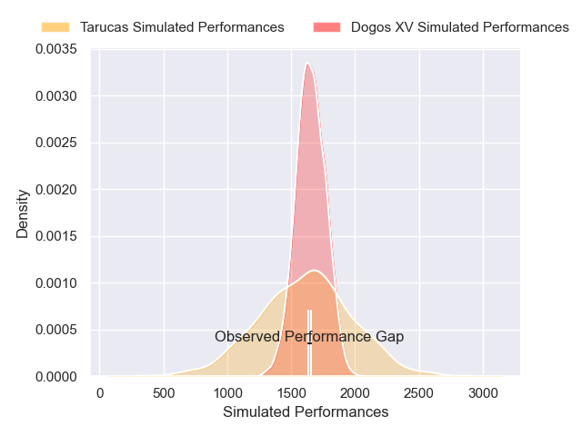
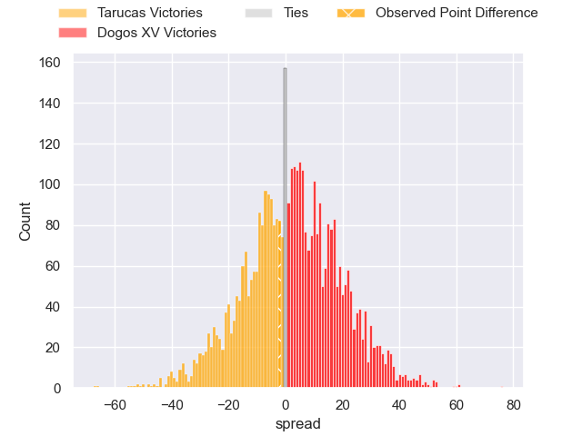
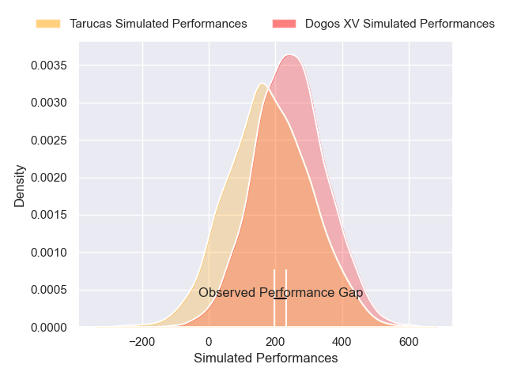
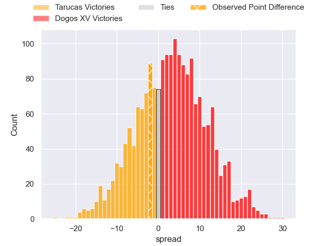

---  
layout: page  
title: Tarucas at Dogos XV; 22-20  
date: 2025-03-24 18:00:00 -0500  
categories: "Super Rugby Americas 2025" match review  
---
# Tarucas at Dogos XV; 22-20

# Club Level Predictions

The first set of predictions treats a club as the smallest object, as the club develops its members, organizes a gameplan, and deploys its players as needed for each match. This club model has a prediction of 0.549, which translates to predicting Dogos XV to win by 2.6.

Our Over/Under is 56.5 - and combined with the spread above, we have a predicted scoreline of 27 to 30

Each club has a rating and a rating deviation (similar to a Glicko rating), and expected performances can be generated. This allows for simulated matches and spreads like the ones below.
## Projected Performances - Club Model

## Projected Spreads - Club Model

## Projected Results - Club Model

# Player Level Predictions

Treating teams instead as an entity made up of the currently active players, I have ratings for each player in an altogether different system. These can be combined to form team ratings once teamsheets are announced, weighting starters a bit higher than the reserves. After the match is played, players can be weighted by their minutes on the field, allowing for an accurate measure of the team's composition. With these compiled team ratings, we can make predictions, measure inaccuracy, and update the individual player ratings.
## Prediction without Player Minutes: Dogos XV by 7.2

Dogos XV by 4.8 on a neutral pitch

## Projected Performances - Player Model

## Projected Spreads - Player Model

## Projected Results - Player Model

|   Away Minutes | Away Player             |   Away Percentile |   Number |   Home Percentile | Home Player               |   Home Minutes |
|---------------:|:------------------------|------------------:|---------:|------------------:|:--------------------------|---------------:|
|             52 | Benjamin Garrido        |             29.99 |        1 |             84.89 | Boris Wenger              |             36 |
|             46 | Tomas Bartolini         |             34.6  |        2 |             77.32 | Leonel Oviedo             |             63 |
|             80 | Francisco Moreno        |             68.91 |        3 |             68.75 | Pedro Delgado             |             80 |
|             80 | Mariano Perondi         |             60.97 |        4 |             84.94 | Lautaro Simes             |             80 |
|             80 | Alvaro Garcia Iandolino |             72.77 |        5 |             54.55 | Federico Albrisi          |             80 |
|             80 | Facundo Javier Cardozo  |             58.58 |        6 |             72.73 | Aitor Bildosola           |             12 |
|              5 | Agustin Sarelli         |             43.86 |        7 |             77.79 | Valentin Cabral           |             52 |
|             80 | Joaquin Aguilar         |             51.16 |        8 |             44.59 | Gennaro Fissore           |             34 |
|             80 | Simon Benitez Cruz      |             84.8  |        9 |             88.77 | Agustin Moyano            |             12 |
|             63 | Nicolas Roger           |             59.47 |       10 |             56.38 | Juan Baronio              |             12 |
|             22 | Tomas Vanni             |             14.13 |       11 |             88.06 | Franco Rossetto           |             34 |
|             22 | Tomas Medina            |             78.33 |       12 |             90.25 | Faustino Sánchez Valarolo |             58 |
|             28 | Bautista Estofan        |             53.99 |       13 |             89.56 | Agustin Segura            |             34 |
|             34 | Martiniano Arrieta      |             39.29 |       14 |             85.14 | Mateo Soler               |             13 |
|             22 | Juan Manuel Molinuevo   |             21.95 |       15 |             19.51 | Mateo Sanchez             |             68 |
|             49 | Julian Martin           |             58.57 |       16 |            nan    | Conrado Iglesias Quintana |             80 |
|             80 | Rodrigo Navarro         |             35.24 |       17 |             69.92 | Lorenzo Colidio           |             17 |
|             61 | Luciano Asevedo         |             38.1  |       18 |             77.04 | Leonardo Gea Salim        |             80 |
|             46 | Stefano Ferro           |             44.11 |       19 |             73.87 | Julian Ignacio Hernandez  |             58 |
|             36 | Thiago Sbrocco          |             20.66 |       20 |            nan    | Gaston Revol              |             46 |
|             46 | Miguel Mukdise          |            nan    |       21 |             86.06 | Octavio Filippa           |             28 |
|             67 | Juan Manuel Vivas       |             58.77 |       22 |            nan    | Ignacio Jose Gandini      |             80 |

