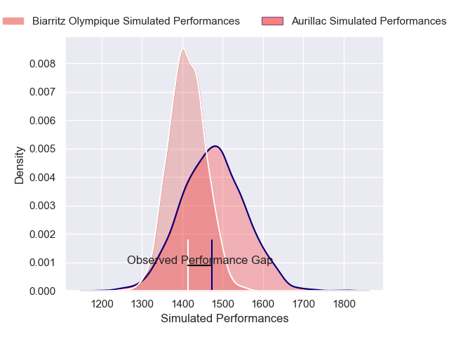
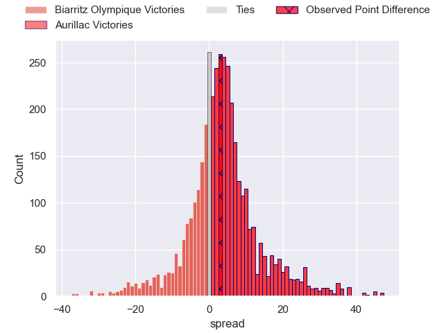
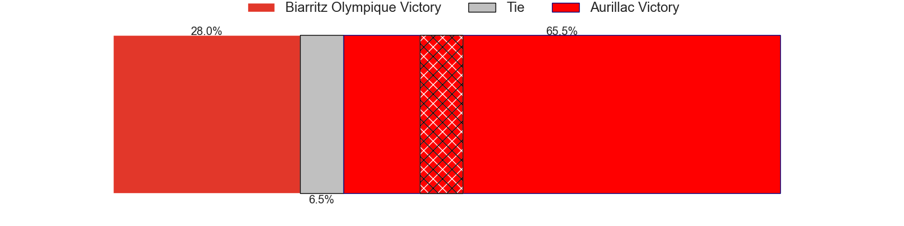
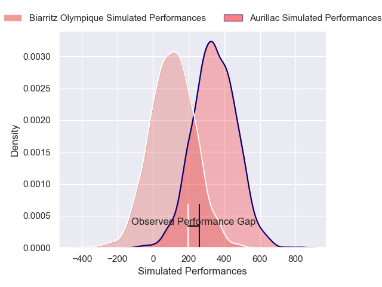
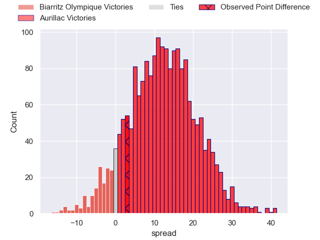
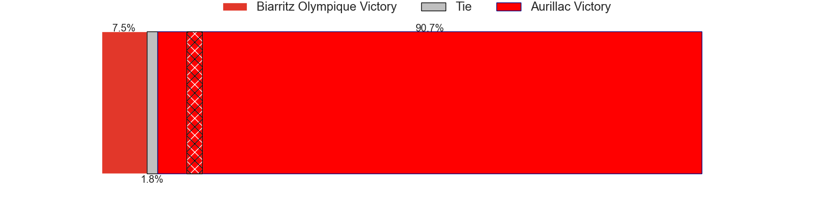

---  
layout: page  
title: Biarritz Olympique at Aurillac; 31-34  
date: 2025-03-28 18:00:00 -0500  
categories: "Pro D2 24/25" match review  
---
# Biarritz Olympique at Aurillac; 31-34

# Club Level Predictions

The first set of predictions treats a club as the smallest object, as the club develops its members, organizes a gameplan, and deploys its players as needed for each match. This club model has a prediction of 0.59, which translates to predicting Aurillac to win by 3.2.

Our Over/Under is 52.5 - and combined with the spread above, we have a predicted scoreline of 25 to 28

Each club has a rating and a rating deviation (similar to a Glicko rating), and expected performances can be generated. This allows for simulated matches and spreads like the ones below.
## Projected Performances - Club Model

## Projected Spreads - Club Model

## Projected Results - Club Model

# Player Level Predictions

Treating teams instead as an entity made up of the currently active players, I have ratings for each player in an altogether different system. These can be combined to form team ratings once teamsheets are announced, weighting starters a bit higher than the reserves. After the match is played, players can be weighted by their minutes on the field, allowing for an accurate measure of the team's composition. With these compiled team ratings, we can make predictions, measure inaccuracy, and update the individual player ratings.
## Prediction without Player Minutes: Aurillac by 12.2

Biarritz Olympique by 0.9 on a neutral pitch

## Projected Performances - Player Model

## Projected Spreads - Player Model

## Projected Results - Player Model

|   Away Minutes | Away Player        |   Away Percentile |   Number |   Home Percentile | Home Player             |   Home Minutes |
|---------------:|:-------------------|------------------:|---------:|------------------:|:------------------------|---------------:|
|             40 | Alexandre Plantier |             54.34 |        1 |             28.08 | Irakli Mtchedlidze      |             32 |
|             25 | Clément Martinez   |             49.75 |        2 |             35.39 | Luka Nioradze           |             16 |
|             25 | Giorgi Nutsubidze  |             52.68 |        3 |             38.01 | Giorgi Kartvelishvili   |             34 |
|             35 | Aitor Hourcade     |             52.88 |        4 |             61.66 | Koen Bloemen            |             13 |
|             40 | Levi Douglas       |             54.01 |        5 |             42.78 | Martial Rolland         |             32 |
|             50 | Thomas Hébert      |             55.8  |        6 |             31.57 | Eoghan Masterson        |             18 |
|             80 | Jessy Jegerlehner  |             60.26 |        7 |             40.76 | Lucas Oudard            |             35 |
|             80 | Cornell du Preez   |             41.84 |        8 |             21.22 | Didier Tison            |             80 |
|             55 | Anoa Laurent       |             53.6  |        9 |             47.24 | Boris Hadinegoro        |             80 |
|             80 | Edgar Retière      |             49.39 |       10 |             22.95 | Ugo Seunes              |             80 |
|             66 | Yohan Tapie        |             56.75 |       11 |             32.99 | Aj Coertzen             |             80 |
|             80 | Carlo Mignot       |             54.51 |       12 |             32.32 | Elijah Niko             |             80 |
|             14 | François Vergnaud  |             44.48 |       13 |             30.6  | Karl Martin             |             48 |
|             50 | Bastien Guillemin  |             54.25 |       14 |             37.25 | Simeli Yabaki           |             59 |
|             25 | Thomas Dolhagaray  |             26.26 |       15 |             19.39 | Jake Strachan           |             56 |
|             80 | Yohan Beheregaray  |              7.01 |       16 |            nan    | Ronan Loughnane         |             56 |
|             25 | François Mur       |            nan    |       17 |            nan    | Robbie Rodgers          |             80 |
|             30 | Ekain Imaz         |             70.29 |       18 |             36.45 | Mehdi Slamani           |             55 |
|             30 | Nafi Ma'Afu        |            nan    |       19 |            nan    | Aleksandre Burduli      |             24 |
|             55 | Imanol Biscay      |            nan    |       20 |            nan    | Hugo Huurman            |             63 |
|             80 | Mathieu Acebes     |             90.02 |       21 |             52.09 | Mikheil Alania          |             55 |
|             72 | Baptiste Fariscot  |            nan    |       22 |            nan    | Hugo Bastard            |             80 |
|             74 | Zakaria El Fakir   |            nan    |       23 |             28.55 | Dominic Robertson-McCoy |             80 |

