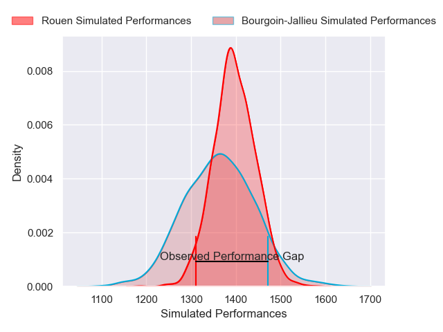
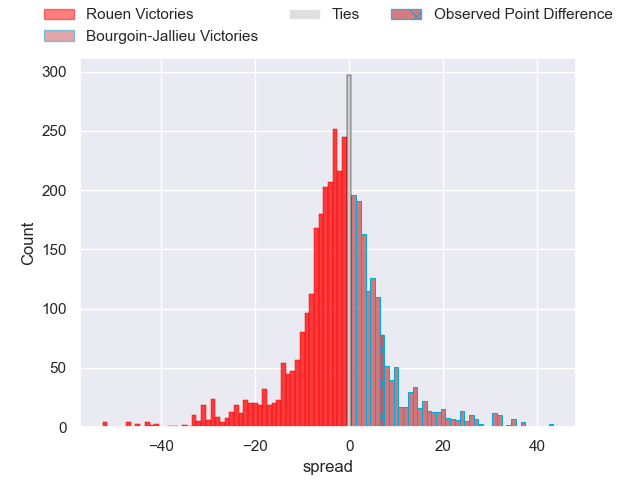
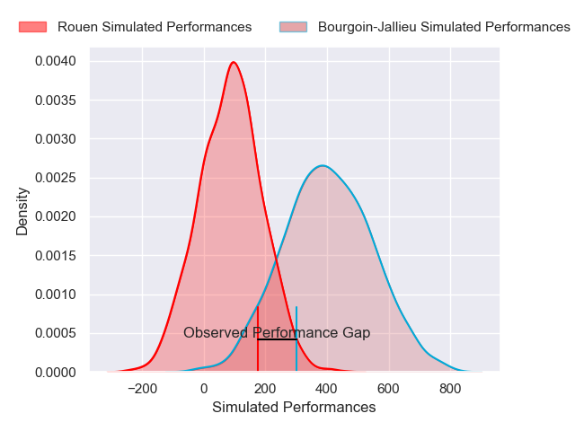
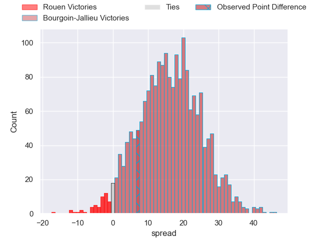
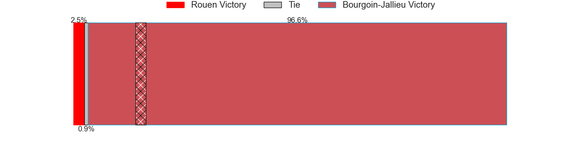

---  
layout: page  
title: Rouen at Bourgoin-Jallieu; 23-30  
date: 2025-03-28 18:00:00 -0500  
categories: "Nationale 24/25" match review  
---
# Rouen at Bourgoin-Jallieu; 23-30

# Club Level Predictions

The first set of predictions treats a club as the smallest object, as the club develops its members, organizes a gameplan, and deploys its players as needed for each match. This club model has a prediction of 0.454, which translates to predicting Rouen to win by 1.6.

Our Over/Under is 47.5 - and combined with the spread above, we have a predicted scoreline of 25 to 23

Each club has a rating and a rating deviation (similar to a Glicko rating), and expected performances can be generated. This allows for simulated matches and spreads like the ones below.
## Projected Performances - Club Model

## Projected Spreads - Club Model

## Projected Results - Club Model

# Player Level Predictions

Treating teams instead as an entity made up of the currently active players, I have ratings for each player in an altogether different system. These can be combined to form team ratings once teamsheets are announced, weighting starters a bit higher than the reserves. After the match is played, players can be weighted by their minutes on the field, allowing for an accurate measure of the team's composition. With these compiled team ratings, we can make predictions, measure inaccuracy, and update the individual player ratings.
## Prediction without Player Minutes: Bourgoin-Jallieu by 13.4

Rouen by 0.0 on a neutral pitch

## Projected Performances - Player Model

## Projected Spreads - Player Model

## Projected Results - Player Model

|   Away Minutes | Away Player           |   Away Percentile |   Number |   Home Percentile | Home Player      |   Home Minutes |
|---------------:|:----------------------|------------------:|---------:|------------------:|:-----------------|---------------:|
|             28 | Ewan Clément          |             52.21 |        1 |             33.68 | Adrien Mallet    |             80 |
|             80 | Mathieu Bonnot        |             55.76 |        2 |             29.55 | Maxime Castant   |             80 |
|             80 | Khvicha Tsopurashvili |             56.94 |        3 |             38.72 | Keynan Knox      |             69 |
|             48 | Jean Leleu            |             53.26 |        4 |             33.81 | Thomas Adélaïde  |             80 |
|             54 | Jc Astle              |             54.11 |        5 |             35.32 | Léandre Cotte    |             80 |
|             66 | Lucas Costa           |             55.62 |        6 |             36.21 | Kévin Rivoire    |             80 |
|             40 | Willy N'Diaye         |             52.83 |        7 |             31.66 | Bynjamin Rabatel |             80 |
|             40 | Abdelkarim Fofana     |             47.14 |        8 |             31.63 | Poutasi Luafutu  |             51 |
|             58 | Florent Campeggia     |             51.76 |        9 |             36.18 | Yoan Cottin      |             80 |
|             18 | Maxime Javaux         |             40.98 |       10 |             27.46 | Nicolas Cachet   |             80 |
|             11 | Nicolas Nieto         |             50.46 |       11 |             36.97 | Adrian Fugit     |             80 |
|             34 | Marin Boulier         |             46.4  |       12 |             33.43 | Isaiah Leota     |             80 |
|             69 | Ope Peleseuma         |             50.46 |       13 |             29.89 | Tom Danovaro     |             80 |
|              0 | Kévin Bly             |             45.33 |       14 |             40.67 | Pierre Mignot    |             28 |
|              0 | Aloïs Chayla          |             43.54 |       15 |             36.16 | Rémy Bouet       |             28 |
|             11 | Lucas Malbert         |            nan    |       16 |             41.07 | Julien Ratajczak |             80 |
|             11 | Alexis Decaux         |            nan    |       17 |            nan    | Rémi Gaborit     |             80 |
|             29 | Octave Leleu          |            nan    |       18 |            nan    | Robin Gascou     |             45 |
|             65 | Julien Ruaud          |            nan    |       19 |            nan    | Théophile Cotte  |             40 |
|             26 | Maxime Cassonnet      |            nan    |       20 |            nan    | Louis Giamarchi  |             40 |
|              0 | Benjamin Debetz       |            nan    |       21 |             37.18 | Aviata Silago    |             48 |
|             56 | Manolo Laffond        |            nan    |       22 |            nan    | Mattéo Broeders  |             80 |
|             69 | Sidi-Mohammed Diallo  |            nan    |       23 |             47.4  | Dimitri Tchapnga |             77 |

