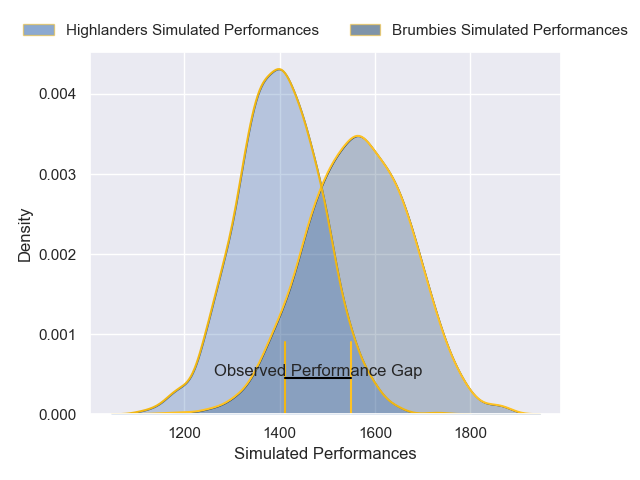
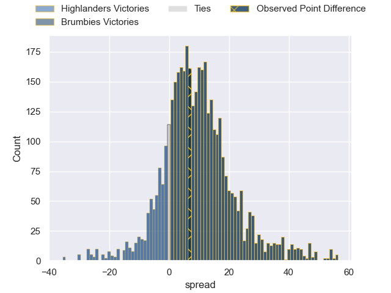
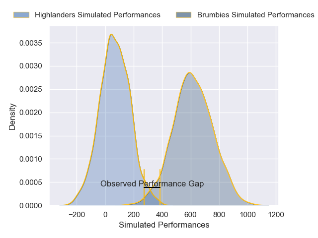
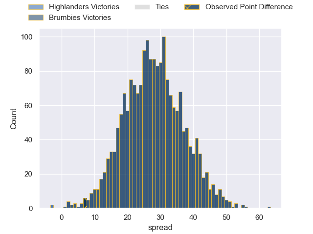

---  
layout: page  
title: Highlanders at Brumbies; 27-34  
date: 2025-03-28 18:00:00 -0500  
categories: "Super Rugby Pacific 2025" match review  
---
# Highlanders at Brumbies; 27-34

# Club Level Predictions

The first set of predictions treats a club as the smallest object, as the club develops its members, organizes a gameplan, and deploys its players as needed for each match. This club model has a prediction of 0.714, which translates to predicting Brumbies to win by 8.3.

Our Over/Under is 61.5 - and combined with the spread above, we have a predicted scoreline of 27 to 35

Each club has a rating and a rating deviation (similar to a Glicko rating), and expected performances can be generated. This allows for simulated matches and spreads like the ones below.
## Projected Performances - Club Model

## Projected Spreads - Club Model

## Projected Results - Club Model

# Player Level Predictions

Treating teams instead as an entity made up of the currently active players, I have ratings for each player in an altogether different system. These can be combined to form team ratings once teamsheets are announced, weighting starters a bit higher than the reserves. After the match is played, players can be weighted by their minutes on the field, allowing for an accurate measure of the team's composition. With these compiled team ratings, we can make predictions, measure inaccuracy, and update the individual player ratings.
## Prediction without Player Minutes: Brumbies by 21.1

Brumbies by 12.7 on a neutral pitch

## Projected Performances - Player Model

## Projected Spreads - Player Model

## Projected Results - Player Model

|   Away Minutes | Away Player          |   Away Percentile |   Number |   Home Percentile | Home Player      |   Home Minutes |
|---------------:|:---------------------|------------------:|---------:|------------------:|:-----------------|---------------:|
|             80 | Daniel Lienert-Brown |             59.2  |        1 |             91.07 | James Slipper    |             62 |
|             80 | Daniel Lienert-Brown |             59.2  |        1 |             91.07 | James Slipper    |             80 |
|             24 | Soane Vikena         |             81.13 |        2 |             72.19 | Billy Pollard    |             80 |
|             24 | Saula Ma'u           |             43.07 |        3 |             96.32 | Allan Alaalatoa  |             45 |
|             17 | Fabian Holland       |             73.88 |        4 |             46.93 | Nick Frost       |             80 |
|             37 | Mitchell Dunshea     |             92.29 |        5 |             24.44 | Lachlan Shaw     |             56 |
|             65 | TK Howden            |              0.56 |        6 |             34.77 | Tom Hooper       |             80 |
|             21 | Veveni Lasaqa        |             29.52 |        7 |             44.8  | Rory Scott       |             80 |
|             45 | Sean Withy           |             20.27 |        8 |             93.63 | Rob Valetini     |             80 |
|             24 | Nathan Hastie        |             54.4  |        9 |             26.94 | Harrison Goddard |              8 |
|              9 | Taine Robinson       |             45.88 |       10 |             80.66 | Noah Lolesio     |             80 |
|             24 | Jona Nareki          |             84.23 |       11 |             58.07 | Corey Toole      |             80 |
|             30 | Timoci Tavatavanawai |             83.65 |       12 |             35.37 | David Feliuai    |             17 |
|             47 | Thomas Umaga-Jensen  |             10.34 |       13 |             78.72 | Len Ikitau       |             35 |
|             80 | Caleb Tangitau       |             57.89 |       14 |             95.35 | Andy Muirhead    |             35 |
|             80 | Sam Gilbert          |             50.41 |       15 |             74.8  | Tom Wright       |             12 |
|             30 | Henry Bell           |             56.62 |       16 |            nan    | Liam Bowron      |             71 |
|             80 | Josh Bartlett        |             77.6  |       17 |             52    | Blake Schoupp    |             56 |
|             50 | Sefo Kautai          |             18.32 |       18 |            nan    | Rhys Van Nek     |             80 |
|             30 | Will Stodart         |             44.98 |       19 |             99.54 | Cadeyrn Neville  |             80 |
|             50 | Michael Loft         |             24.55 |       20 |             48.36 | Luke Reimer      |             45 |
|             80 | Adam Lennox          |             55.44 |       21 |            nan    | Klayton Thorn    |             68 |
|             24 | Ajay Faleafaga       |             64.33 |       22 |             76.13 | Jack Debreczeni  |             63 |
|             56 | Tanielu Tele'a       |              7.78 |       23 |             93.16 | Ollie Sapsford   |             35 |

