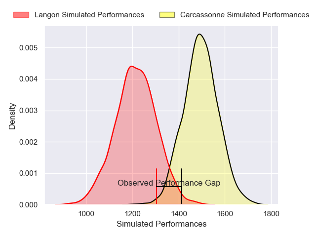
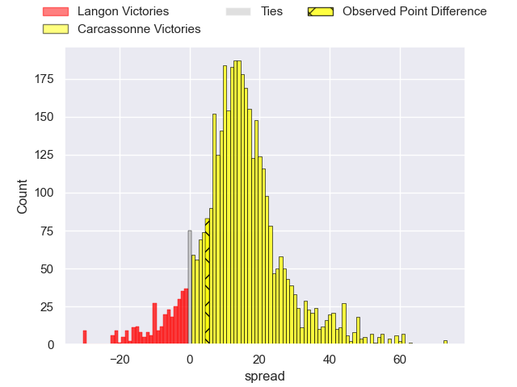
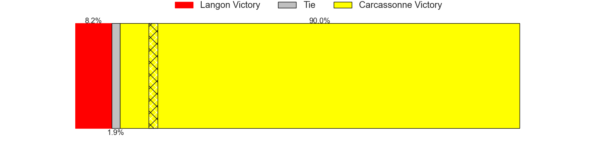
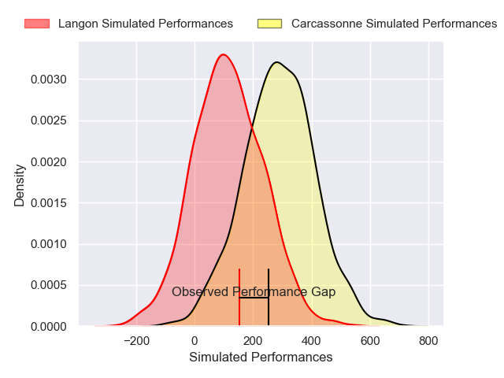
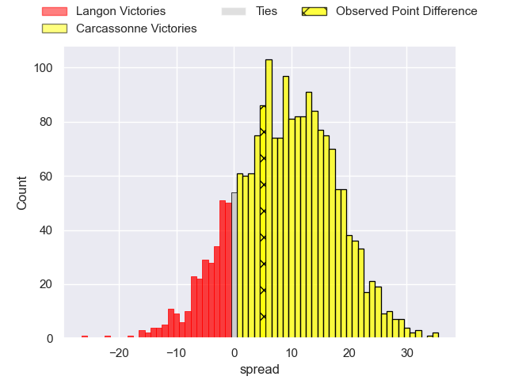
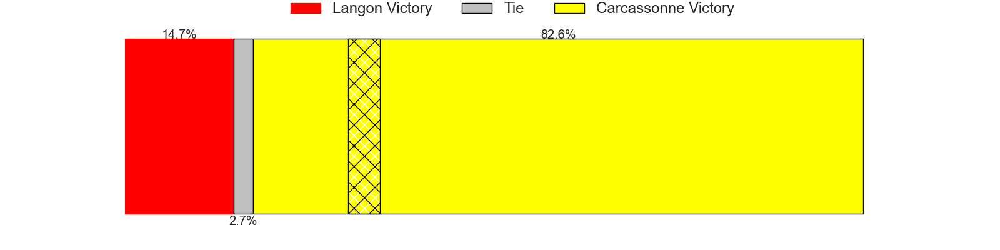

---  
layout: page  
title: Langon at Carcassonne; 16-21  
date: 2025-03-28 18:00:00 -0500  
categories: "Nationale 24/25" match review  
---
# Langon at Carcassonne; 16-21

# Club Level Predictions

The first set of predictions treats a club as the smallest object, as the club develops its members, organizes a gameplan, and deploys its players as needed for each match. This club model has a prediction of 0.825, which translates to predicting Carcassonne to win by 14.0.

Our Over/Under is 52.5 - and combined with the spread above, we have a predicted scoreline of 19 to 33

Each club has a rating and a rating deviation (similar to a Glicko rating), and expected performances can be generated. This allows for simulated matches and spreads like the ones below.
## Projected Performances - Club Model

## Projected Spreads - Club Model

## Projected Results - Club Model

# Player Level Predictions

Treating teams instead as an entity made up of the currently active players, I have ratings for each player in an altogether different system. These can be combined to form team ratings once teamsheets are announced, weighting starters a bit higher than the reserves. After the match is played, players can be weighted by their minutes on the field, allowing for an accurate measure of the team's composition. With these compiled team ratings, we can make predictions, measure inaccuracy, and update the individual player ratings.
## Prediction without Player Minutes: Carcassonne by 7.8

Langon by 1.4 on a neutral pitch

## Projected Performances - Player Model

## Projected Spreads - Player Model

## Projected Results - Player Model

|   Away Minutes | Away Player              |   Away Percentile |   Number |   Home Percentile | Home Player       |   Home Minutes |
|---------------:|:-------------------------|------------------:|---------:|------------------:|:------------------|---------------:|
|             40 | Lucas Hernandez          |             51.81 |        1 |             44.4  | Yan Arnold        |           53   |
|             12 | Julien Graffouillère     |             46.24 |        2 |             42.4  | Raphaël Carbou    |           29   |
|             41 | Maxime Gau               |             51.97 |        3 |             45.98 | Fabien Lorenzon   |           34.5 |
|              9 | Simon Lobjoit            |             48.35 |        4 |             10.58 | Marius Iftimiciuc |           27   |
|             31 | Isikeli Davetawalu       |             49.86 |        5 |             43.63 | Clément Fontaine  |           61   |
|              0 | Thomas Mendy             |             47.96 |        6 |             42.25 | Bilal Fadli       |           71   |
|             51 | Thomas Bishop            |             51.53 |        7 |             43.55 | Noé Bedou         |           53   |
|             80 | Thomas De Molder         |             73.88 |        8 |             40.41 | Ferdinand Dréno   |           27   |
|             80 | Baptiste Tisné           |             51.26 |        9 |             44.39 | Gaëtan Pichon     |           31   |
|             80 | Vincent Debladis         |             43.85 |       10 |             37.91 | Johnny Mcphillips |           31   |
|             80 | Thomas Wallraf           |             70.24 |       11 |             43.25 | Naïm Ben Alla     |           40   |
|             73 | Guillaume Christophe     |             47.82 |       12 |             40.32 | Sefa Naivalu      |           31   |
|             80 | Yul Charrier             |             48.23 |       13 |             39.41 | Lukas Doyhenard   |           61   |
|             11 | Quentin Lefort           |             46.49 |       14 |             39.93 | Paul Gadéa        |           80   |
|             69 | Baptiste Castanier       |             48.08 |       15 |             39.8  | Nils Chaliès      |           80   |
|             80 | Clément Renaud           |            nan    |       16 |            nan    | Baptiste Moréno   |           80   |
|             80 | Tunaï Ratu Vatubua       |            nan    |       17 |            nan    | Florent Lorenzon  |           80   |
|             18 | Kemueli Lavetanakoroi    |            nan    |       18 |            nan    | Romain Guyot      |           68   |
|             18 | Helmi Mimouna            |            nan    |       19 |            nan    | Etienne Herjean   |           53   |
|             11 | Paul Castéra             |            nan    |       20 |            nan    | Gabin Michet      |           51   |
|             27 | Jules Depoortère         |            nan    |       21 |             48.43 | Jeremy To'A       |           80   |
|              0 | Sionasa Vunisa           |            nan    |       22 |            nan    | Corentin Bousquet |           80   |
|             80 | Emiliano Coria Marchetti |            nan    |       23 |             45.1  |                   |           80   |

