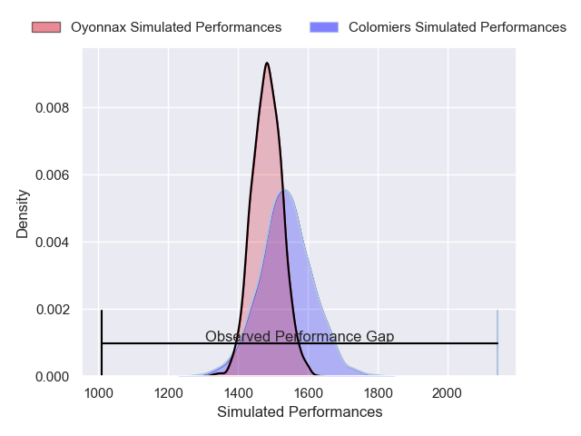
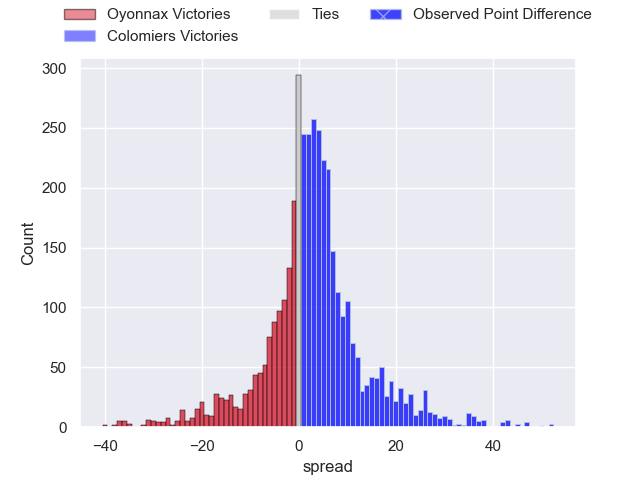
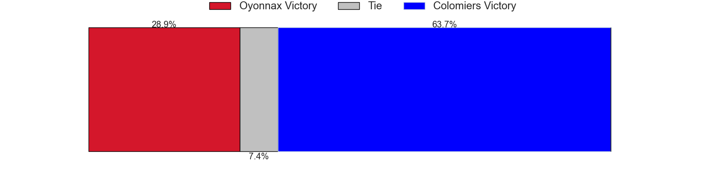
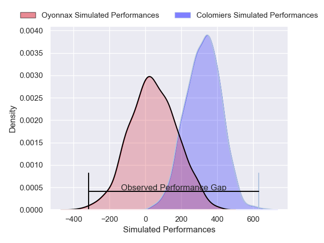
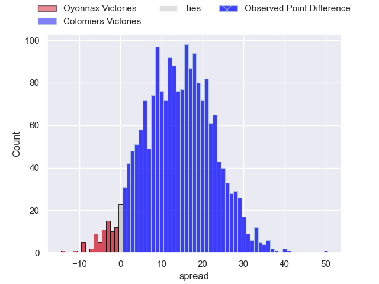
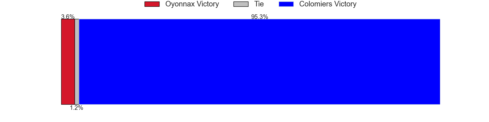

---  
layout: page  
title: Oyonnax at Colomiers; 12-62  
date: 2025-03-28 18:00:00 -0500  
categories: "Pro D2 24/25" match review  
---
# Oyonnax at Colomiers; 12-62

# Club Level Predictions

The first set of predictions treats a club as the smallest object, as the club develops its members, organizes a gameplan, and deploys its players as needed for each match. This club model has a prediction of 0.574, which translates to predicting Colomiers to win by 2.6.

Our Over/Under is 57.5 - and combined with the spread above, we have a predicted scoreline of 27 to 30

Each club has a rating and a rating deviation (similar to a Glicko rating), and expected performances can be generated. This allows for simulated matches and spreads like the ones below.
## Projected Performances - Club Model

## Projected Spreads - Club Model

## Projected Results - Club Model

# Player Level Predictions

Treating teams instead as an entity made up of the currently active players, I have ratings for each player in an altogether different system. These can be combined to form team ratings once teamsheets are announced, weighting starters a bit higher than the reserves. After the match is played, players can be weighted by their minutes on the field, allowing for an accurate measure of the team's composition. With these compiled team ratings, we can make predictions, measure inaccuracy, and update the individual player ratings.
## Prediction without Player Minutes: Colomiers by 15.4

Colomiers by 3.0 on a neutral pitch

## Projected Performances - Player Model

## Projected Spreads - Player Model

## Projected Results - Player Model

|   Away Minutes | Away Player        |   Away Percentile |   Number |   Home Percentile | Home Player        |   Home Minutes |
|---------------:|:-------------------|------------------:|---------:|------------------:|:-------------------|---------------:|
|             80 | Antoine Abraham    |             36.59 |        1 |             50.67 | Guillaume Tartas   |             14 |
|             80 | Benjamin Geledan   |             27.21 |        2 |             57.43 | Pablo Dimcheff     |             80 |
|             80 | Ali Oz             |             16.25 |        3 |             50.67 | Robin Bellemand    |             14 |
|             53 | Ewan Johnson       |             31.73 |        4 |             49.67 | Jean Thomas        |             17 |
|             80 | Manuel Leindekar   |              0.76 |        5 |             49.29 | Jack Whetton       |             14 |
|             80 | Wandrille Picault  |             87.93 |        6 |             51.72 | Anthony Coletta    |             30 |
|             61 | Hugo Hermet        |             16.81 |        7 |             51.25 | Grégoire Bazin     |             27 |
|             80 | David Odiase (2)   |             32.65 |        8 |             53.27 | Caleb Timu         |             80 |
|             80 | Vasil Lobzhanidze  |              6.53 |        9 |             25.8  | Sadek Deghmache    |             80 |
|             80 | Justin Bouraux     |              2.66 |       10 |             41.39 | Brett Herron       |             17 |
|             40 | Karim Qadiri       |             39.65 |       11 |             57.76 | Martin Alonso      |             80 |
|             30 | Afusipa Taumoepeau |             40.53 |       12 |             48.83 | Ray Nu'U           |             50 |
|             30 | Eddie Sawailau     |             38.7  |       13 |             53.29 | Martin Dulon       |             80 |
|             13 | Maxime Salles      |             62.48 |       14 |             75.97 | Vincent Pinto      |             33 |
|             19 | Darren Sweetnam    |             71.11 |       15 |             28.08 | Ugo Pacome         |              0 |
|             13 | Teddy Durand       |              1.5  |       16 |            nan    | Théo Lachaud       |             12 |
|             19 | Oli Kebble         |             95.35 |       17 |            nan    | Hugo Pirlet        |             30 |
|             30 | Victor Lebas       |            nan    |       18 |            nan    | Maxime Granouillet |             22 |
|             80 | Kevin Lebreton     |             22.59 |       19 |            nan    | Jérémy Béchu       |             27 |
|             13 | Jonathan Ruru      |             93.47 |       20 |            nan    | Eliott Maurel      |             24 |
|             80 | Antoine Miquel     |             16.06 |       21 |            nan    | Mathis Galthié     |             21 |
|             80 | Zack Holmes        |             79.71 |       22 |            nan    | Baptiste Serrano   |             80 |
|             80 | Paulo Tafili       |             68.3  |       23 |             54.5  | Marco Fepulea'i    |              4 |
|            nan | nan                |            nan    |       24 |             45.1  |                    |             80 |

