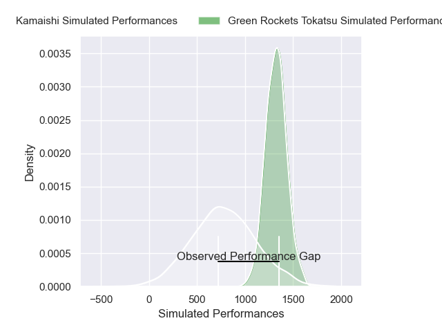
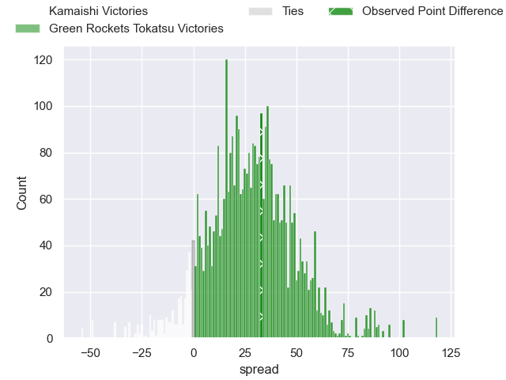
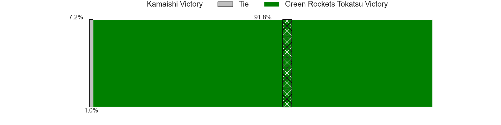
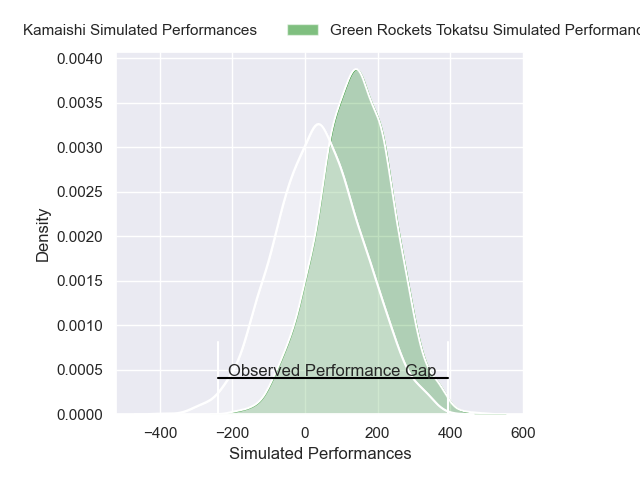
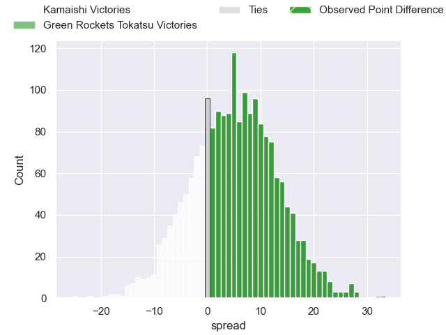
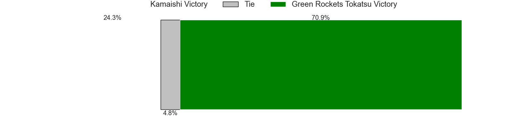

---  
layout: page  
title: Kamaishi at Green Rockets Tokatsu; 7-40  
date: 2025-03-28 18:00:00 -0500  
categories: "Japan Rugby League One - Division 2 2025" match review  
---
# Kamaishi at Green Rockets Tokatsu; 7-40

# Club Level Predictions

The first set of predictions treats a club as the smallest object, as the club develops its members, organizes a gameplan, and deploys its players as needed for each match. This club model has a prediction of 0.892, which translates to predicting Green Rockets Tokatsu to win by 26.5.

Our Over/Under is 48.5 - and combined with the spread above, we have a predicted scoreline of 11 to 38

Each club has a rating and a rating deviation (similar to a Glicko rating), and expected performances can be generated. This allows for simulated matches and spreads like the ones below.
## Projected Performances - Club Model

## Projected Spreads - Club Model

## Projected Results - Club Model

# Player Level Predictions

Treating teams instead as an entity made up of the currently active players, I have ratings for each player in an altogether different system. These can be combined to form team ratings once teamsheets are announced, weighting starters a bit higher than the reserves. After the match is played, players can be weighted by their minutes on the field, allowing for an accurate measure of the team's composition. With these compiled team ratings, we can make predictions, measure inaccuracy, and update the individual player ratings.
## Prediction without Player Minutes: Green Rockets Tokatsu by 5.3

Green Rockets Tokatsu by 0.9 on a neutral pitch

## Projected Performances - Player Model

## Projected Spreads - Player Model

## Projected Results - Player Model

|   Away Minutes | Away Player        |   Away Percentile |   Number |   Home Percentile | Home Player           |   Home Minutes |
|---------------:|:-------------------|------------------:|---------:|------------------:|:----------------------|---------------:|
|             80 | Yusuke Yamada      |             15.69 |        1 |             26.18 | Kosei Yamamoto        |             17 |
|             80 | Taiki Ito          |             11.85 |        2 |             73.96 | Ash Dixon             |             32 |
|             80 | Satoshi Ueda       |             14.98 |        3 |             44.48 | Keisuke Kikuta        |             22 |
|             67 | Satoshi Hatazawa   |             15.2  |        4 |             63.55 | Daiki Yamagiwa        |              0 |
|             43 | Hamish Dalzell     |             18.7  |        5 |             13.22 | Edward Annandale      |             32 |
|              2 | Ben Nee Nee        |             15.23 |        6 |             89.51 | Geoff Cridge          |              0 |
|             50 | Ryota Kono         |             14.02 |        7 |             48.38 | Ryoi Kamei            |              0 |
|             76 | Kohei Ishigaki     |             12.24 |        8 |             70    | Aseri Masivou         |             60 |
|             80 | Yohei Murakami     |             11.56 |        9 |             44.22 | Tatsuya Fujii         |             66 |
|             80 | Mitch Hunt         |              6.76 |       10 |             68.65 | Ko Yoshimura          |             51 |
|             49 | Jamie Henry        |             17.65 |       11 |             67.28 | Kanta Omata           |             80 |
|             67 | Mosese Tonga       |             27.56 |       12 |             38.3  | Orbyn Leger           |             47 |
|             49 | Osuka Lloyd Murata |             17.73 |       13 |             33.74 | Maritino Nemani       |             73 |
|             49 | Gosuke Kawakami    |             22.55 |       14 |             43.35 | Keagen Faria          |             29 |
|             47 | Kazushi Ochi       |             18.38 |       15 |             31.72 | Hiroyuki Miyajima     |             31 |
|             24 | Naoki Ouno         |            nan    |       16 |            nan    | Miyu Arai             |             13 |
|              0 | Sei Matsuyama      |            nan    |       17 |            nan    | Sunao Takizawa        |             31 |
|             37 |                    |             45.1  |       18 |            nan    | Suliasi Tolu          |             33 |
|             13 | Ryunosuke Yamada   |            nan    |       19 |            nan    | Ika Motulalo Takau    |             31 |
|             31 | Dallas Tatana      |             32.29 |       20 |            nan    | Mitieli Tuinakauvadra |             39 |
|             40 | Atsushi Minami     |            nan    |       21 |            nan    | Yoshiki Yoshioka      |             76 |
|             25 | Sho Kataoka        |            nan    |       22 |            nan    | Nathanael Tupou       |             80 |
|             69 | Taichi Takahashi   |            nan    |       23 |            nan    | Yuma Sugimoto         |             80 |

