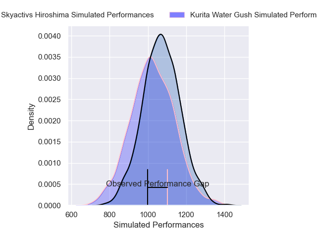
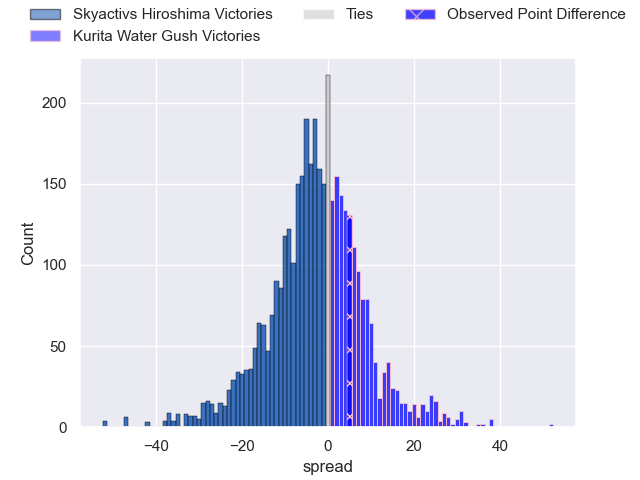
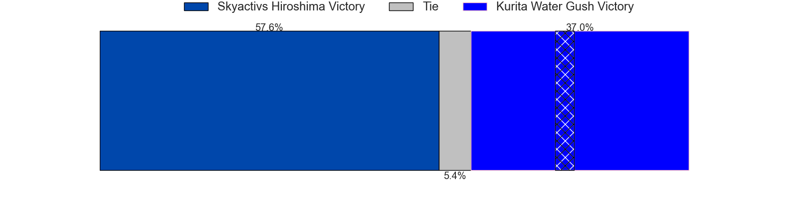
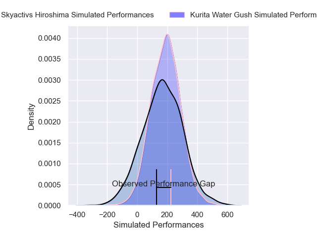
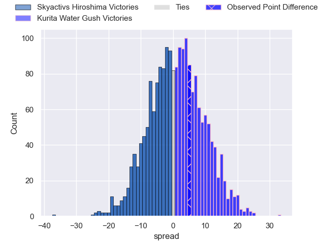
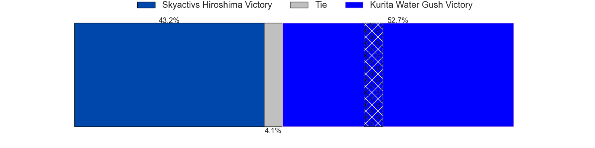

---  
layout: page  
title: Skyactivs Hiroshima at Kurita Water Gush; 18-23  
date: 2025-03-28 18:00:00 -0500  
categories: "Japan Rugby League One D3 24/25" match review  
---
# Skyactivs Hiroshima at Kurita Water Gush; 18-23

# Club Level Predictions

The first set of predictions treats a club as the smallest object, as the club develops its members, organizes a gameplan, and deploys its players as needed for each match. This club model has a prediction of 0.445, which translates to predicting Skyactivs Hiroshima to win by 2.0.

Our Over/Under is 58.5 - and combined with the spread above, we have a predicted scoreline of 30 to 28

Each club has a rating and a rating deviation (similar to a Glicko rating), and expected performances can be generated. This allows for simulated matches and spreads like the ones below.
## Projected Performances - Club Model

## Projected Spreads - Club Model

## Projected Results - Club Model

# Player Level Predictions

Treating teams instead as an entity made up of the currently active players, I have ratings for each player in an altogether different system. These can be combined to form team ratings once teamsheets are announced, weighting starters a bit higher than the reserves. After the match is played, players can be weighted by their minutes on the field, allowing for an accurate measure of the team's composition. With these compiled team ratings, we can make predictions, measure inaccuracy, and update the individual player ratings.
## Prediction without Player Minutes: Kurita Water Gush by 4.2

Kurita Water Gush by 1.3 on a neutral pitch

## Projected Performances - Player Model

## Projected Spreads - Player Model

## Projected Results - Player Model

|   Away Minutes | Away Player       |   Away Percentile |   Number |   Home Percentile | Home Player      |   Home Minutes |
|---------------:|:------------------|------------------:|---------:|------------------:|:-----------------|---------------:|
|           80   | Koshi Kato        |             75.87 |        1 |             62.15 | Kei Takusagawa   |           67   |
|           80   | Taichi Yokoo      |             38.23 |        2 |             54.92 | Kota Hojo        |           59   |
|           34.5 | Tomoya Otake      |             76.74 |        3 |             77.76 | Rui Kuriyama     |           80   |
|           34.5 | Yutaro Tanaka     |             90.93 |        4 |             72.9  | Kota Nakamura    |           50   |
|           37   | Andrew Davidson   |             75.35 |        5 |             74.5  | Daymon Leasuasu  |           80   |
|           18   | Jackson Pugh      |             82.54 |        6 |             55.15 | Kengo Nakamura   |           80   |
|           29   | Tomoki Ashida     |             80.22 |        7 |             74.65 | Taisei Nakao     |           19   |
|           80   | Tevin Ferris      |             76.53 |        8 |             68.78 | Harrison Brewer  |           30   |
|           14   | Taiyo Fukuyama    |             70.02 |        9 |             49.08 | Kakeru Sugihara  |           30   |
|           80   | Issen Kano        |             56.56 |       10 |             62.3  | Piers Francis    |           17   |
|           26   | Kaito Sasaoka     |             76.99 |       11 |             53.79 | Keigo Hamazoe    |           80   |
|           47   | Jacob Abel        |             63.22 |       12 |             71.43 | Leo Gordon       |           80   |
|           32.5 | Clynton Knox      |             41.24 |       13 |             65.86 | So Matsushima    |            2   |
|           37   | Yuto Nakamura     |             70.06 |       14 |             56.56 | Ryo Hosomoto     |           19   |
|           80   | Ginjiro Sakiguchi |             62.42 |       15 |             67.27 | Yuta Sugiyama    |           11   |
|           80   | Tomohiro Takeda   |             76.46 |       16 |            nan    | Ryota Kuribara   |            9.5 |
|           80   | Tomonori Koyanagi |            nan    |       17 |            nan    | Aki Kajihara     |           14   |
|           80   | Haruki Umemoto    |             79.42 |       18 |            nan    | Masashi Debuchi  |           14   |
|           80   | Ramo Sato         |             63.93 |       19 |            nan    | Yoji Shiina      |           14   |
|           80   | Iori Suzuki       |            nan    |       20 |            nan    | Hiroki Kawase    |           14   |
|           21   | Syoya Maeda       |             61.98 |       21 |            nan    | Ryo Omasa        |           16   |
|           80   | Hitaka Inoue      |             68.44 |       22 |            nan    | Takuro Hayashida |           64   |
|           60   | Soopyung Lee      |             44.58 |       23 |            nan    | Katsuki Ishizuka |           57   |

