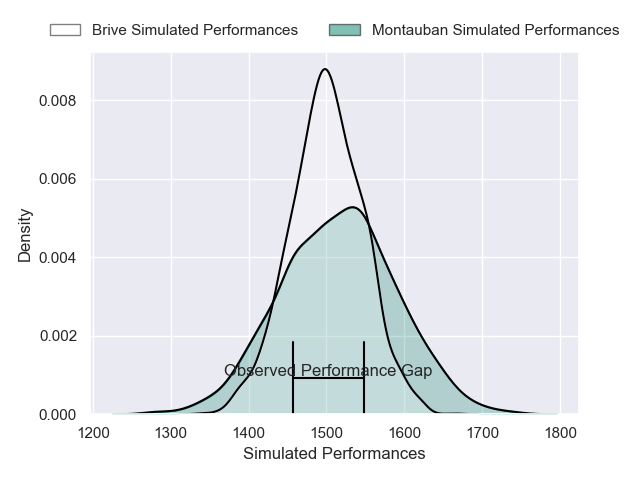
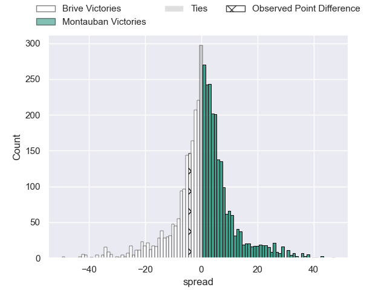
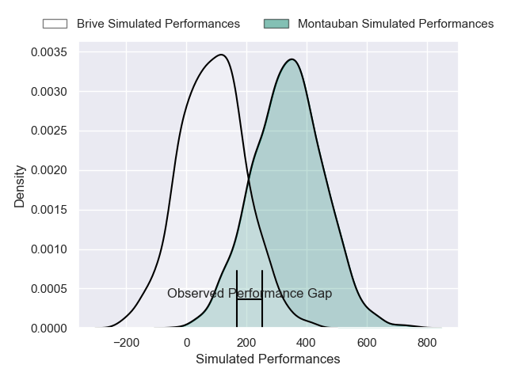
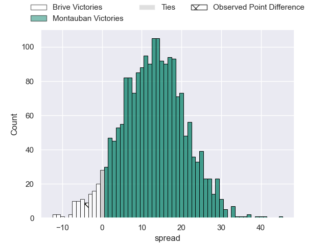
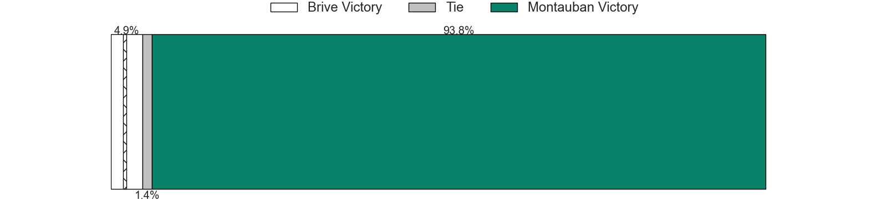

---  
layout: page  
title: Brive at Montauban; 21-17  
date: 2025-03-28 18:00:00 -0500  
categories: "Pro D2 24/25" match review  
---
# Brive at Montauban; 21-17

# Club Level Predictions

The first set of predictions treats a club as the smallest object, as the club develops its members, organizes a gameplan, and deploys its players as needed for each match. This club model has a prediction of 0.524, which translates to predicting Montauban to win by 0.8.

Our Over/Under is 53.5 - and combined with the spread above, we have a predicted scoreline of 26 to 27

Each club has a rating and a rating deviation (similar to a Glicko rating), and expected performances can be generated. This allows for simulated matches and spreads like the ones below.
## Projected Performances - Club Model

## Projected Spreads - Club Model

## Projected Results - Club Model

# Player Level Predictions

Treating teams instead as an entity made up of the currently active players, I have ratings for each player in an altogether different system. These can be combined to form team ratings once teamsheets are announced, weighting starters a bit higher than the reserves. After the match is played, players can be weighted by their minutes on the field, allowing for an accurate measure of the team's composition. With these compiled team ratings, we can make predictions, measure inaccuracy, and update the individual player ratings.
## Prediction without Player Minutes: Montauban by 10.7

Brive by 0.4 on a neutral pitch

## Projected Performances - Player Model

## Projected Spreads - Player Model

## Projected Results - Player Model

|   Away Minutes | Away Player               |   Away Percentile |   Number |   Home Percentile | Home Player           |   Home Minutes |
|---------------:|:--------------------------|------------------:|---------:|------------------:|:----------------------|---------------:|
|       80       | Vakh Abdaladze            |             68.85 |        1 |             38.33 | Léo Aouf              |        30      |
|       80       | Lucas Da Silva            |             66.78 |        2 |             21.7  | Kévin Firmin          |        80      |
|       62       | Marcel Van Der Merwe      |             65.46 |        3 |             27.76 | Tietie Tuimauga       |        80      |
|       80       | Retief Marais             |             66.34 |        4 |             14.73 | Tjiuee Uanivi         |        62      |
|       80       | Asier Usarraga            |             66.34 |        5 |             25.78 | Victor Moreaux        |        80      |
|       80       | Ross Moriarty             |             67.6  |        6 |             23.96 | Fred Quercy           |        80      |
|        0       | Courtney Lawes            |             96.66 |        7 |             28.23 | Kyllian Ringuet       |        61      |
|       29       | Taniela Sadrugu           |             50.2  |        8 |             73.27 | Sikhumbuzo Notshe     |        80      |
|        0       | Mathis Ferté              |             45.9  |        9 |             31.83 | Hugo Zabalza          |        51      |
|       27       | Stuart Olding             |             45.08 |       10 |             22.34 | Jérôme Bosviel        |        80      |
|       31       | Erwan Dridi               |             56.19 |       11 |             25.88 | Josua Vici            |        80      |
|       80       | Paul Pimienta             |             63.42 |       12 |             28.77 | Simon Renda           |        51      |
|       31       | Georges Shvelidze         |             58.56 |       13 |             32.62 | Jt Jackson            |        34.5    |
|       11       | Benjamin Lefranc          |             49.54 |       14 |             95.29 | Stephane Ahmed        |         0      |
|       13       | Curwin Bosch              |             87.07 |       15 |             43.54 | Baptiste Mouchous     |         0      |
|       31       | Nathan Fraissenon         |            nan    |       16 |            nan    | Vakhtang Jintcharadze |         0      |
|        3.33333 | Simon-Pierre Chauvac      |             15.14 |       17 |            nan    | Lucas Seyrolle        |        66      |
|       17       | Konstantin Mikautadze     |              6.61 |       18 |            nan    | Lewis Bean            |        27      |
|       40       | Samuel Maximin            |            nan    |       19 |            nan    | Karl Wilkins          |        16.3333 |
|       40       | Rahboni Warren-Vosayaco   |            nan    |       20 |            nan    | Tyrone Viiga          |        49      |
|       49       | Maxime Sidobre            |            nan    |       21 |            nan    | Joe Powell            |        49      |
|       49       | Maxence Biasotto          |            nan    |       22 |            nan    | Maxime Espeut         |        80      |
|       49       | Francisco Coria Marchetti |            nan    |       23 |            nan    | Facundo Pomponio      |        62      |

