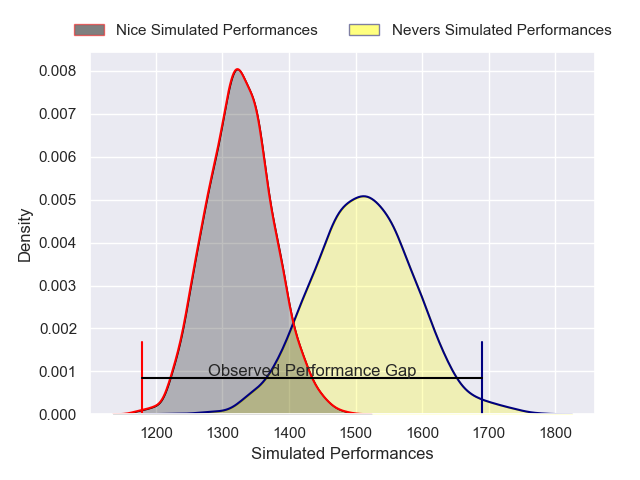
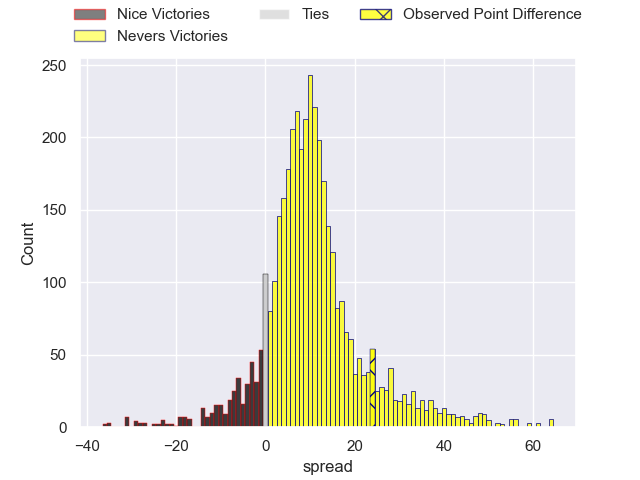
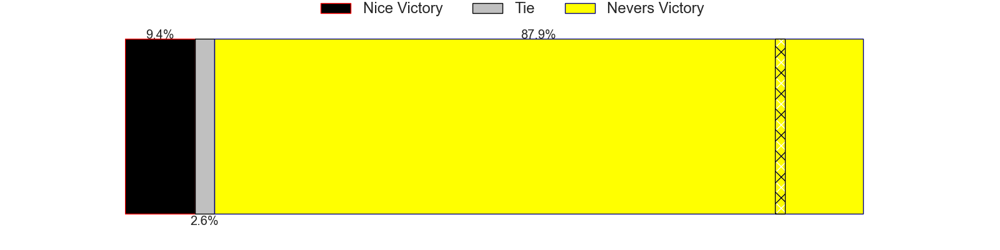
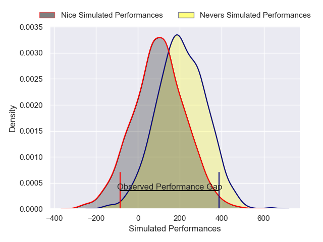
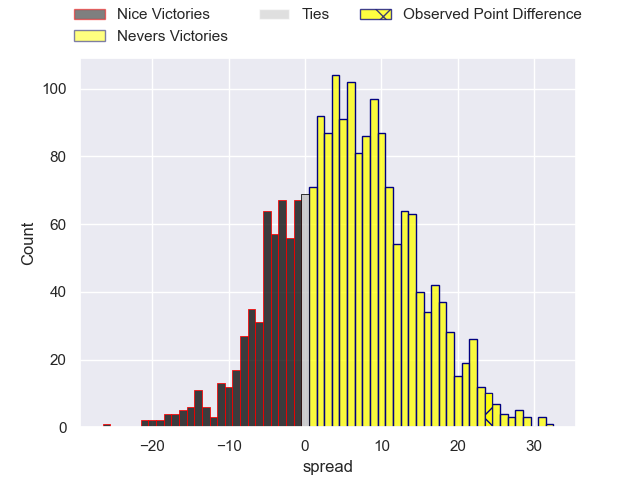
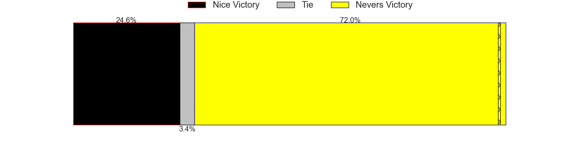

---  
layout: page  
title: Nice at Nevers; 24-48  
date: 2025-03-28 18:00:00 -0500  
categories: "Pro D2 24/25" match review  
---
# Nice at Nevers; 24-48

# Club Level Predictions

The first set of predictions treats a club as the smallest object, as the club develops its members, organizes a gameplan, and deploys its players as needed for each match. This club model has a prediction of 0.747, which translates to predicting Nevers to win by 9.5.

Our Over/Under is 60.5 - and combined with the spread above, we have a predicted scoreline of 26 to 35

Each club has a rating and a rating deviation (similar to a Glicko rating), and expected performances can be generated. This allows for simulated matches and spreads like the ones below.
## Projected Performances - Club Model

## Projected Spreads - Club Model

## Projected Results - Club Model

# Player Level Predictions

Treating teams instead as an entity made up of the currently active players, I have ratings for each player in an altogether different system. These can be combined to form team ratings once teamsheets are announced, weighting starters a bit higher than the reserves. After the match is played, players can be weighted by their minutes on the field, allowing for an accurate measure of the team's composition. With these compiled team ratings, we can make predictions, measure inaccuracy, and update the individual player ratings.
## Prediction without Player Minutes: Nevers by 7.4

Nevers by 2.3 on a neutral pitch

## Projected Performances - Player Model

## Projected Spreads - Player Model

## Projected Results - Player Model

|   Away Minutes | Away Player        |   Away Percentile |   Number |   Home Percentile | Home Player                |   Home Minutes |
|---------------:|:-------------------|------------------:|---------:|------------------:|:---------------------------|---------------:|
|             24 | Facundo Gigena     |              7.02 |        1 |             61.36 | Aitor Kitutu               |             64 |
|             80 | Pierre Strippoli   |             28.38 |        2 |             52.09 | Jean-Maxence Jules-Rosette |             25 |
|             38 | Tom Ross           |              3.39 |        3 |             64.43 | Cleopas Kundiona           |             80 |
|             20 | Tom Murday         |             42.97 |        4 |             62.7  | Charlie Francoz            |             80 |
|             27 | Clément Chartier   |             41.45 |        5 |             58.45 | Chris Gabriel              |             53 |
|             27 | Hugo Sarrasin      |             39.93 |        6 |             63    | Julien Kazubek             |             80 |
|             40 | Bastien Berenguel  |             37.23 |        7 |             63    | Hugues Bastide             |             80 |
|             80 | Jordan Taufua      |             83.88 |        8 |             58.98 | Jason Fraser               |             80 |
|             20 | Jules Solinas      |             42.04 |        9 |             59.97 | Hugo Bouyssou              |             80 |
|             10 | Flavio Asquini     |             37.5  |       10 |             55.33 | Shaun Reynolds             |             80 |
|             62 | Baptiste Lafond    |             34.75 |       11 |             62.94 | Arthur Mathiron            |             80 |
|             45 | Tom Daly           |              8.81 |       12 |             52.99 | Léonard Paris              |             46 |
|             48 | Luca Cutayar       |             33.13 |       13 |             47.21 | Alivereti Loaloa           |             22 |
|             80 | Christiaan Erasmus |             32.16 |       14 |             45.33 | Johan Wasserman            |              0 |
|             80 | Andrzej Charlat    |             29.9  |       15 |             45.05 | Perry Mayo                 |              4 |
|             27 | Sacha Idoumi       |             12.19 |       16 |             59.27 | Stefan Buruiana            |              0 |
|             80 | Fabio Gonzalez     |            nan    |       17 |            nan    | Louis Chanet               |             40 |
|             80 | Thibaud Rey        |            nan    |       18 |             44.1  | Ugo Vignolles              |             50 |
|             80 | Martin Freytes     |            nan    |       19 |            nan    | Luka Plataret              |             50 |
|             80 | Louis Suaud        |            nan    |       20 |            nan    | Steven David               |             40 |
|             29 | Corentin Penc'Hoat |            nan    |       21 |            nan    | Simon Tarel                |             48 |
|             66 | Paul Auradou       |            nan    |       22 |            nan    | Atu Manu                   |             51 |
|             50 | Kévin Yaméogo      |            nan    |       23 |            nan    | Aselo Ikahehegi            |             27 |

