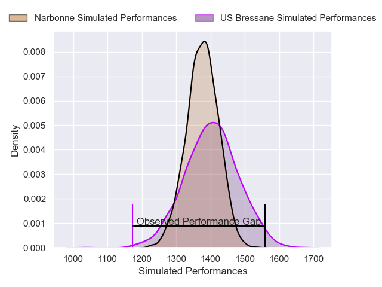
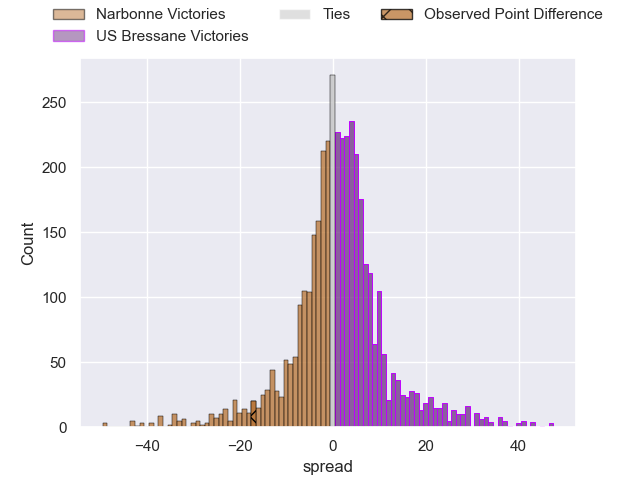
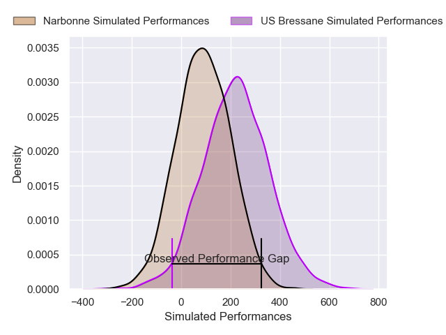
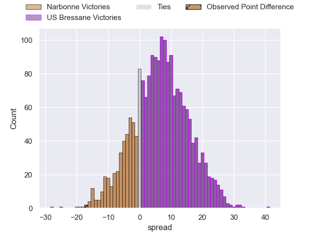
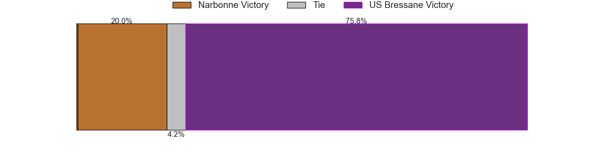

---  
layout: page  
title: Narbonne at US Bressane; 34-17  
date: 2025-03-28 18:00:00 -0500  
categories: "Nationale 24/25" match review  
---
# Narbonne at US Bressane; 34-17

# Club Level Predictions

The first set of predictions treats a club as the smallest object, as the club develops its members, organizes a gameplan, and deploys its players as needed for each match. This club model has a prediction of 0.534, which translates to predicting US Bressane to win by 1.2.

Our Over/Under is 48.5 - and combined with the spread above, we have a predicted scoreline of 24 to 25

Each club has a rating and a rating deviation (similar to a Glicko rating), and expected performances can be generated. This allows for simulated matches and spreads like the ones below.
## Projected Performances - Club Model

## Projected Spreads - Club Model

## Projected Results - Club Model

# Player Level Predictions

Treating teams instead as an entity made up of the currently active players, I have ratings for each player in an altogether different system. These can be combined to form team ratings once teamsheets are announced, weighting starters a bit higher than the reserves. After the match is played, players can be weighted by their minutes on the field, allowing for an accurate measure of the team's composition. With these compiled team ratings, we can make predictions, measure inaccuracy, and update the individual player ratings.
## Prediction without Player Minutes: US Bressane by 6.3

US Bressane by 0.8 on a neutral pitch

## Projected Performances - Player Model

## Projected Spreads - Player Model

## Projected Results - Player Model

|   Away Minutes | Away Player          |   Away Percentile |   Number |   Home Percentile | Home Player          |   Home Minutes |
|---------------:|:---------------------|------------------:|---------:|------------------:|:---------------------|---------------:|
|       30       | Gregory Fichten      |             26.74 |        1 |             21.45 | Téo Bordenave        |             80 |
|       30       | Clément Estériola    |             53.42 |        2 |             17.36 | Louis Dasalmartini   |             80 |
|       30       | Chris Talakai        |             56.62 |        3 |             36.36 | Nicolas Lemaire      |             28 |
|       38       | Marius Antonescu     |             54.49 |        4 |             21.95 | Thomas Déliance      |             80 |
|       13       | Leva Fifita          |              9.92 |        5 |             21.95 | Josh Peters          |             80 |
|       38       | Thibault Clauzade    |             58.87 |        6 |             25.26 | Nicolas Tachat       |             56 |
|       60       | Paul Belzons         |             58.96 |        7 |             19.41 | Quentin Witt         |             80 |
|        0       | Lopeti Timani        |             81.22 |        8 |             18.37 | Waël May             |             78 |
|       47       | Pierrick Nova        |             58.63 |        9 |             19.26 | Jérémy Valençot      |             80 |
|       80       | Gilles Bosch         |             59.02 |       10 |             18.03 | Fred Zeilinga        |             80 |
|       50       | Clément Clavières    |             55.08 |       11 |             41.27 | Elie De Fleurian     |              7 |
|       50       | Taiso Silafai-Leaana |             51.27 |       12 |             46.91 | Maxime Vacquier      |             22 |
|       80       | Peter Betham         |             58.05 |       13 |             41.49 | Alexandre Badet      |              0 |
|       42       | Pierre-Hugo Ducom    |             47.6  |       14 |             41.27 | Dimitri Doucet       |              7 |
|       67       | Boris Goutard        |             63.84 |       15 |             35.96 | Florent Massip       |             20 |
|       80       | Mehdi Boundjema      |            nan    |       16 |            nan    | Clément Jullien      |              0 |
|       80       | Théo Castinel        |            nan    |       17 |            nan    | Erich De Jager       |             33 |
|       50       | Darrel Dyer          |             42.4  |       18 |            nan    | Victor Fromentèze    |             73 |
|       42       | Dennis Visser        |            nan    |       19 |            nan    | Loic Baradel         |             80 |
|       28       | Pablo Barbaste       |            nan    |       20 |            nan    | Jérémie Martin       |             80 |
|       23       | Tom Chauvet          |            nan    |       21 |            nan    | Nathan Azaïs         |             80 |
|        3.33333 | Luke Nakobukobua     |            nan    |       22 |            nan    | Benjamin Doy         |             80 |
|       63       | Mohamed Loukia       |             34.62 |       23 |            nan    | Atonio Ulutuipalelei |             80 |

