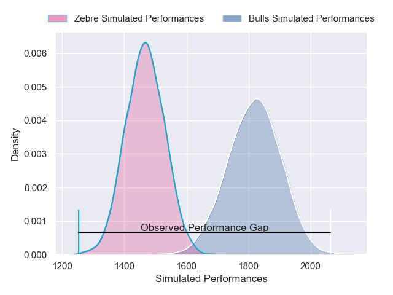
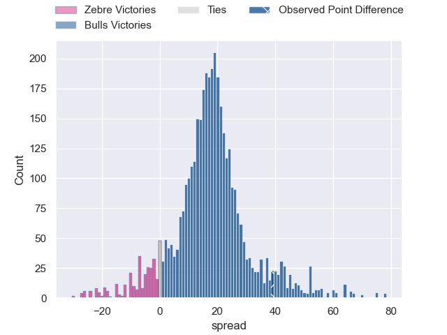
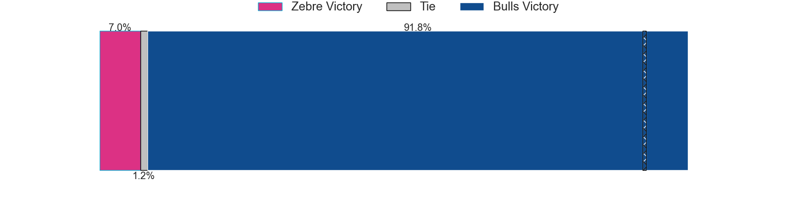
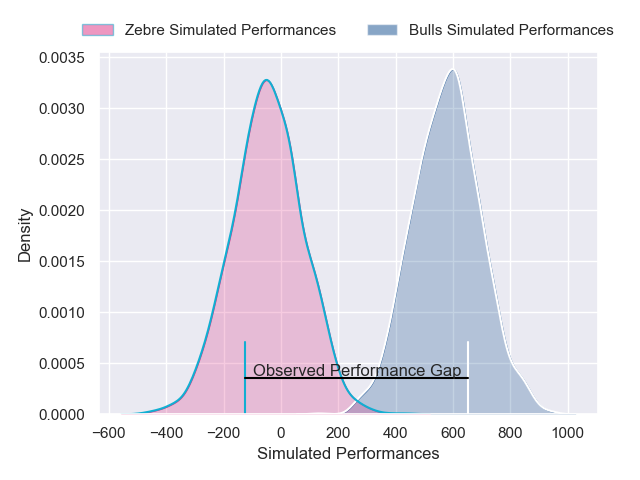
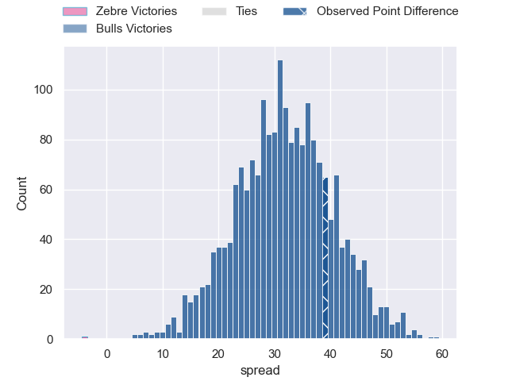

---  
layout: page  
title: Zebre at Bulls; 24-63  
date: 2025-03-29 18:00:00 -0500  
categories: "United Rugby Championship 24/25" match review  
---
# Zebre at Bulls; 24-63

# Club Level Predictions

The first set of predictions treats a club as the smallest object, as the club develops its members, organizes a gameplan, and deploys its players as needed for each match. This club model has a prediction of 0.881, which translates to predicting Bulls to win by 17.7.

Our Over/Under is 60.5 - and combined with the spread above, we have a predicted scoreline of 22 to 39

Each club has a rating and a rating deviation (similar to a Glicko rating), and expected performances can be generated. This allows for simulated matches and spreads like the ones below.
## Projected Performances - Club Model

## Projected Spreads - Club Model

## Projected Results - Club Model

# Player Level Predictions

Treating teams instead as an entity made up of the currently active players, I have ratings for each player in an altogether different system. These can be combined to form team ratings once teamsheets are announced, weighting starters a bit higher than the reserves. After the match is played, players can be weighted by their minutes on the field, allowing for an accurate measure of the team's composition. With these compiled team ratings, we can make predictions, measure inaccuracy, and update the individual player ratings.
## Prediction without Player Minutes: Bulls by 26.9

Bulls by 18.4 on a neutral pitch

## Projected Performances - Player Model

## Projected Spreads - Player Model

## Projected Results - Player Model

|   Away Minutes | Away Player            |   Away Percentile |   Number |   Home Percentile | Home Player         |   Home Minutes |
|---------------:|:-----------------------|------------------:|---------:|------------------:|:--------------------|---------------:|
|             40 | Luca Rizzoli           |             65.62 |        1 |             66.64 | Alulutho Tshakweni  |             62 |
|             31 | Luca Bigi              |             58.76 |        2 |             58.1  | Jan-Hendrik Wessels |             55 |
|             13 | Muhamed Hasa           |             25.32 |        3 |             79.73 | Mornay Smith        |             53 |
|             37 | Matteo Canali          |             80.08 |        4 |              3.68 | Ruan Vermaak        |             80 |
|             80 | Leonard Krumov         |              1.32 |        5 |             11.61 | JF van Heerden      |             30 |
|             29 | Guido Volpi            |             86.07 |        6 |             97.77 | Marcell Coetzee     |              7 |
|             80 | Iacopo Bianchi         |              2.79 |        7 |             89.79 | Jannes Kirsten      |             80 |
|             80 | Bautista Stavile       |              9.59 |        8 |             43.27 | Celimpilo Gumede    |             57 |
|             80 | Alessandro Fusco       |              2.18 |        9 |             93.3  | Zak Burger          |             65 |
|             56 | Giovanni Montemauri    |              1.02 |       10 |             10.86 | Keagan Johannes     |             57 |
|             80 | Alessandro Gesi        |             29.94 |       11 |             75.23 | Stravino Jacobs     |             16 |
|             80 | Enrico Lucchin         |             69.81 |       12 |             95.04 | Harold Vorster      |             80 |
|             80 | Filippo Drago          |             37.89 |       13 |             83.79 | David Kriel         |              0 |
|             80 | Jacopo Trulla          |              6.56 |       14 |             95.38 | Sergeal Petersen    |             80 |
|             21 | Geronimo Prisciantelli |             90.91 |       15 |             90.1  | Devon Williams      |             43 |
|             80 | Tommaso Di Bartolomeo  |             62.27 |       16 |             97.33 | Akker van der Merwe |             80 |
|             80 | Paolo Buonfiglio       |             34.86 |       17 |             81.39 | Simphiwe Matanzima  |             24 |
|             25 | Juan Pitinari          |             31.07 |       18 |             98.19 | Wilco Louw          |             77 |
|             27 | Francesco Ruffolo      |            nan    |       19 |             85.17 | Ruan Nortje         |             80 |
|             11 | Giacomo Ferrari        |             55.51 |       20 |             94.61 | Marco van Staden    |             56 |
|             10 | Ratko Jelic            |            nan    |       21 |             93.06 | Nizaam Carr         |             69 |
|             21 | Giacomo Da Re          |             11.92 |       22 |             92.63 | Embrose Papier      |             34 |
|              0 | Damiano Mazza          |             65.15 |       23 |             70.9  | Boeta Chamberlain   |             25 |

