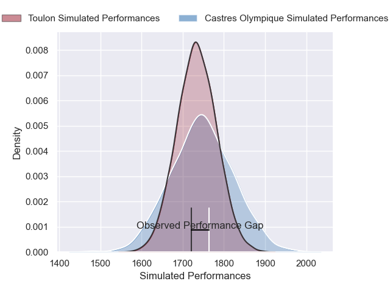
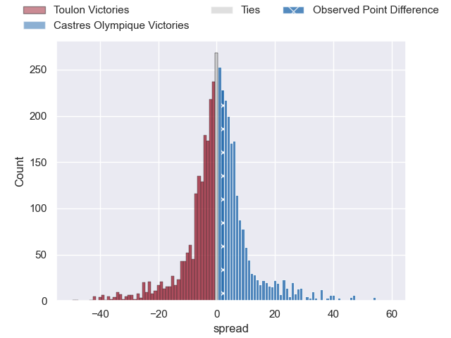
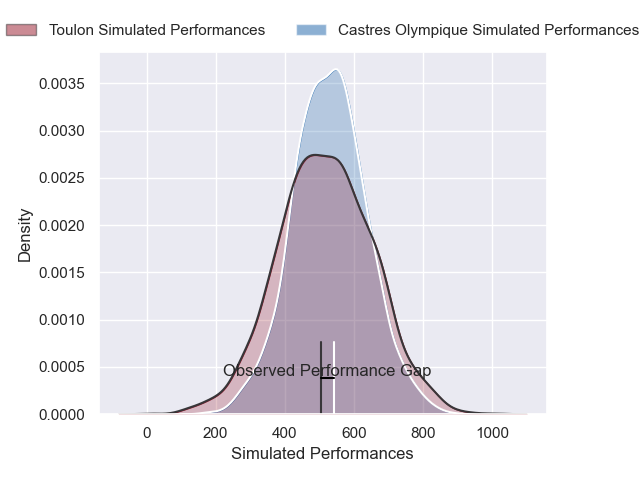
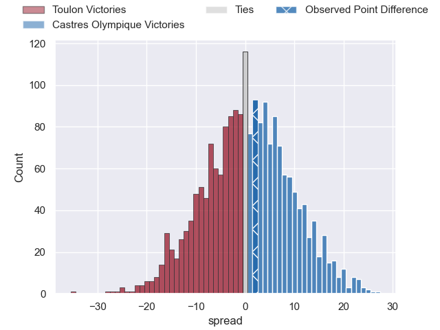

---  
layout: page  
title: Toulon at Castres Olympique; 26-28  
date: 2025-03-29 18:00:00 -0500  
categories: "Top 14 Orange 24/25" match review  
---
# Toulon at Castres Olympique; 26-28

# Club Level Predictions

The first set of predictions treats a club as the smallest object, as the club develops its members, organizes a gameplan, and deploys its players as needed for each match. This club model has a prediction of 0.516, which translates to predicting Castres Olympique to win by 0.6.

Our Over/Under is 50.5 - and combined with the spread above, we have a predicted scoreline of 25 to 25

Each club has a rating and a rating deviation (similar to a Glicko rating), and expected performances can be generated. This allows for simulated matches and spreads like the ones below.
## Projected Performances - Club Model

## Projected Spreads - Club Model

## Projected Results - Club Model

# Player Level Predictions

Treating teams instead as an entity made up of the currently active players, I have ratings for each player in an altogether different system. These can be combined to form team ratings once teamsheets are announced, weighting starters a bit higher than the reserves. After the match is played, players can be weighted by their minutes on the field, allowing for an accurate measure of the team's composition. With these compiled team ratings, we can make predictions, measure inaccuracy, and update the individual player ratings.
## Prediction without Player Minutes: Castres Olympique by 10.1

Toulon by 4.2 on a neutral pitch

## Projected Performances - Player Model

## Projected Spreads - Player Model

## Projected Results - Player Model

|   Away Minutes | Away Player        |   Away Percentile |   Number |   Home Percentile | Home Player           |   Home Minutes |
|---------------:|:-------------------|------------------:|---------:|------------------:|:----------------------|---------------:|
|          80    | Jean-Baptiste Gros |             98.34 |        1 |             65.54 | Quentin Walcker       |          47    |
|          80    | Gianmarco Lucchesi |             87.48 |        2 |             85.64 | Gaetan Barlot         |          54    |
|          49    | Beka Gigashvili    |             68.22 |        3 |             87.38 | Levan Chilachava      |           0    |
|          80    | Corentin Mezou     |             69.41 |        4 |             38.81 | Guillaume Ducat       |          80    |
|          37    | Swan Rebbadj       |             77.05 |        5 |             94.71 | Florent Vanverberghe  |          80    |
|          80    | Matteo Le Corvec   |             88.95 |        6 |             63.14 | Mathieu Babillot      |          31    |
|          80    | Jules Coulon       |             70.38 |        7 |             90.99 | Baptiste Delaporte    |          19    |
|          80    | Selevasio Tolofua  |             81.63 |        8 |             71.63 | Abraham Papali'i      |          80    |
|          31    | Ben White          |             96.48 |        9 |             61.81 | Santiago Arata        |          49    |
|          24.25 | Dan Biggar         |             98.77 |       10 |             81.56 | Louis Le Brun         |          15    |
|          80    | Gabin Villiere     |             94.92 |       11 |             94.09 | Remy Baget            |          19    |
|          80    | Oliver Cowie       |             49.65 |       12 |             97.16 | Jack Goodhue          |          10    |
|          61    | Seta Tuicuvu       |             64.24 |       13 |             71.94 | Vilimoni Botitu       |          31    |
|          80    | Jiuta Wainiqolo    |             93.35 |       14 |             75.51 | Christian Ambadiang   |           9    |
|           0    | Marius Domon       |             74.34 |       15 |             98.38 | Geoffrey Palis        |          16    |
|          80    | Mickael Ivaldi     |             95.33 |       16 |             17.03 | Loris Zarantonello    |          61    |
|          26    | Dany Priso         |             94.64 |       17 |             72.32 | Lois Guerois-Galisson |          80    |
|          26    | Dany Priso         |             94.64 |       17 |             72.32 | Lois Guerois-Galisson |          56    |
|          59    | Brian Alainu'uese  |             83.47 |       18 |             96.51 | Leone Nakarawa        |          24.25 |
|          24.25 | Lewis Ludlam       |             80.13 |       19 |             48.93 | Baptiste Cope         |          31    |
|          40    | Ma'a Nonu          |             87.13 |       20 |             90.12 | Jeremy Fernandez      |          31    |
|          40    | Jules Danglot      |             60.97 |       21 |             93.82 | Adrea Cocagi          |          24    |
|          80    | Melvyn Jaminet     |             92.32 |       22 |             57.78 | Theo Chabouni         |          56    |
|          70    | Kyle Sinckler      |             97.48 |       23 |             89.83 | Will Collier          |          53    |

