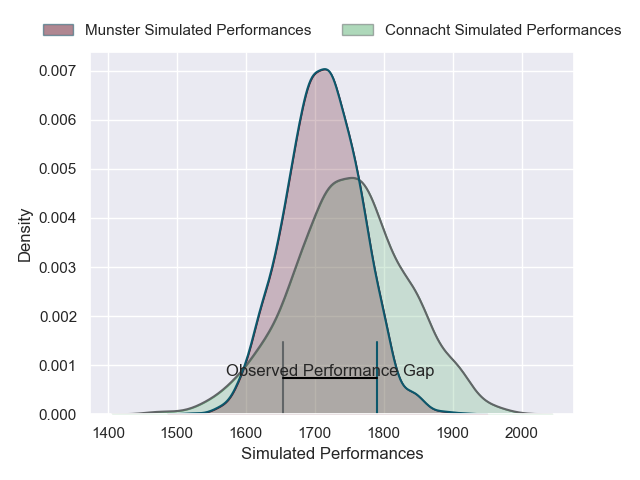
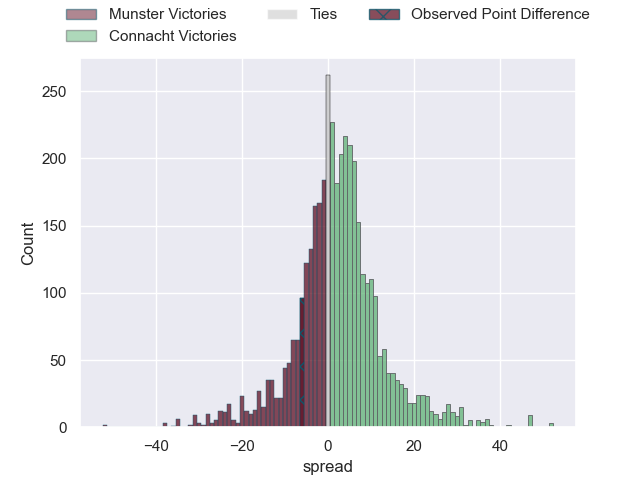
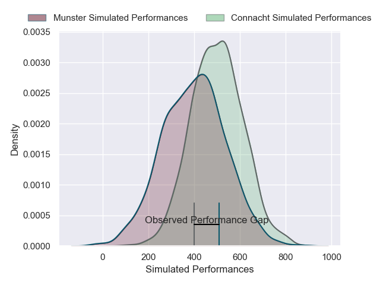
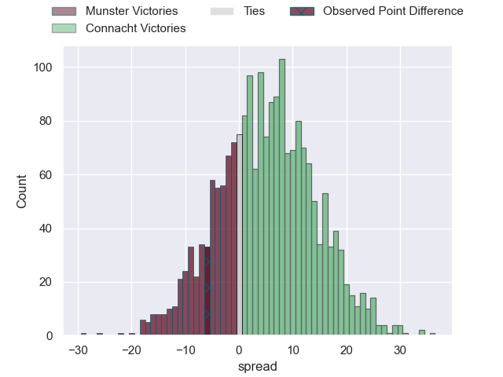
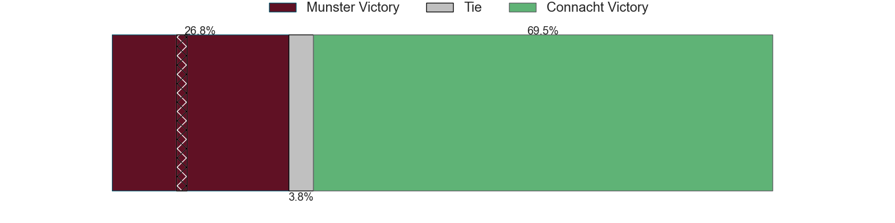

---  
layout: page  
title: Munster at Connacht; 30-24  
date: 2025-03-29 18:00:00 -0500  
categories: "United Rugby Championship 24/25" match review  
---
# Munster at Connacht; 30-24

# Club Level Predictions

The first set of predictions treats a club as the smallest object, as the club develops its members, organizes a gameplan, and deploys its players as needed for each match. This club model has a prediction of 0.552, which translates to predicting Connacht to win by 1.8.

Our Over/Under is 53.5 - and combined with the spread above, we have a predicted scoreline of 26 to 28

Each club has a rating and a rating deviation (similar to a Glicko rating), and expected performances can be generated. This allows for simulated matches and spreads like the ones below.
## Projected Performances - Club Model

## Projected Spreads - Club Model

## Projected Results - Club Model

# Player Level Predictions

Treating teams instead as an entity made up of the currently active players, I have ratings for each player in an altogether different system. These can be combined to form team ratings once teamsheets are announced, weighting starters a bit higher than the reserves. After the match is played, players can be weighted by their minutes on the field, allowing for an accurate measure of the team's composition. With these compiled team ratings, we can make predictions, measure inaccuracy, and update the individual player ratings.
## Prediction without Player Minutes: Connacht by 11.3

Connacht by 3.0 on a neutral pitch

## Projected Performances - Player Model

## Projected Spreads - Player Model

## Projected Results - Player Model

|   Away Minutes | Away Player      |   Away Percentile |   Number |   Home Percentile | Home Player           |   Home Minutes |
|---------------:|:-----------------|------------------:|---------:|------------------:|:----------------------|---------------:|
|             25 | Jeremy Loughman  |             91.32 |        1 |             45.19 | Jordan Duggan         |             40 |
|             10 | Diarmuid Barron  |             82.14 |        2 |             33.39 | Dave Heffernan        |             80 |
|             74 | Oli Jager        |             86.51 |        3 |             91.96 | Finlay Bealham        |             80 |
|             69 | Fineen Wycherley |             18.89 |        4 |             94.24 | Joe Joyce             |             80 |
|             80 | Tadhg Beirne     |             99.43 |        5 |             56.75 | Darragh Murray        |             10 |
|             80 | Thomas Ahern     |             12.53 |        6 |             34.08 | Cian Prendergast      |             18 |
|             80 | John Hodnett     |             22.84 |        7 |             57.75 | Shamus Hurley-Langton |             80 |
|             80 | Gavin Coombes    |             76.73 |        8 |             10.41 | Sean Jansen           |             14 |
|             69 | Craig Casey      |             77.22 |        9 |             82.24 | Caolin Blade          |             74 |
|             11 | Jack Crowley     |             21.31 |       10 |             82.38 | Josh Ioane            |              0 |
|             80 | Seán O'Brien     |             64.88 |       11 |             59.89 | Finn Treacy           |             32 |
|             80 | Alex Nankivell   |             93.52 |       12 |             99.59 | Bundee Aki            |             21 |
|             71 | Tom Farrell      |             51.06 |       13 |             38.2  | Hugh Gavin            |             24 |
|             41 | Calvin Nash      |             93.72 |       14 |             44.55 | Chay Mullins          |             18 |
|             31 | Ben O'Connor     |             17.98 |       15 |             80.61 | Mack Hansen           |             23 |
|             49 | Niall Scannell   |             87.31 |       16 |             70.12 | Dylan Tierney-Martin  |             56 |
|              9 | Josh Wycherley   |             13.17 |       17 |             92.9  | Denis Buckley         |             50 |
|             44 | Stephen Archer   |             98.42 |       18 |             62.54 | Jack Aungier          |              6 |
|             80 | Jean Kleyn       |             98.96 |       19 |             94.33 | Josh Murphy           |             50 |
|             80 | Ruadhan Quinn    |             23.58 |       20 |             60.2  | Paul Boyle            |             67 |
|             80 | Conor Murray     |             99.33 |       21 |             50.25 | Matthew Devine        |             69 |
|              9 | Rory Scannell    |             95.74 |       22 |             90.37 | JJ Hanrahan           |             80 |
|             80 | Alex Kendellen   |             89.14 |       23 |             98.06 | Santiago Cordero      |             80 |

