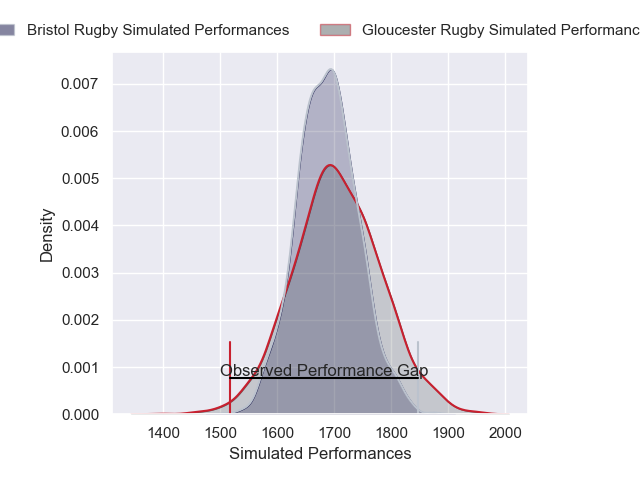
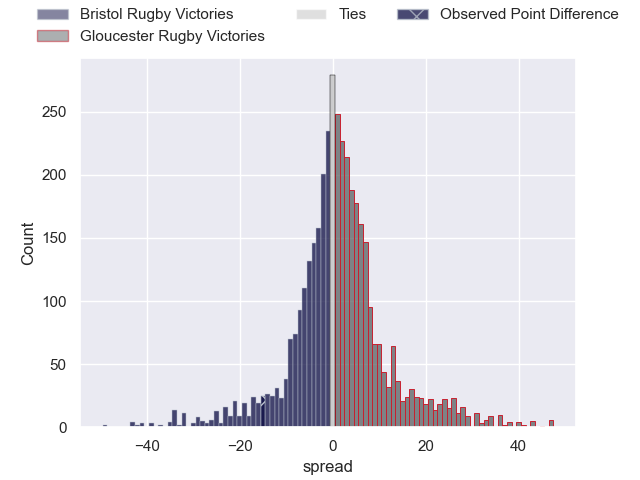
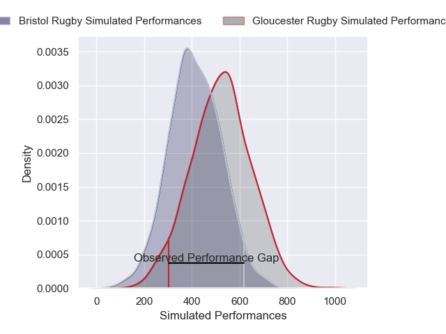
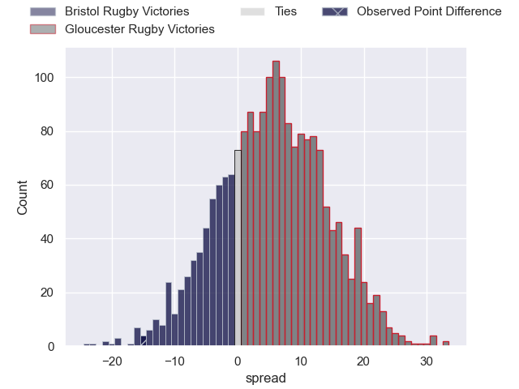
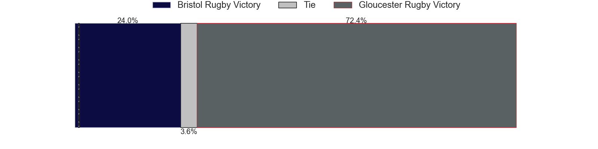

---  
layout: page  
title: Bristol Rugby at Gloucester Rugby; 28-13  
date: 2025-03-29 18:00:00 -0500  
categories: "Gallagher Premiership 24/25" match review  
---
# Bristol Rugby at Gloucester Rugby; 28-13

# Club Level Predictions

The first set of predictions treats a club as the smallest object, as the club develops its members, organizes a gameplan, and deploys its players as needed for each match. This club model has a prediction of 0.526, which translates to predicting Gloucester Rugby to win by 0.9.

Our Over/Under is 66.5 - and combined with the spread above, we have a predicted scoreline of 33 to 34

Each club has a rating and a rating deviation (similar to a Glicko rating), and expected performances can be generated. This allows for simulated matches and spreads like the ones below.
## Projected Performances - Club Model

## Projected Spreads - Club Model

## Projected Results - Club Model

# Player Level Predictions

Treating teams instead as an entity made up of the currently active players, I have ratings for each player in an altogether different system. These can be combined to form team ratings once teamsheets are announced, weighting starters a bit higher than the reserves. After the match is played, players can be weighted by their minutes on the field, allowing for an accurate measure of the team's composition. With these compiled team ratings, we can make predictions, measure inaccuracy, and update the individual player ratings.
## Prediction without Player Minutes: Bristol Rugby by 0.6

Bristol Rugby by 16.5 on a neutral pitch

## Projected Performances - Player Model

## Projected Spreads - Player Model

## Projected Results - Player Model

|   Away Minutes | Away Player                |   Away Percentile |   Number |   Home Percentile | Home Player       |   Home Minutes |
|---------------:|:---------------------------|------------------:|---------:|------------------:|:------------------|---------------:|
|             24 | Ellis Genge                |             83.52 |        1 |             83.99 | Val Rapava-Ruskin |             80 |
|             24 | Gabriel Oghre              |             84.14 |        2 |             90.32 | Jack Singleton    |             64 |
|             80 | Max Lahiff                 |             85.17 |        3 |             82.57 | Afolabi Fasogban  |             75 |
|             75 | James Dun                  |             97.36 |        4 |             22.47 | Freddie Clarke    |             31 |
|             18 | Paddy Pearce               |             24.74 |        5 |             59.96 | Freddie Thomas    |             35 |
|             28 | Steven Luatua              |            100    |        6 |              7.34 | Jack Clement      |             39 |
|             10 | Fitz Harding               |             97.12 |        7 |             14.86 | Lewis Ludlow      |             44 |
|             65 | Viliame Mata               |             27.96 |        8 |             70.82 | Ruan Ackermann    |             40 |
|             18 | Harry Randall              |             96.31 |        9 |             73.53 | Tomos Williams    |             59 |
|              6 | Harry Byrne                |             89.75 |       10 |             80.53 | Charlie Atkinson  |             31 |
|              6 | Harry Byrne                |             89.75 |       10 |             80.53 | Charlie Atkinson  |             80 |
|             48 | Kalaveti Ravouvou          |             89.56 |       11 |             85.77 | Josh Hathaway     |             57 |
|             80 | James Williams             |             84.9  |       12 |             44.28 | Seb Atkinson      |             55 |
|             80 | James Williams             |             84.9  |       12 |             44.28 | Seb Atkinson      |             80 |
|             64 | Benhard Janse van Rensburg |             98.18 |       13 |             46.3  | Chris Harris      |             80 |
|             80 | Jack Bates                 |             40.02 |       14 |             97.6  | Christian Wade    |             80 |
|             62 | Richard Lane               |             67.88 |       15 |             85.86 | Santiago Carreras |             80 |
|             59 | Harry Thacker              |             74.46 |       16 |             76.29 | Seb Blake         |             62 |
|             42 | Jake Woolmore              |             95.43 |       17 |              6.28 | Ciaran Knight     |             27 |
|             54 | Jimmy Halliwell            |            nan    |       18 |             88.33 | Kirill Gotovtsev  |             31 |
|             40 | Benjamin Grondona          |             77.35 |       19 |             97.17 | Cameron Jordan    |             31 |
|             18 | Jake Heenan                |             57.57 |       20 |             74.93 | Harry Taylor      |              0 |
|             21 | Kieran Marmion             |             95.64 |       21 |             36.85 | Caolan Englefield |             31 |
|             65 | AJ MacGinty                |             97.13 |       22 |             34.45 | William Butler    |             22 |
|             59 | Ratu Naulago               |             81.24 |       23 |             57.58 | George Barton     |              9 |

