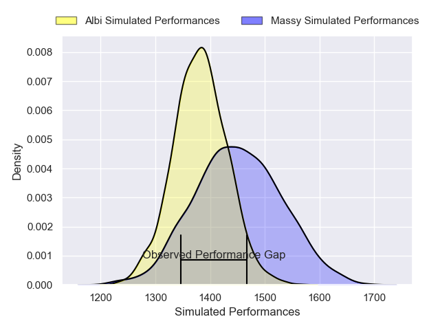
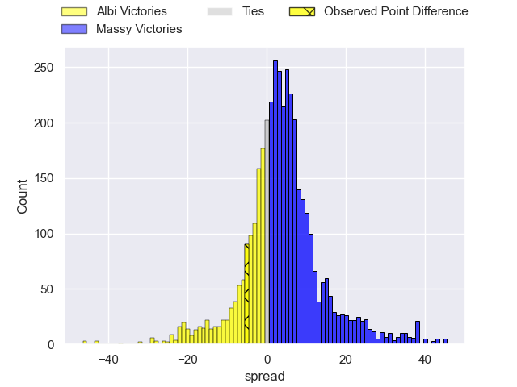
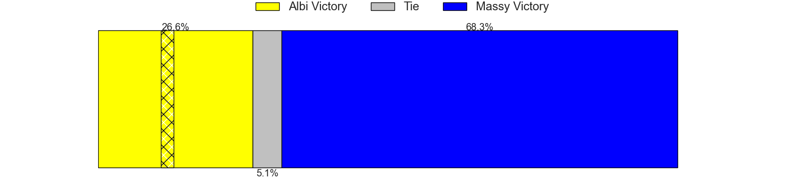
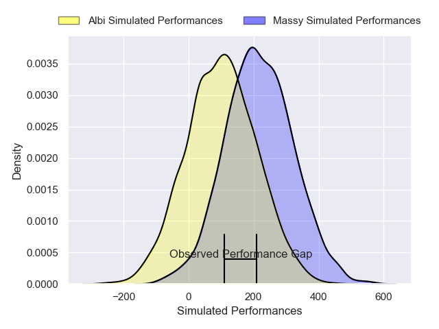
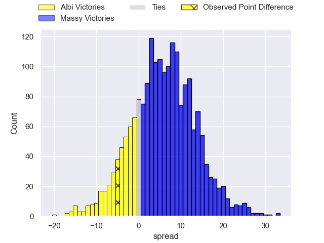
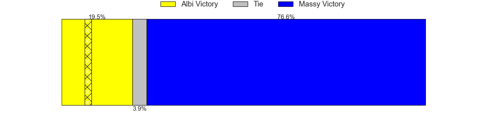

---  
layout: page  
title: Albi at Massy; 30-25  
date: 2025-03-29 18:00:00 -0500  
categories: "Nationale 24/25" match review  
---
# Albi at Massy; 30-25

# Club Level Predictions

The first set of predictions treats a club as the smallest object, as the club develops its members, organizes a gameplan, and deploys its players as needed for each match. This club model has a prediction of 0.596, which translates to predicting Massy to win by 3.4.

Our Over/Under is 48.5 - and combined with the spread above, we have a predicted scoreline of 23 to 26

Each club has a rating and a rating deviation (similar to a Glicko rating), and expected performances can be generated. This allows for simulated matches and spreads like the ones below.
## Projected Performances - Club Model

## Projected Spreads - Club Model

## Projected Results - Club Model

# Player Level Predictions

Treating teams instead as an entity made up of the currently active players, I have ratings for each player in an altogether different system. These can be combined to form team ratings once teamsheets are announced, weighting starters a bit higher than the reserves. After the match is played, players can be weighted by their minutes on the field, allowing for an accurate measure of the team's composition. With these compiled team ratings, we can make predictions, measure inaccuracy, and update the individual player ratings.
## Prediction without Player Minutes: Massy by 5.5

Albi by 0.7 on a neutral pitch

## Projected Performances - Player Model

## Projected Spreads - Player Model

## Projected Results - Player Model

|   Away Minutes | Away Player         |   Away Percentile |   Number |   Home Percentile | Home Player            |   Home Minutes |
|---------------:|:--------------------|------------------:|---------:|------------------:|:-----------------------|---------------:|
|             23 | Antoine Soave       |             57.49 |        1 |             74.53 | Siegfried Fisi'ihoi    |             80 |
|             80 | Arthur Castant      |             67.78 |        2 |             41.24 | Nolan Pienaar          |             27 |
|             13 | Maks Van Dyk        |             58.99 |        3 |             39.43 | Tijde Visser           |             80 |
|             32 | Yanis Horvat        |             78.85 |        4 |             58.07 | Saba Pesvianidze       |             55 |
|             27 | Jonathan Kpoku      |             54.39 |        5 |             57.51 | Andrei Mahu            |             80 |
|              8 | Robin Dioné         |             50.7  |        6 |             47.54 | Hugo Boutin            |             49 |
|             62 | Mattéo Coustalat    |             61.93 |        7 |             32.87 | Clément Vidoni         |             65 |
|              0 | Guillem Calmon      |             42.14 |        8 |             46.12 | Giani Gamba            |             29 |
|             51 | Gilen Queheille     |             57.96 |        9 |             35.18 | Julien Blanc           |             80 |
|             51 | Victor Pisano       |             52.05 |       10 |             42.01 | Christian Lacombe      |             36 |
|             80 | Antoine Bouzerand   |             65.71 |       11 |             47.13 | Ilian El Yahyaoui      |             15 |
|             80 | Victorien Jacomme   |             63.93 |       12 |             49.54 | Gonzalo Lopez Bontempo |             27 |
|             40 | Baptiste Couchinave |             57.85 |       13 |             44.88 | Luca Mignot            |             80 |
|             49 | Simon Hartmann      |             63.68 |       14 |             65.25 | Giorgi Gogoladze       |              5 |
|             57 | Siméon Soenen       |             69.9  |       15 |             36.97 | Martin Carré           |             35 |
|             29 | Reinach Venter      |            nan    |       16 |             63.44 | Pierre Trassoudaine    |             40 |
|             31 | Kévin Tougne        |            nan    |       17 |            nan    | Robin Poipy            |             20 |
|             40 | Vincent Mutel       |            nan    |       18 |            nan    | Noa Rolnin             |              8 |
|             57 | Théo Mercadier      |             47.26 |       19 |            nan    | Alexandre Loubière     |              0 |
|             57 | Ruben Courtiès      |            nan    |       20 |            nan    | Lucas Rubio            |             80 |
|             52 | Théo Vidal          |            nan    |       21 |            nan    | Arthur Seigneuret      |             23 |
|             27 | Gabriel Aviragnet   |            nan    |       22 |            nan    | Anthony Favier         |             23 |
|             57 | Thomas Crétu        |            nan    |       23 |             67.74 | Nicolas Ferrer         |             33 |
|            nan | nan                 |            nan    |       24 |             45.1  |                        |             33 |

