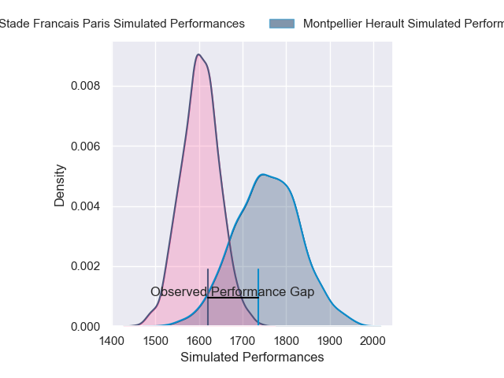
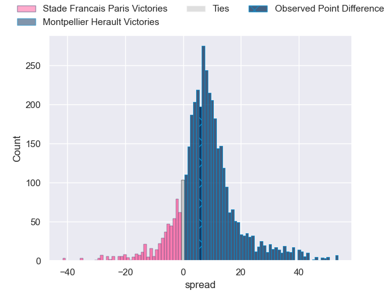
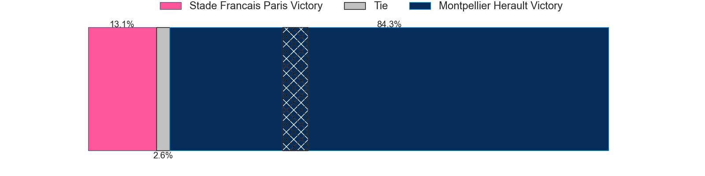
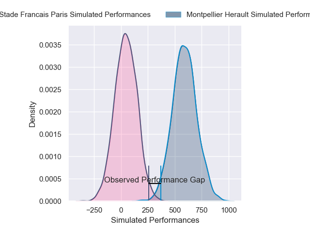
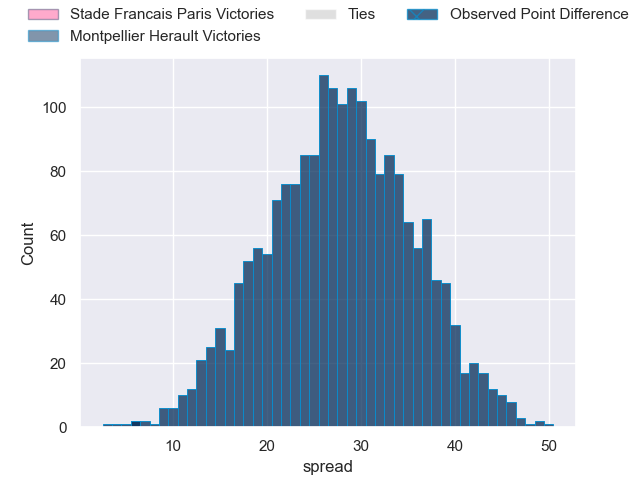

---  
layout: page  
title: Stade Francais Paris at Montpellier Herault; 32-38  
date: 2025-03-29 18:00:00 -0500  
categories: "Top 14 Orange 24/25" match review  
---
# Stade Francais Paris at Montpellier Herault; 32-38

# Club Level Predictions

The first set of predictions treats a club as the smallest object, as the club develops its members, organizes a gameplan, and deploys its players as needed for each match. This club model has a prediction of 0.706, which translates to predicting Montpellier Herault to win by 7.7.

Our Over/Under is 58.5 - and combined with the spread above, we have a predicted scoreline of 25 to 33

Each club has a rating and a rating deviation (similar to a Glicko rating), and expected performances can be generated. This allows for simulated matches and spreads like the ones below.
## Projected Performances - Club Model

## Projected Spreads - Club Model

## Projected Results - Club Model

# Player Level Predictions

Treating teams instead as an entity made up of the currently active players, I have ratings for each player in an altogether different system. These can be combined to form team ratings once teamsheets are announced, weighting starters a bit higher than the reserves. After the match is played, players can be weighted by their minutes on the field, allowing for an accurate measure of the team's composition. With these compiled team ratings, we can make predictions, measure inaccuracy, and update the individual player ratings.
## Prediction without Player Minutes: Montpellier Herault by 32.8

Montpellier Herault by 20.6 on a neutral pitch

## Projected Performances - Player Model

## Projected Spreads - Player Model

## Projected Results - Player Model

|   Away Minutes | Away Player              |   Away Percentile |   Number |   Home Percentile | Home Player         |   Home Minutes |
|---------------:|:-------------------------|------------------:|---------:|------------------:|:--------------------|---------------:|
|             62 | Sergo Abramishvili       |             85.57 |        1 |              9.62 | Baptiste Erdocio    |             26 |
|             57 | Sergo Abramishvili       |             85.57 |        1 |              9.62 | Baptiste Erdocio    |             26 |
|             18 | Lucas Peyresblanques     |              1.84 |        2 |             16.36 | Jordan Uelese       |             26 |
|             40 | Paul Alo-Emile           |             48.82 |        3 |             41.96 | Wilfrid Hounkpatin  |             80 |
|             40 | Paul Gabrillagues        |              2.74 |        4 |             69.69 | Florian Verhaeghe   |             80 |
|             63 | Pierre-Henri Azagoh      |             83.85 |        5 |             83.38 | Tyler Duguid        |             23 |
|             47 | Tanginoa Halaifonua      |              8.82 |        6 |             93.96 | Yacouba Camara      |             29 |
|             37 | Ryan Chapuis             |              8.73 |        7 |             75.12 | Alexandre Becognee  |             80 |
|             25 | Yoan Tanga               |             60.82 |        8 |            100    | Billy Vunipola      |             25 |
|             76 | Louis Foursans-Bourdette |              5.7  |        9 |             76.21 | Leo Coly            |             37 |
|             11 | Louis Carbonel           |             35.45 |       10 |             97.34 | Stuart Hogg         |             80 |
|             26 | Samuel Ezeala            |              2.96 |       11 |             93.9  | George Bridge       |             26 |
|             49 | Jeremy Ward              |             59.47 |       12 |             63.53 | Jan Serfontein      |             12 |
|             10 | Joe Marchant             |             28.47 |       13 |             35.46 | Auguste Cadot       |             20 |
|             57 | Charles Laloi            |              7.02 |       14 |              9.7  | Gabriel Ngandebe    |              9 |
|             26 | Leo Barre                |             11.72 |       15 |             78.99 | Joshua Moorby       |             25 |
|             80 | Alvaro Garcia            |             75.46 |       16 |             97.66 | Christopher Tolofua |             80 |
|             24 | Clement Castets          |             60.09 |       17 |             91.88 | Nika Abuladze       |             80 |
|             30 | Setareki Turagacoke      |            nan    |       18 |             93.31 | Lenni Nouchi        |             71 |
|             18 | Romain Briatte           |             20.15 |       19 |             54.69 | Sam Simmonds        |             80 |
|             13 | Thibaut Motassi          |             40.87 |       20 |             92.96 | Cobus Reinach       |             51 |
|             30 | Zack Henry               |             45.29 |       21 |             67.68 | Anthony Bouthier    |             80 |
|             13 | Lester Etien             |             81.7  |       22 |             68.95 | Arthur Vincent      |             80 |
|             55 | Giorgi Melikidze         |             94.79 |       23 |             94.56 | Luka Japaridze      |             33 |

