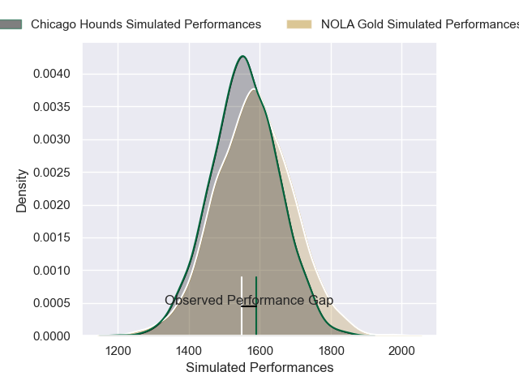
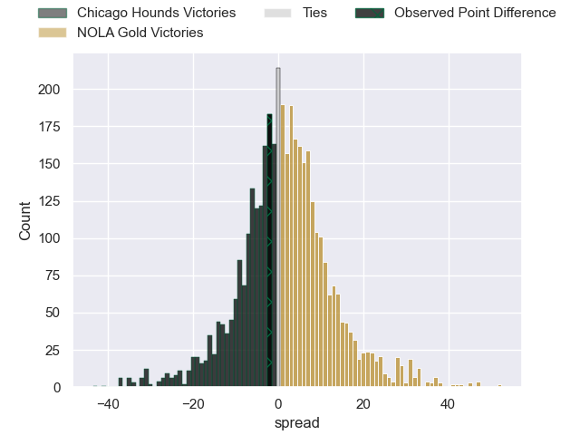
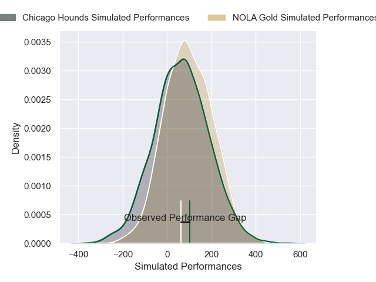
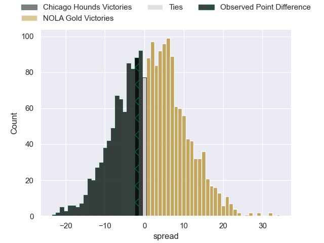

---  
layout: page  
title: Chicago Hounds at NOLA Gold; 20-18  
date: 2025-03-29 18:00:00 -0500  
categories: "Major League Rugby 2025" match review  
---
# Chicago Hounds at NOLA Gold; 20-18

# Club Level Predictions

The first set of predictions treats a club as the smallest object, as the club develops its members, organizes a gameplan, and deploys its players as needed for each match. This club model has a prediction of 0.547, which translates to predicting NOLA Gold to win by 1.7.

Our Over/Under is 60.5 - and combined with the spread above, we have a predicted scoreline of 29 to 31

Each club has a rating and a rating deviation (similar to a Glicko rating), and expected performances can be generated. This allows for simulated matches and spreads like the ones below.
## Projected Performances - Club Model

## Projected Spreads - Club Model

## Projected Results - Club Model

# Player Level Predictions

Treating teams instead as an entity made up of the currently active players, I have ratings for each player in an altogether different system. These can be combined to form team ratings once teamsheets are announced, weighting starters a bit higher than the reserves. After the match is played, players can be weighted by their minutes on the field, allowing for an accurate measure of the team's composition. With these compiled team ratings, we can make predictions, measure inaccuracy, and update the individual player ratings.
## Prediction without Player Minutes: NOLA Gold by 0.9

Chicago Hounds by 2.5 on a neutral pitch

## Projected Performances - Player Model

## Projected Spreads - Player Model

## Projected Results - Player Model

|   Away Minutes | Away Player       |   Away Percentile |   Number |   Home Percentile | Home Player     |   Home Minutes |
|---------------:|:------------------|------------------:|---------:|------------------:|:----------------|---------------:|
|             22 | Faka'osi Pifeleti |             88.72 |        1 |             25    | Matthew Harmon  |             46 |
|             20 | Dylan Fawsitt     |             95.16 |        2 |             23.71 | Alex Lopeti     |             80 |
|             40 | Charlie Abel      |             22.48 |        3 |             45.43 | Tyler Matchem   |             62 |
|             27 | James Scott       |             83    |        4 |             28.9  | Kaden Duguid    |             66 |
|             27 | Hamish Bain       |             54.67 |        5 |             10.67 | Cam Dolan       |             80 |
|             20 | Mason Flesch      |              1.39 |        6 |              4.92 | Moni Tonga'uiha |             80 |
|             38 | Maclean Jones     |             25.44 |        7 |             44.01 | Aidan King      |             46 |
|             80 | Lucas Rumball     |              1.02 |        8 |             59.59 | Jonah Mau'u     |             64 |
|             80 | Mitch Short       |             40.2  |        9 |              4.19 | Luke Campbell   |             80 |
|             80 | Chris Hilsenbeck  |              4.92 |       10 |             64.34 | Dorian Jones    |             62 |
|             80 | Nate Augspurger   |             93.62 |       11 |             64.7  | Harley Wheeler  |             80 |
|             80 | Ollie Devoto      |             13.68 |       12 |             58.97 | JP du Plessis   |             52 |
|             70 | Bryce Campbell    |             84.8  |       13 |              2.84 | Isaac Te Tamaki |             15 |
|             58 | Noah Brown        |             93.07 |       14 |             73.94 | Xavier Mignot   |             23 |
|             53 | Adriaan Carelse   |             12.32 |       15 |             65.25 | Julian Roberts  |             30 |
|             80 | Jackson Zabierek  |            nan    |       16 |             62.6  | Joe Taufete'E   |             30 |
|             60 | Liam Fletcher     |            nan    |       17 |            nan    | Bart Vermeulen  |             23 |
|             80 | Ignacio Peculo    |             82.97 |       18 |             16.17 | Paul Mullen     |             28 |
|             40 | Luke White        |              3.47 |       19 |             62.42 | Callum Botchar  |             38 |
|             53 | Matt Oworu        |            nan    |       20 |            nan    | Cian Darling    |              0 |
|             62 | Jason Higgins     |             23.12 |       21 |              9.21 | Damian Stevens  |             27 |
|             33 | Tim Swiel         |              4.51 |       22 |              5.94 | Luke Carty      |             62 |
|             40 | Noah Flesch       |             25.13 |       23 |              0.81 | Nikolai Foliaki |             10 |

