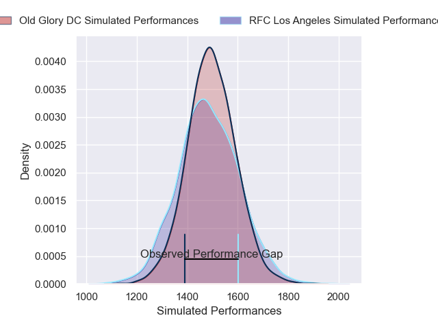
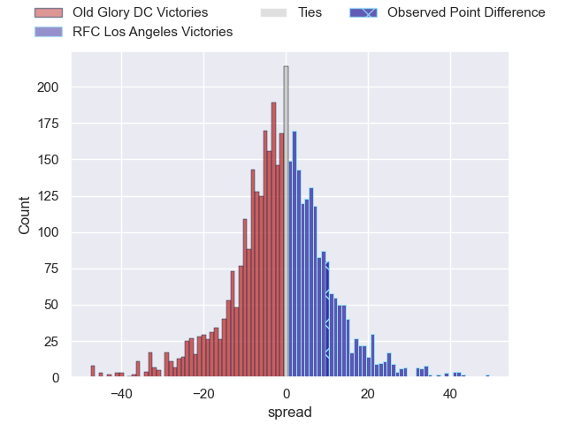
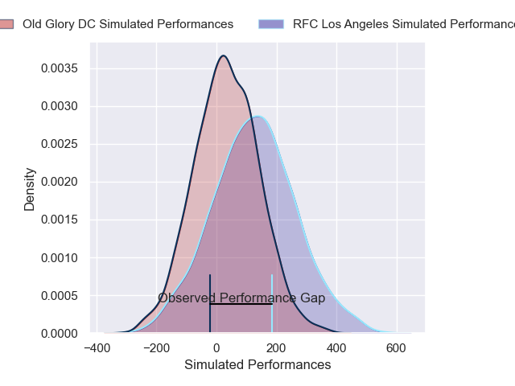
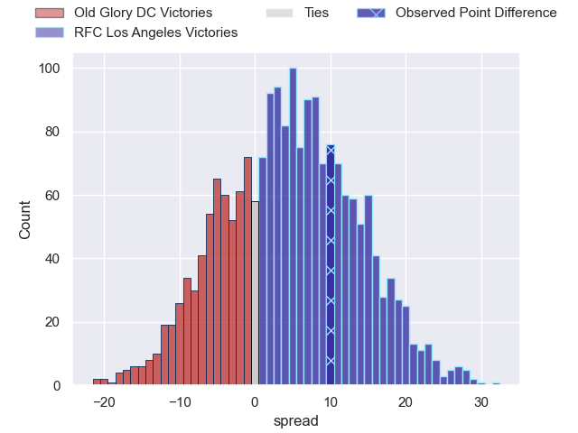
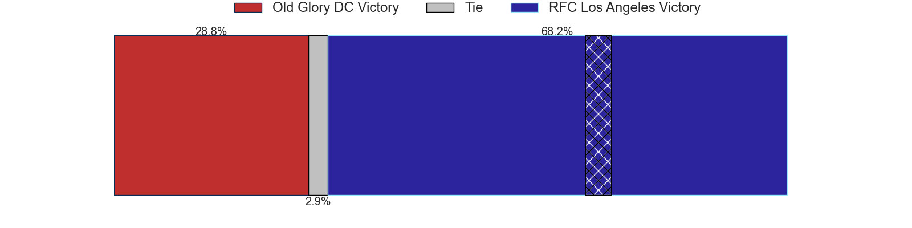

---  
layout: page  
title: Old Glory DC at RFC Los Angeles; 44-54  
date: 2025-03-29 18:00:00 -0500  
categories: "Major League Rugby 2025" match review  
---
# Old Glory DC at RFC Los Angeles; 44-54

# Club Level Predictions

The first set of predictions treats a club as the smallest object, as the club develops its members, organizes a gameplan, and deploys its players as needed for each match. This club model has a prediction of 0.475, which translates to predicting Old Glory DC to win by 0.9.

Our Over/Under is 70.5 - and combined with the spread above, we have a predicted scoreline of 36 to 35

Each club has a rating and a rating deviation (similar to a Glicko rating), and expected performances can be generated. This allows for simulated matches and spreads like the ones below.
## Projected Performances - Club Model

## Projected Spreads - Club Model

## Projected Results - Club Model

# Player Level Predictions

Treating teams instead as an entity made up of the currently active players, I have ratings for each player in an altogether different system. These can be combined to form team ratings once teamsheets are announced, weighting starters a bit higher than the reserves. After the match is played, players can be weighted by their minutes on the field, allowing for an accurate measure of the team's composition. With these compiled team ratings, we can make predictions, measure inaccuracy, and update the individual player ratings.
## Prediction without Player Minutes: RFC Los Angeles by 3.8

RFC Los Angeles by 1.4 on a neutral pitch

## Projected Performances - Player Model

## Projected Spreads - Player Model

## Projected Results - Player Model

|   Away Minutes | Away Player        |   Away Percentile |   Number |   Home Percentile | Home Player           |   Home Minutes |
|---------------:|:-------------------|------------------:|---------:|------------------:|:----------------------|---------------:|
|             80 | Jack Iscaro        |             10.41 |        1 |             38.8  | Alessandro Heaney     |           38   |
|             80 | KoiKoi Nelligan    |             36.73 |        2 |             40.23 | Mike Sosene-Feagai    |           10   |
|             70 | Joe Rees           |             12.62 |        3 |             61.28 | Maliu Niuafe          |           80   |
|             77 | Ignacio Dotti Uria |              9.07 |        4 |             57.6  | Lucas Bur             |           80   |
|             18 | Tevita Naqali      |             15.96 |        5 |             89.9  | Jurie van Vuuren      |           80   |
|             62 | Collin Grosse      |             20.61 |        6 |             38.9  | Semi Kunatani         |           80   |
|              0 | Cory Daniel        |             18.48 |        7 |             61.19 | Edward Timpson        |           80   |
|             34 | Lautaro Bavaro     |             98.16 |        8 |             53.47 | Ben Houston           |           80   |
|             18 | Connor Buckley     |             55.61 |        9 |             83.58 | Gonzalo Bertranou     |           80   |
|             14 | Jason Robertson    |              0.82 |       10 |             87.91 | Christian Leali'ifano |           80   |
|             34 | John Rizzo         |             41.04 |       11 |             74.31 | Andrew Coe            |           80   |
|             16 | Nick Grigg         |             11.25 |       12 |             53.09 | Billy Meakes          |           15   |
|             28 | Steffan Hughes     |             80.04 |       13 |             43.97 | Matias Jensen         |           41   |
|             80 | Perry Humphreys    |             23.29 |       14 |             13.4  | Jack Shaw             |            6   |
|             25 | Damien Hoyland     |             55.15 |       15 |              4.24 | Rory van Vugt         |           80   |
|             25 | Martín Vaca        |            nan    |       16 |            nan    | Ben Strang            |           80   |
|             25 | Joe Wrafter        |            nan    |       17 |            nan    | Declan Leaney         |           52   |
|             21 | Calixto Martinez   |             11.28 |       18 |            nan    | Franco Van Den Berg   |           74   |
|             18 | Bill Whiteside     |             74.69 |       19 |              4.63 | Jason Damm            |           80   |
|              3 | Logan Weidner      |             33.33 |       20 |              0.28 | Matt Heaton           |           80   |
|             62 | Ethan McVeigh      |             78.39 |       21 |             30.99 | Tas Smith             |           62   |
|             80 | Jason Emery        |              4.66 |       22 |             90.67 | Christian Dyer        |           33.5 |
|             52 | John Powers        |             47.32 |       23 |             67.47 | Reece MacDonald       |           80   |

