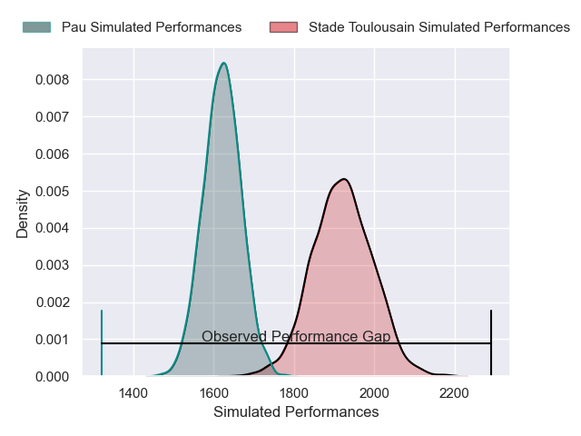
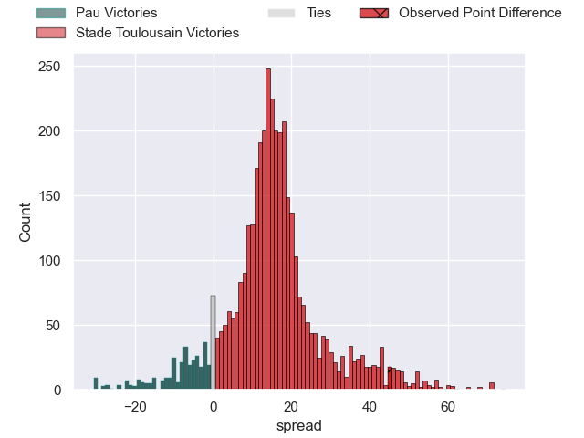
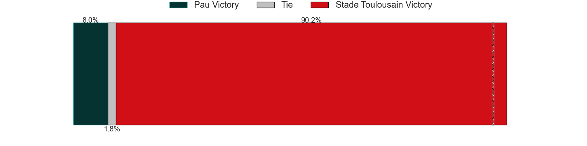
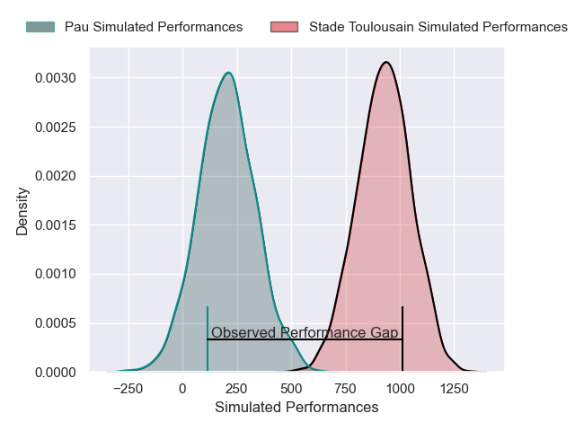
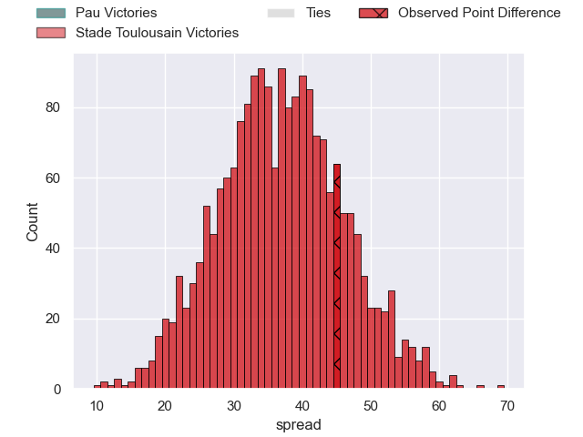

---  
layout: page  
title: Pau at Stade Toulousain; 10-55  
date: 2025-03-29 18:00:00 -0500  
categories: "Top 14 Orange 24/25" match review  
---
# Pau at Stade Toulousain; 10-55

# Club Level Predictions

The first set of predictions treats a club as the smallest object, as the club develops its members, organizes a gameplan, and deploys its players as needed for each match. This club model has a prediction of 0.848, which translates to predicting Stade Toulousain to win by 15.1.

Our Over/Under is 56.5 - and combined with the spread above, we have a predicted scoreline of 20 to 36

Each club has a rating and a rating deviation (similar to a Glicko rating), and expected performances can be generated. This allows for simulated matches and spreads like the ones below.
## Projected Performances - Club Model

## Projected Spreads - Club Model

## Projected Results - Club Model

# Player Level Predictions

Treating teams instead as an entity made up of the currently active players, I have ratings for each player in an altogether different system. These can be combined to form team ratings once teamsheets are announced, weighting starters a bit higher than the reserves. After the match is played, players can be weighted by their minutes on the field, allowing for an accurate measure of the team's composition. With these compiled team ratings, we can make predictions, measure inaccuracy, and update the individual player ratings.
## Prediction without Player Minutes: Stade Toulousain by 39.1

Stade Toulousain by 26.3 on a neutral pitch

## Projected Performances - Player Model

## Projected Spreads - Player Model

## Projected Results - Player Model

|   Away Minutes | Away Player         |   Away Percentile |   Number |   Home Percentile | Home Player            |   Home Minutes |
|---------------:|:--------------------|------------------:|---------:|------------------:|:-----------------------|---------------:|
|             51 | Daniel Bibi Biziwu  |             14.04 |        1 |             96.85 | Cyril Baille           |             66 |
|             14 | Romain Ruffenach    |             69.12 |        2 |             99    | Julien Marchand        |             80 |
|             43 | Harry Williams      |             96.06 |        3 |             97.63 | Dorian Aldegheri       |             44 |
|             80 | Thomas Jolmes       |             11.33 |        4 |             95.56 | Thibaud Flament        |             80 |
|             80 | Lekima Tagitagivalu |             72.05 |        5 |             87.82 | Clement Verge          |              0 |
|             62 | Luke Whitelock      |             98.33 |        6 |             69.36 | Mathis Castro-Ferreira |              0 |
|             51 | Loic Credoz         |             18.66 |        7 |             99.35 | Anthony Jelonch        |             21 |
|             59 | Beka Gorgadze       |             76.12 |        8 |             96.33 | Alexandre Roumat       |             80 |
|             72 | Thibault Daubagna   |             87.27 |        9 |             72.53 | Paul Graou             |             80 |
|             64 | Joe Simmonds        |             75.41 |       10 |             98.98 | Juan Cruz Mallia       |             26 |
|             63 | Aaron Grandidier    |             64.42 |       11 |             99.63 | Blair Kinghorn         |             71 |
|             37 | Nathan Decron       |             54.81 |       12 |             74.57 | Pita Ahki              |             59 |
|             14 | Tumua Manu          |             90.68 |       13 |             90.58 | Pierre-Louis Barassi   |             80 |
|              9 | Aymeric Luc         |             26.62 |       14 |             98.43 | Ange Capuozzo          |             71 |
|             80 | Theo Attissogbe     |              5.25 |       15 |             96.16 | Thomas Ramos           |             40 |
|             70 | Theo Attissogbe     |              5.25 |       15 |             96.16 | Thomas Ramos           |             40 |
|             29 | Dan Jooste          |             63.94 |       16 |             81.14 | Thomas Lacombre        |             80 |
|             10 | Hugo Parrou         |             56.31 |       17 |             48.66 | Rodrigue Neti          |             80 |
|             29 | Hugo Auradou        |             44.75 |       18 |             79.79 | Emmanuel Meafou        |             80 |
|             20 | Carwyn Tuipulotu    |             66.73 |       19 |             96.75 | Francois Cros          |             80 |
|             46 | Joel Kpoku          |             58.12 |       20 |             98.24 | Jack Willis            |             51 |
|             80 | Dan Robson          |             98.99 |       21 |             98.71 | Matthis Lebel          |             59 |
|             43 | Fabien Brau Boirie  |             86.12 |       22 |             88.04 | Paul Costes            |             62 |
|             59 | Jon Zabala          |             19.32 |       23 |             61.59 | Joel Merkler           |              8 |

