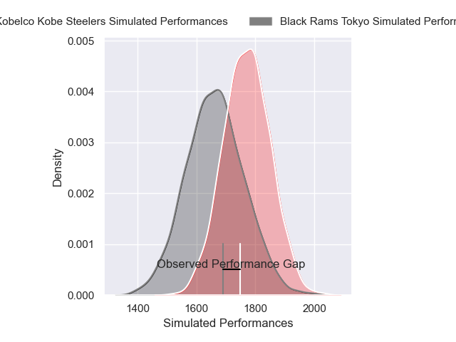
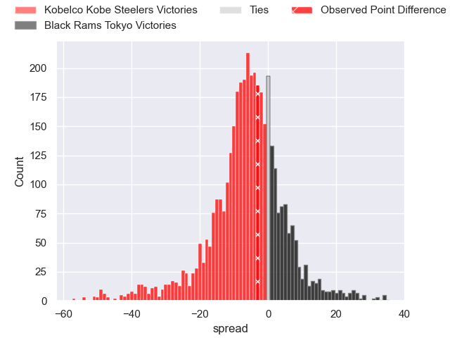
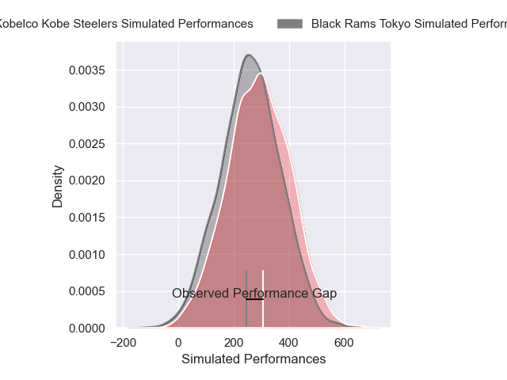
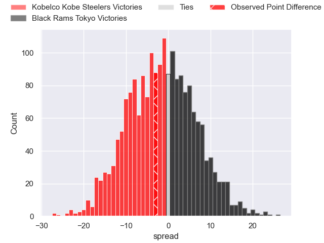

---  
layout: page  
title: Kobelco Kobe Steelers at Black Rams Tokyo; 27-24  
date: 2025-03-30 18:00:00 -0500  
categories: "Japan Rugby League One 24/25" match review  
---
# Kobelco Kobe Steelers at Black Rams Tokyo; 27-24

# Club Level Predictions

The first set of predictions treats a club as the smallest object, as the club develops its members, organizes a gameplan, and deploys its players as needed for each match. This club model has a prediction of 0.35, which translates to predicting Kobelco Kobe Steelers to win by 5.5.

Our Over/Under is 76.5 - and combined with the spread above, we have a predicted scoreline of 41 to 36

Each club has a rating and a rating deviation (similar to a Glicko rating), and expected performances can be generated. This allows for simulated matches and spreads like the ones below.
## Projected Performances - Club Model

## Projected Spreads - Club Model

## Projected Results - Club Model

# Player Level Predictions

Treating teams instead as an entity made up of the currently active players, I have ratings for each player in an altogether different system. These can be combined to form team ratings once teamsheets are announced, weighting starters a bit higher than the reserves. After the match is played, players can be weighted by their minutes on the field, allowing for an accurate measure of the team's composition. With these compiled team ratings, we can make predictions, measure inaccuracy, and update the individual player ratings.
## Prediction without Player Minutes: Kobelco Kobe Steelers by 4.5

Kobelco Kobe Steelers by 8.7 on a neutral pitch

## Projected Performances - Player Model

## Projected Spreads - Player Model

## Projected Results - Player Model

|   Away Minutes | Away Player          |   Away Percentile |   Number |   Home Percentile | Home Player      |   Home Minutes |
|---------------:|:---------------------|------------------:|---------:|------------------:|:-----------------|---------------:|
|             78 | Shigure Takao        |             77.29 |        1 |             48.97 | Taishi Tsumura   |             80 |
|             77 | George Turner        |             99.83 |        2 |             73.46 | Shin Ouchi       |             56 |
|             67 | Hiroshi Yamashita    |             97.16 |        3 |             99.21 | Paddy Ryan       |             80 |
|             67 | Hiroshi Yamashita    |             97.16 |        3 |             99.21 | Paddy Ryan       |             50 |
|             80 | Gerard Cowley-Tuioti |             89.71 |        4 |             60.62 | Reijiro Yamamoto |             80 |
|             29 | Naohiro Kotaki       |             30.59 |        5 |             36.26 | Harrison Fox     |             20 |
|             24 | Tiennan Costley      |             83.1  |        6 |              2.6  | Mike Stolberg    |             15 |
|             56 | Solomone Funaki      |             66.95 |        7 |             80.97 | Liam Gill        |             15 |
|             13 | Amanaki Saumaki      |             71.43 |        8 |             63.47 | Brodi McCurran   |             15 |
|             80 | Atsushi Hiwasa       |             92.46 |        9 |             96.98 | TJ Perenara      |             34 |
|             80 | Bryn Gatland         |             93.85 |       10 |             39.34 | Ichigo Nakakusu  |             80 |
|             80 | Kenta Matsunaga      |             77.36 |       11 |             51.39 | Semisi Tupou     |             48 |
|             80 | Seungsin Lee         |              6.08 |       12 |             61.5  | Yuki Ikeda       |             56 |
|             57 | Ngani Laumape        |             92.4  |       13 |             52.89 | Penieli Jr Latu  |             80 |
|             13 | Ataata Moeakiola     |             40.3  |       14 |             28.56 | Tomoya Yamamura  |             80 |
|             70 | Ryohei Yamanaka      |             67.07 |       15 |             60.2  | Taira Main       |             58 |

