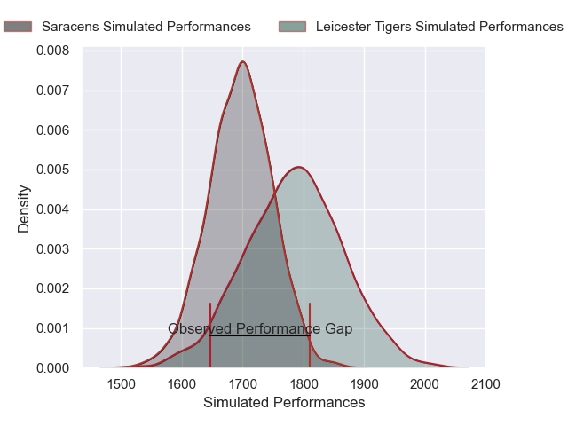
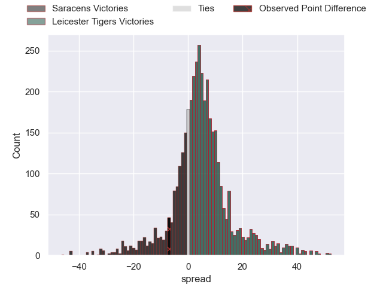
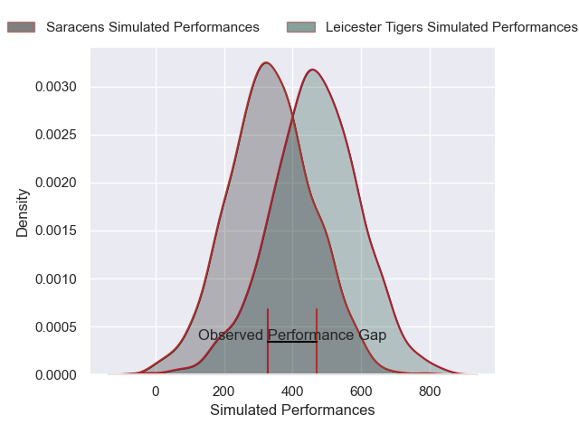
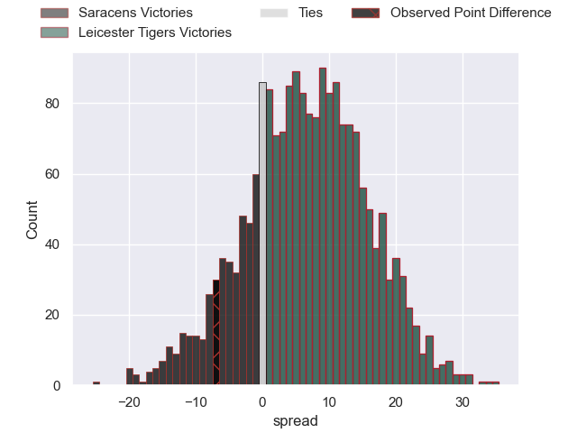

---  
layout: page  
title: Saracens at Leicester Tigers; 29-22  
date: 2025-03-30 18:00:00 -0500  
categories: "Gallagher Premiership 24/25" match review  
---
# Saracens at Leicester Tigers; 29-22

# Club Level Predictions

The first set of predictions treats a club as the smallest object, as the club develops its members, organizes a gameplan, and deploys its players as needed for each match. This club model has a prediction of 0.623, which translates to predicting Leicester Tigers to win by 4.4.

Our Over/Under is 53.5 - and combined with the spread above, we have a predicted scoreline of 24 to 29

Each club has a rating and a rating deviation (similar to a Glicko rating), and expected performances can be generated. This allows for simulated matches and spreads like the ones below.
## Projected Performances - Club Model

## Projected Spreads - Club Model

## Projected Results - Club Model

# Player Level Predictions

Treating teams instead as an entity made up of the currently active players, I have ratings for each player in an altogether different system. These can be combined to form team ratings once teamsheets are announced, weighting starters a bit higher than the reserves. After the match is played, players can be weighted by their minutes on the field, allowing for an accurate measure of the team's composition. With these compiled team ratings, we can make predictions, measure inaccuracy, and update the individual player ratings.
## Prediction without Player Minutes: Leicester Tigers by 4.7

Saracens by 10.5 on a neutral pitch

## Projected Performances - Player Model

## Projected Spreads - Player Model

## Projected Results - Player Model

|   Away Minutes | Away Player           |   Away Percentile |   Number |   Home Percentile | Home Player           |   Home Minutes |
|---------------:|:----------------------|------------------:|---------:|------------------:|:----------------------|---------------:|
|             80 | Eroni Mawi            |             94.4  |        1 |             57.73 | Nicky Smith           |             80 |
|             12 | Jamie George          |             99.67 |        2 |             86.48 | Julian Montoya        |             15 |
|             70 | Fraser Balmain        |             11.91 |        3 |             94.24 | Joe Heyes             |             65 |
|             11 | Maro Itoje            |             96.6  |        4 |             71.1  | Cameron Henderson     |             80 |
|             20 | Hugh Tizard           |             76.96 |        5 |             86.97 | Harry Wells           |             65 |
|             24 | Theo McFarland        |             46.24 |        6 |             83.47 | Hanro Liebenberg      |             80 |
|             80 | Juan Martin Gonzalez  |             97.59 |        7 |             72.89 | Tommy Reffell         |             59 |
|             56 | Tom Willis            |             36.73 |        8 |             20.82 | Olly Cracknell        |             80 |
|             80 | Ivan van Zyl          |             86.93 |        9 |             43.22 | Jack van Poortvliet   |             80 |
|             80 | Fergus Burke          |             61.48 |       10 |             79.92 | Handre Pollard        |             61 |
|             73 | Angus Hall            |             65.34 |       11 |             44.73 | Ollie Hassell-Collins |             80 |
|             80 | Nick Tompkins         |            100    |       12 |             25.23 | Joseph Woodward       |             80 |
|             80 | Alex Lozowski         |             85.01 |       13 |              4.96 | Solomone Kata         |             57 |
|             23 | Tobias Elliott        |             53.6  |       14 |              6.84 | Adam Radwan           |             80 |
|             80 | Elliot Daly           |             91.72 |       15 |              1.41 | Freddie Steward       |             67 |
|             71 | Theo Dan              |             18.03 |       16 |             15.53 | Charlie Clare         |             60 |
|             56 | Rhys Carre            |             35.96 |       17 |             19.4  | James Whitcombe       |             52 |
|              8 | Marco Riccioni        |             81.47 |       18 |             17.27 | Dan Cole              |             65 |
|             21 | Nick Isiekwe          |             97.45 |       19 |            nan    | Come Joussain         |             35 |
|             24 | Andy Onyeama-Christie |             60.54 |       20 |             81.99 | Emeka Ilione          |              7 |
|             16 | Ben Earl              |             99.39 |       21 |             71.36 | Ben Youngs            |              0 |
|             56 | Gareth Simpson        |             41.21 |       22 |             37.7  | Jamie Shillcock       |             65 |
|             30 | Alex Goode            |             94.55 |       23 |             29.48 | Izaia Perese          |             23 |

