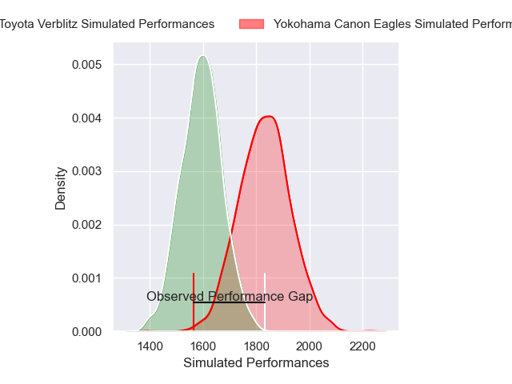
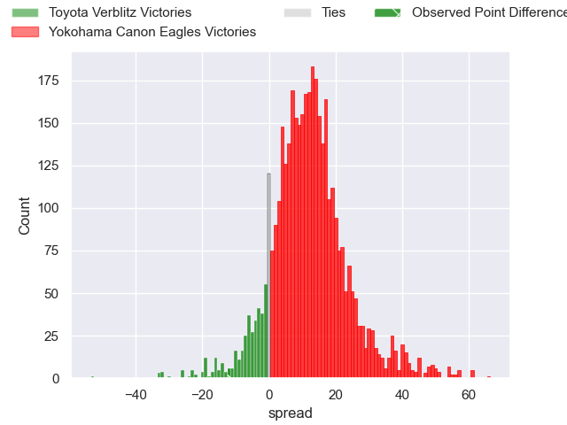
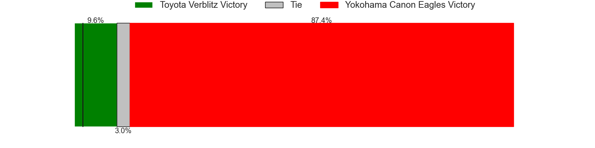
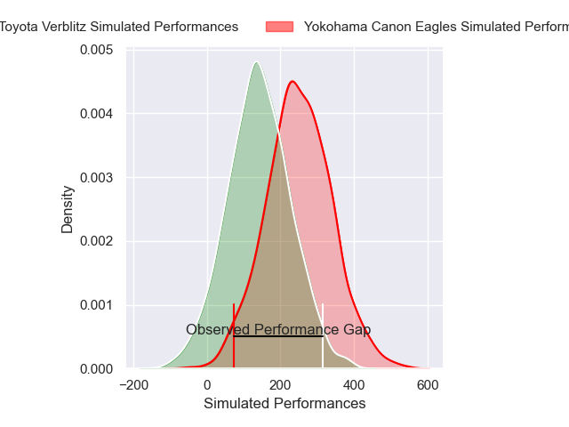
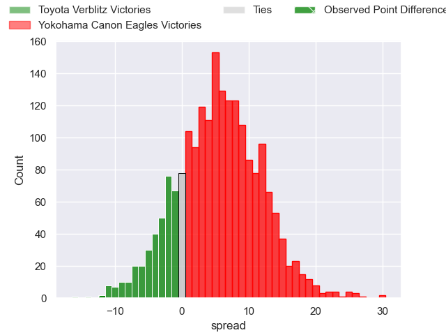
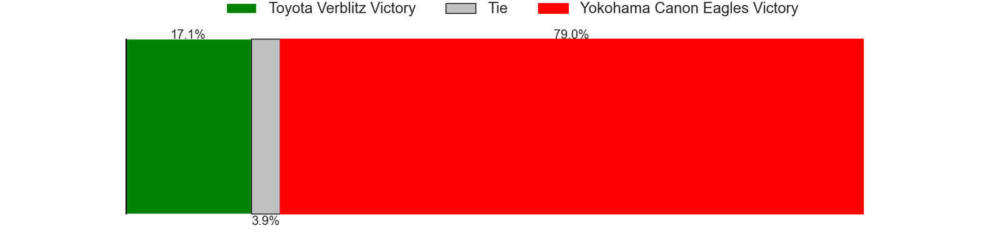

---  
layout: page  
title: Toyota Verblitz at Yokohama Canon Eagles; 29-17  
date: 2025-03-30 18:00:00 -0500  
categories: "Japan Rugby League One 24/25" match review  
---
# Toyota Verblitz at Yokohama Canon Eagles; 29-17

# Club Level Predictions

The first set of predictions treats a club as the smallest object, as the club develops its members, organizes a gameplan, and deploys its players as needed for each match. This club model has a prediction of 0.785, which translates to predicting Yokohama Canon Eagles to win by 11.6.

Our Over/Under is 63.5 - and combined with the spread above, we have a predicted scoreline of 26 to 38

Each club has a rating and a rating deviation (similar to a Glicko rating), and expected performances can be generated. This allows for simulated matches and spreads like the ones below.
## Projected Performances - Club Model

## Projected Spreads - Club Model

## Projected Results - Club Model

# Player Level Predictions

Treating teams instead as an entity made up of the currently active players, I have ratings for each player in an altogether different system. These can be combined to form team ratings once teamsheets are announced, weighting starters a bit higher than the reserves. After the match is played, players can be weighted by their minutes on the field, allowing for an accurate measure of the team's composition. With these compiled team ratings, we can make predictions, measure inaccuracy, and update the individual player ratings.
## Prediction without Player Minutes: Yokohama Canon Eagles by 4.0

Toyota Verblitz by 0.2 on a neutral pitch

## Projected Performances - Player Model

## Projected Spreads - Player Model

## Projected Results - Player Model

|   Away Minutes | Away Player         |   Away Percentile |   Number |   Home Percentile | Home Player       |   Home Minutes |
|---------------:|:--------------------|------------------:|---------:|------------------:|:------------------|---------------:|
|              0 | Shogo Miura         |             89.27 |        1 |             25.87 | Tomoki Minami     |             76 |
|             52 | Yoshikatsu Hikosaka |             90.48 |        2 |             68.61 | Yusuke Niwai      |             30 |
|             45 | Yusuke Kizu         |             77.84 |        3 |             57.33 | Ryosuke Iwaihara  |             40 |
|              3 | Richie Gray         |             84.14 |        4 |              4.15 | Liaki Moli        |             75 |
|             13 | Josh Dickson        |             46.65 |        5 |             36.54 | Matt Philip       |             13 |
|             11 | Keito Aoki          |             30.83 |        6 |             14.58 | Lekima Nasamila   |              0 |
|             51 | Michael Hooper      |             99.54 |        7 |             45.13 | Masato Furukawa   |             10 |
|             20 | Isaiah Mapusua      |             79.8  |        8 |             61.22 | Billy Harmon      |              4 |
|             67 | Kaito Shigeno       |             32.16 |        9 |             62.81 | Kafazumi Yamasuga |             23 |
|             80 | Shinya Komura       |             51.84 |       10 |             80.33 | Yu Tamura         |             70 |
|             80 | Viliame Tuidraki    |             91.4  |       11 |             90.48 | Viliame Takayawa  |             56 |
|             29 | Nicholas McCurran   |             80.24 |       12 |             42.76 | Ryo Tabata        |             24 |
|             26 | Siosaia Fifita      |              0.81 |       13 |             97.67 | Jesse Kriel       |             80 |
|             46 | Joseph Manu         |             18.39 |       14 |             17.84 | Kippei Ishida     |             67 |
|             80 | Taichi Takahashi    |             86.26 |       15 |             84.24 | Brendan Owen      |             80 |

