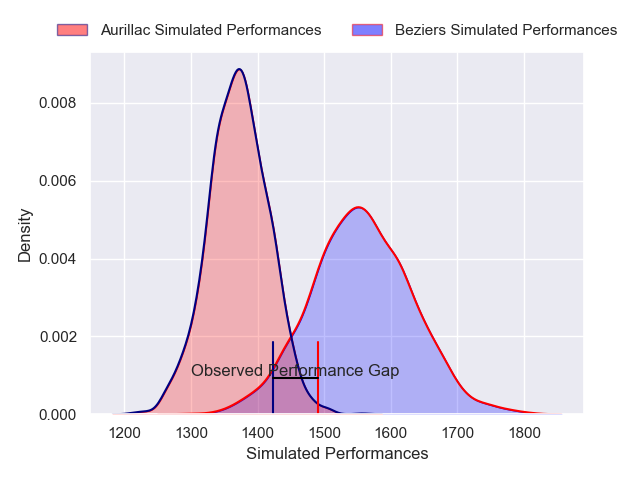
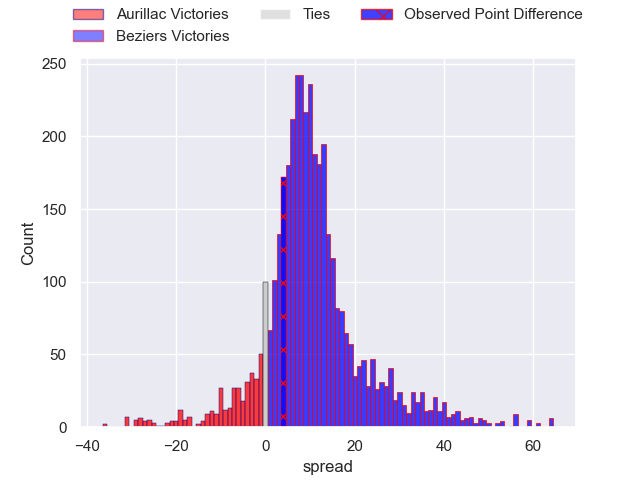
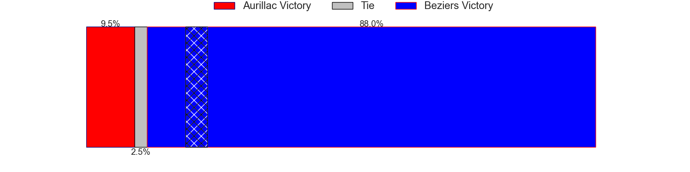
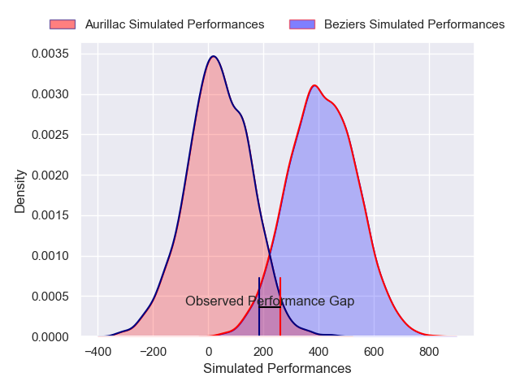
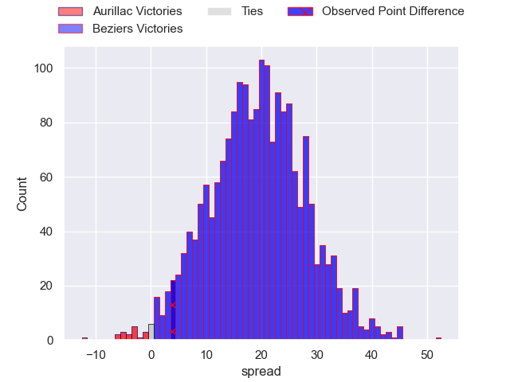
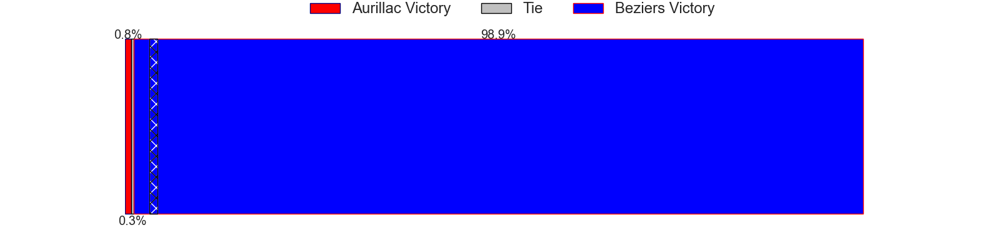

---  
layout: page  
title: Aurillac at Beziers; 19-23  
date: 2025-04-04 18:00:00 -0500  
categories: "Pro D2 24/25" match review  
---
# Aurillac at Beziers; 19-23

# Club Level Predictions

The first set of predictions treats a club as the smallest object, as the club develops its members, organizes a gameplan, and deploys its players as needed for each match. This club model has a prediction of 0.742, which translates to predicting Beziers to win by 9.3.

Our Over/Under is 69.5 - and combined with the spread above, we have a predicted scoreline of 30 to 39

Each club has a rating and a rating deviation (similar to a Glicko rating), and expected performances can be generated. This allows for simulated matches and spreads like the ones below.
## Projected Performances - Club Model

## Projected Spreads - Club Model

## Projected Results - Club Model

# Player Level Predictions

Treating teams instead as an entity made up of the currently active players, I have ratings for each player in an altogether different system. These can be combined to form team ratings once teamsheets are announced, weighting starters a bit higher than the reserves. After the match is played, players can be weighted by their minutes on the field, allowing for an accurate measure of the team's composition. With these compiled team ratings, we can make predictions, measure inaccuracy, and update the individual player ratings.
## Prediction without Player Minutes: Beziers by 20.4

Beziers by 6.1 on a neutral pitch

## Projected Performances - Player Model

## Projected Spreads - Player Model

## Projected Results - Player Model

|   Away Minutes | Away Player             |   Away Percentile |   Number |   Home Percentile | Home Player                 |   Home Minutes |
|---------------:|:------------------------|------------------:|---------:|------------------:|:----------------------------|---------------:|
|             80 | Robert Rodgers          |             40.1  |        1 |             34.55 | Yahnis El Maslouhi          |             17 |
|             80 | Luka Nioradze           |             11.61 |        2 |             59.2  | Wilmar Arnoldi              |             50 |
|             80 | Valentin Welsch         |             68.7  |        3 |             55.71 | Christian Judge             |             80 |
|             80 | Eoghan Masterson        |             81.73 |        4 |             62.15 | Cam Dodson                  |             80 |
|             66 | Martial Rolland         |             46.8  |        5 |              0.28 | Shahn Eru                   |             80 |
|              0 | Tim De Jong             |             54.08 |        6 |             88.24 | Clement Doumenc             |             39 |
|             80 | Hugo Huurman            |             77.13 |        7 |              8.63 | Gillian Benoy               |             57 |
|              7 | Didier Tison            |             13.1  |        8 |             54.84 | Sias Koen                   |             80 |
|             40 | Mikheil Alania          |             51.18 |        9 |             40.03 | Damien Añon                 |             60 |
|             59 | Jake Strachan           |             23.92 |       10 |             91.96 | Tim Nanai-Williams          |             63 |
|             40 | Axel Bevia              |             61.79 |       11 |             19.8  | Theo Vassallo               |             80 |
|             29 | Elijah Niko             |             17.11 |       12 |             68.53 | Taleta Tupuola              |             54 |
|             23 | Karl Martin             |             34.52 |       13 |             85.23 | Taylor Gontineac            |             60 |
|             25 | Simeli Yabaki           |             14    |       14 |              9.94 | Pierre Courtaud             |             80 |
|             51 | Dachi Papunashvili      |             53.13 |       15 |             85.25 | Gabin Lorre                 |             80 |
|             80 | Dominic Robertson-McCoy |             28.13 |       16 |             55.27 | Pierre Gayraud              |             70 |
|             21 | Abongile Nonkontwana    |              1.22 |       17 |             43.6  | Baptiste Abescat-Leroy      |             80 |
|             54 | Giorgi Kartvelishvili   |             28.05 |       18 |              5.15 | Francisco Fernandes Moreira |             55 |
|             14 | Lucas Oudard            |             52.94 |       19 |             71.97 | Yvann Lalevee               |             47 |
|             25 | Basa Khonelidze         |             49.92 |       20 |             80.9  | Yannick Arroyo              |             14 |
|             19 | Hugo Bastard            |             67.52 |       21 |             61.91 | Paul Recor                  |              5 |
|              7 | Louis Bruinsma          |             22.5  |       22 |             38.34 | Hugo Gomes Camacho          |             14 |
|             80 | Boris Hadinegoro        |              6.59 |       23 |             23.09 | Victor Dreuille             |             30 |

