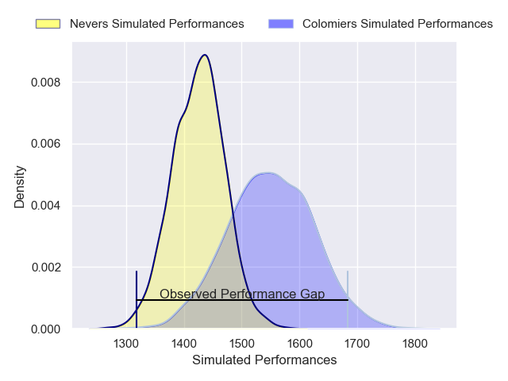
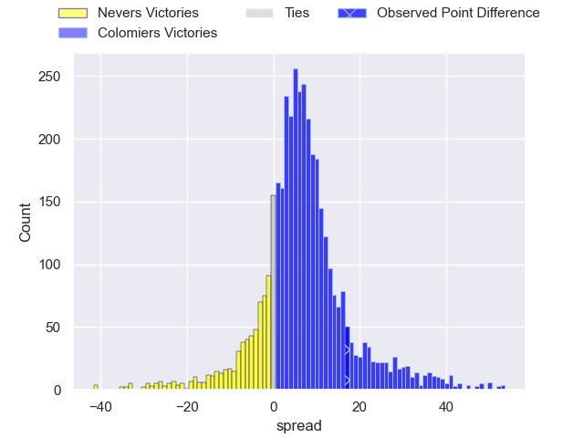
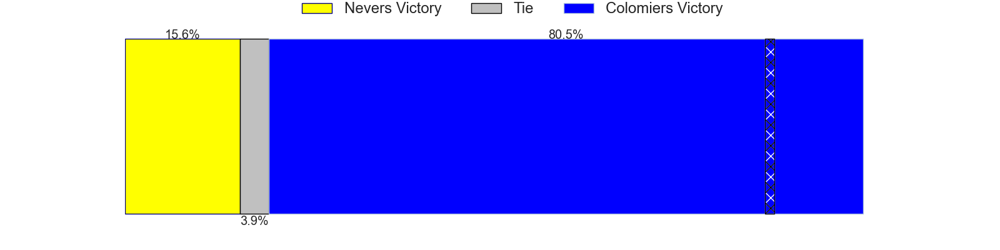
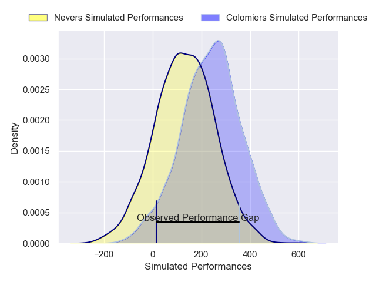
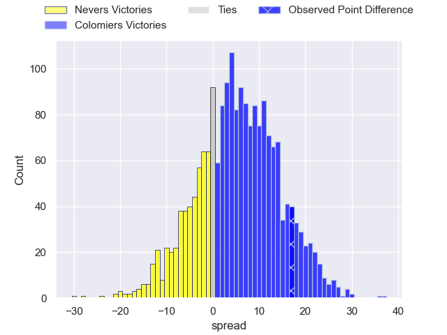
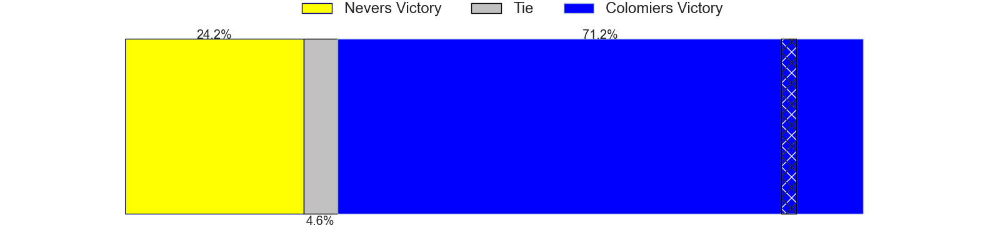

---  
layout: page  
title: Nevers at Colomiers; 34-51  
date: 2025-04-04 18:00:00 -0500  
categories: "Pro D2 24/25" match review  
---
# Nevers at Colomiers; 34-51

# Club Level Predictions

The first set of predictions treats a club as the smallest object, as the club develops its members, organizes a gameplan, and deploys its players as needed for each match. This club model has a prediction of 0.67, which translates to predicting Colomiers to win by 6.2.

Our Over/Under is 59.5 - and combined with the spread above, we have a predicted scoreline of 27 to 33

Each club has a rating and a rating deviation (similar to a Glicko rating), and expected performances can be generated. This allows for simulated matches and spreads like the ones below.
## Projected Performances - Club Model

## Projected Spreads - Club Model

## Projected Results - Club Model

# Player Level Predictions

Treating teams instead as an entity made up of the currently active players, I have ratings for each player in an altogether different system. These can be combined to form team ratings once teamsheets are announced, weighting starters a bit higher than the reserves. After the match is played, players can be weighted by their minutes on the field, allowing for an accurate measure of the team's composition. With these compiled team ratings, we can make predictions, measure inaccuracy, and update the individual player ratings.
## Prediction without Player Minutes: Colomiers by 2.3

Nevers by 10.1 on a neutral pitch

## Projected Performances - Player Model

## Projected Spreads - Player Model

## Projected Results - Player Model

|   Away Minutes | Away Player                 |   Away Percentile |   Number |   Home Percentile | Home Player         |   Home Minutes |
|---------------:|:----------------------------|------------------:|---------:|------------------:|:--------------------|---------------:|
|           56   | Louis Chanet                |             37.48 |        1 |             29.08 | Hugo Pirlet         |             25 |
|           80   | Jean-Maxence Jules-Rosette  |             21.39 |        2 |             48.92 | Pablo Dimcheff      |             33 |
|            6   | Ilia Kaikatsishvili         |             47.15 |        3 |             64.34 | Marco Fepulea'i     |             71 |
|           80   | Ugo Vignolles               |             56.78 |        4 |             27.31 | Jean Thomas         |             80 |
|           80   | George Smith                |             27.59 |        5 |             27.12 | Maxime Granouillet  |             80 |
|           47   | Luka Plataret               |             60.15 |        6 |             16.98 | Anthony Coletta     |             66 |
|           33   | Hugues Bastide              |             89.66 |        7 |             62.43 | Gregoire Bazin      |             75 |
|           17   | Jason-Colin Fraser          |             93.75 |        8 |             31.45 | Jeremy Bechu        |             80 |
|           25   | Simon Tarel                 |             15.2  |        9 |             33.45 | Sadek Deghmache     |             63 |
|           10   | Yohan Le Bourhis            |             75.88 |       10 |              0.21 | Brett Herron        |             63 |
|           11   | Lucas Blanc                 |             70.35 |       11 |             21.09 | Anzelo Tuitavuki    |              9 |
|           80   | Noa Pommelet                |             36.35 |       12 |             25.25 | Ray Nu'u            |             27 |
|           26   | Atunaisa Taulanga Vaka Manu |             31.16 |       13 |              7.03 | Martin Dulon        |              5 |
|           33   | Gabin Rocher                |             11.69 |       14 |             11.88 | Martin Alonso Munoz |             80 |
|           26   | Dylan Jaminet               |             26.67 |       15 |             75.56 | Vincent Pinto       |             55 |
|           65   | Aitor Kitutu                |             50.63 |       16 |              2.32 | Theo Lachaud        |             54 |
|           29   | Rudy Derrieux               |             76.07 |       17 |             78.45 | Guillaume Tartas    |             51 |
|            4.5 | Stefan Buruiana             |             59.7  |       18 |            nan    | Robin Bellemand     |             51 |
|           80   | Lasha Jaiani                |             70.62 |       19 |             13.91 | Caleb Timu          |              9 |
|           80   | Aselo Ikahehegi             |             65.29 |       20 |              5.37 | Jack Whetton        |             80 |
|           80   | Mahamadou Coulibaly         |            nan    |       21 |            nan    | Arthur Diaz         |             80 |
|           80   | Julien Kazubek              |             75.81 |       22 |             24.04 | Max Auriac          |             80 |
|           17   | Hugo Bouyssou               |              3.55 |       23 |             46.54 | Enzo Salles         |             80 |

