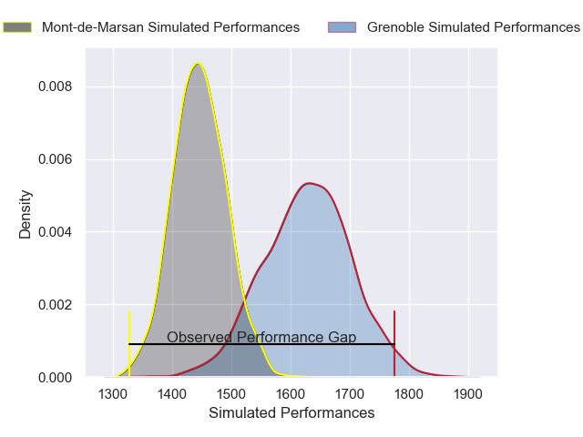
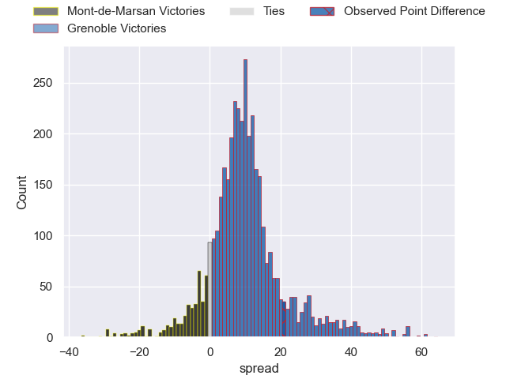
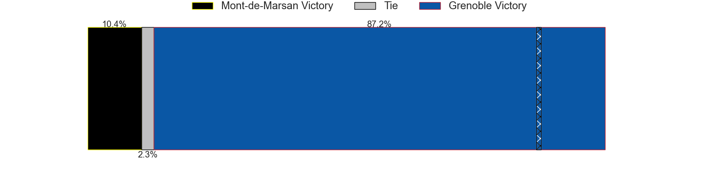
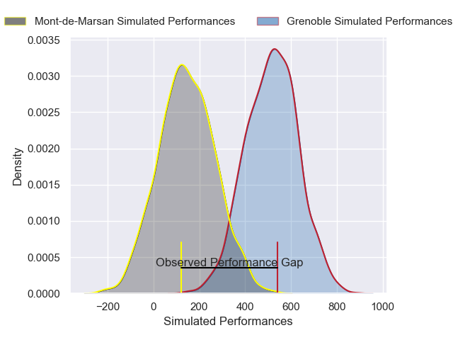
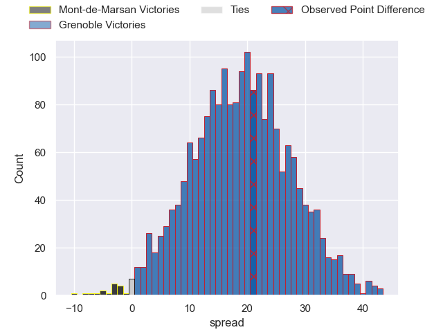
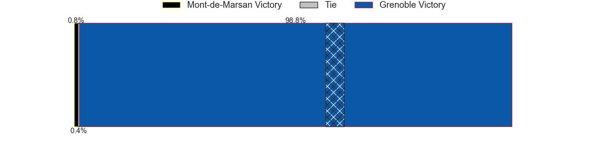

---  
layout: page  
title: Mont-de-Marsan at Grenoble; 26-47  
date: 2025-04-04 18:00:00 -0500  
categories: "Pro D2 24/25" match review  
---
# Mont-de-Marsan at Grenoble; 26-47

# Club Level Predictions

The first set of predictions treats a club as the smallest object, as the club develops its members, organizes a gameplan, and deploys its players as needed for each match. This club model has a prediction of 0.741, which translates to predicting Grenoble to win by 9.2.

Our Over/Under is 66.5 - and combined with the spread above, we have a predicted scoreline of 29 to 38

Each club has a rating and a rating deviation (similar to a Glicko rating), and expected performances can be generated. This allows for simulated matches and spreads like the ones below.
## Projected Performances - Club Model

## Projected Spreads - Club Model

## Projected Results - Club Model

# Player Level Predictions

Treating teams instead as an entity made up of the currently active players, I have ratings for each player in an altogether different system. These can be combined to form team ratings once teamsheets are announced, weighting starters a bit higher than the reserves. After the match is played, players can be weighted by their minutes on the field, allowing for an accurate measure of the team's composition. With these compiled team ratings, we can make predictions, measure inaccuracy, and update the individual player ratings.
## Prediction without Player Minutes: Grenoble by 22.8

Grenoble by 9.7 on a neutral pitch

## Projected Performances - Player Model

## Projected Spreads - Player Model

## Projected Results - Player Model

|   Away Minutes | Away Player           |   Away Percentile |   Number |   Home Percentile | Home Player        |   Home Minutes |
|---------------:|:----------------------|------------------:|---------:|------------------:|:-------------------|---------------:|
|           80   | Ali-Amjad Osman-Bosch |             49.45 |        1 |             91.05 | Tommy Raynaud      |            0   |
|           80   | Luka Begic            |             59.54 |        2 |             37.81 | Mathis Sarragallet |           49   |
|           62   | Gheorghe Gajion       |             84.94 |        3 |             40.41 | Johannes Jonker    |           80   |
|           29   | Harrison Mataele      |              7.06 |        4 |             51.04 | Thomas Lainault    |           25   |
|           47   | Romain Durand         |             70.15 |        5 |             68.17 | Pierce Phillips    |           57   |
|           27   | Yann Brethous         |             60.82 |        6 |             85.01 | Antonin Berruyer   |           53   |
|           40   | Waël Ponpon           |              9.77 |        7 |             82.16 | Thibaut Martel     |            0   |
|           20   | Aurélien Lafforgue    |             24.4  |        8 |             90.93 | Hanru Sirgel       |           80   |
|           80   | Nicolas Darquier      |             51.86 |        9 |             18.75 | Barnabe Couilloud  |           63   |
|           25   | Patricio Fernandez    |             63.09 |       10 |             41.65 | Sam Davies         |           80   |
|           80   | Pierre Sayerse        |             91.9  |       11 |             89.04 | Wilfried Hulleu    |           80   |
|           80   | Baptiste Grulovic     |             43.28 |       12 |             98.27 | Bautista Ezcurra   |           60   |
|           55   | Gatien Masse          |             68.13 |       13 |             75.36 | Romain Trouilloud  |           80   |
|           80   | Simao Bento           |             12.52 |       14 |             91.71 | Kaminieli Rasaku   |            0   |
|           60   | Théo Cortes           |             18.59 |       15 |             71.92 | Hugo Trouilloud    |           65   |
|           15   | Ewan Bertheau         |              1.8  |       16 |             77.11 | Bastien Soury      |            4.5 |
|           31.5 | Florian Dufour        |             45.11 |       17 |             93.79 | Giorgi Kveseladze  |           66   |
|           65   | Mathis Bats           |            nan    |       18 |             58.95 | Eli Eglaine        |           11   |
|           71   | Jules Dussutour       |             19.02 |       19 |             51.03 | Cody Thomas        |           31   |
|           58   | Baptiste Canut        |             43.41 |       20 |             90.77 | Jose Madeira       |           59   |
|           22   | Nacani Wakaya         |             88.09 |       21 |             53.02 | Richard Hardwick   |           49   |
|           15   | Semi Lagivala         |             14.36 |       22 |              9.07 | Marc Palmier       |           80   |
|           80   | Samuel Lagrange       |             31.01 |       23 |             85.98 | Max Clement        |           52   |

