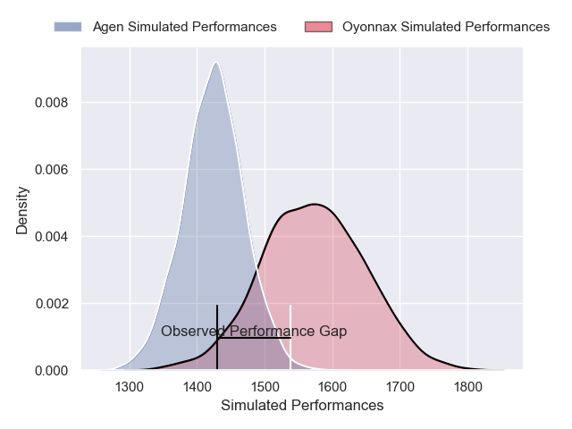
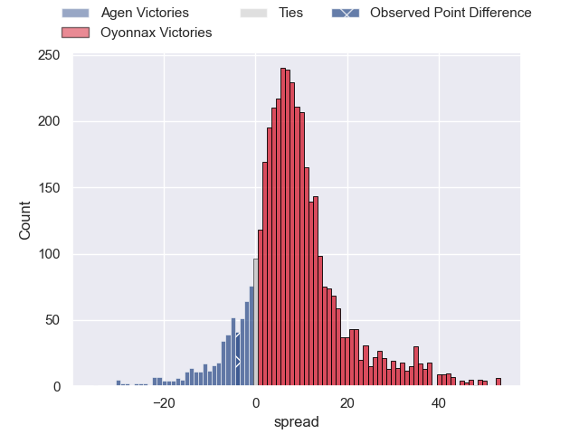
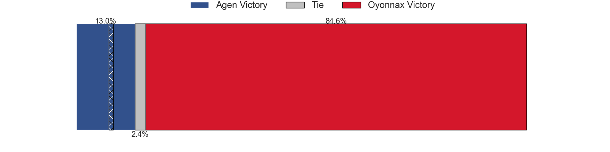
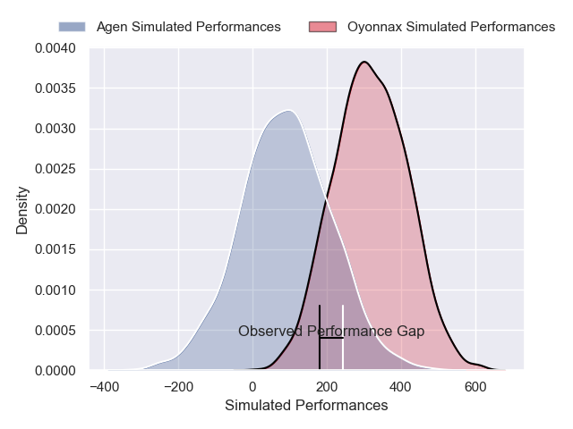
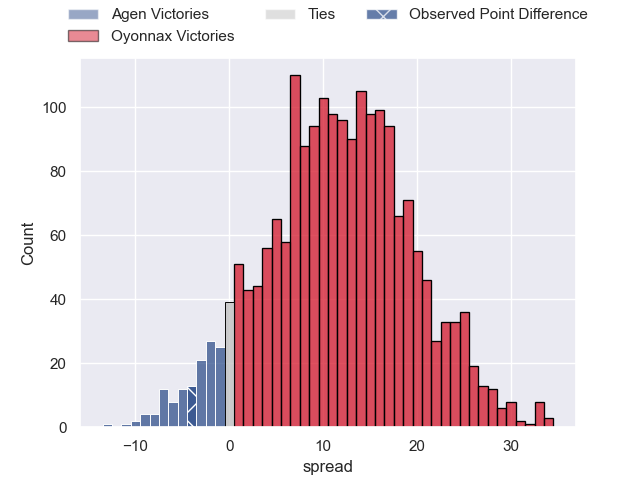
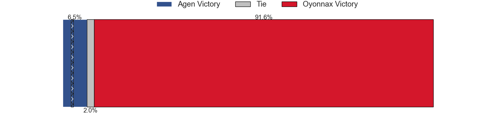

---  
layout: page  
title: Agen at Oyonnax; 34-30  
date: 2025-04-04 18:00:00 -0500  
categories: "Pro D2 24/25" match review  
---
# Agen at Oyonnax; 34-30

# Club Level Predictions

The first set of predictions treats a club as the smallest object, as the club develops its members, organizes a gameplan, and deploys its players as needed for each match. This club model has a prediction of 0.697, which translates to predicting Oyonnax to win by 7.3.

Our Over/Under is 61.5 - and combined with the spread above, we have a predicted scoreline of 27 to 34

Each club has a rating and a rating deviation (similar to a Glicko rating), and expected performances can be generated. This allows for simulated matches and spreads like the ones below.
## Projected Performances - Club Model

## Projected Spreads - Club Model

## Projected Results - Club Model

# Player Level Predictions

Treating teams instead as an entity made up of the currently active players, I have ratings for each player in an altogether different system. These can be combined to form team ratings once teamsheets are announced, weighting starters a bit higher than the reserves. After the match is played, players can be weighted by their minutes on the field, allowing for an accurate measure of the team's composition. With these compiled team ratings, we can make predictions, measure inaccuracy, and update the individual player ratings.
## Prediction without Player Minutes: Oyonnax by 9.6

Agen by 3.7 on a neutral pitch

## Projected Performances - Player Model

## Projected Spreads - Player Model

## Projected Results - Player Model

|   Away Minutes | Away Player          |   Away Percentile |   Number |   Home Percentile | Home Player        |   Home Minutes |
|---------------:|:---------------------|------------------:|---------:|------------------:|:-------------------|---------------:|
|           21   | Hans Lombard-Buret   |             68.23 |        1 |             30.51 | Antoine Abraham    |             26 |
|           61   | Hayam El Bibouji     |             83.58 |        2 |              0.83 | Teddy Durand       |             61 |
|           18   | Lasha Macharashvili  |             55.78 |        3 |             10.54 | Ali Oz             |             80 |
|           73   | Mathieu de Giovanni  |             70.24 |        4 |             89.27 | Phoenix Battye     |             80 |
|           21   | William Demotte      |             77.5  |        5 |              0.94 | Manuel Leindekar   |             12 |
|           29   | Matthieu Bonnet      |             59.39 |        6 |             15.75 | Kevin Lebreton     |             25 |
|           26   | Valentin Gayraud     |             36.43 |        7 |             10.91 | Hugo Hermet        |             80 |
|           45   | Fotu Lokotui         |              5.04 |        8 |             14.11 | Antoine Miquel     |             59 |
|           80   | Theo Idjellidaine    |             35.14 |        9 |             92.4  | Jonathan Ruru      |             36 |
|           80   | Franck Pourteau      |             92.58 |       10 |              1.86 | Justin Bouraux     |             40 |
|           80   | Iban Etcheverry      |             29.1  |       11 |              2.21 | Gavin Stark        |             79 |
|           73   | Kolinio Ramoka       |             63.95 |       12 |              9.47 | Lucas Mensa        |             47 |
|           40   | Theo Belan           |             64.66 |       13 |             34.11 | Afusipa Taumoepeau |              9 |
|           19   | Loris Tolot          |              1.47 |       14 |             55.8  | Maxime Salles      |             29 |
|           17.5 | Jean-Marcelin Buttin |             26.06 |       15 |             15.96 | Martin Bogado      |              9 |
|           40   | Mamuka Mstoiani      |             34.23 |       16 |             68.42 | Karim Qadiri       |             12 |
|           35   | Vincent Farre        |             25.89 |       17 |             87.89 | Peniami Narisia    |             45 |
|           80   | Luca Tabarot         |             62.2  |       18 |            nan    | David Odiase       |             25 |
|           22   | Peyo Muscarditz      |             81.36 |       19 |             79.59 | Zack Holmes        |             80 |
|           80   | Tomasi Fineanganofo  |             52.28 |       20 |             15.63 | Hugo Fabregue      |             29 |
|           55   | Julien Lebian        |             15.84 |       21 |             95.25 | Oli Kebble         |             26 |
|           80   | Pierre Jouvin        |             15.09 |       22 |             67.59 | Paulo Tafili       |             29 |
|           80   | Emile Dayral         |            nan    |       23 |            nan    | nan                |            nan |

