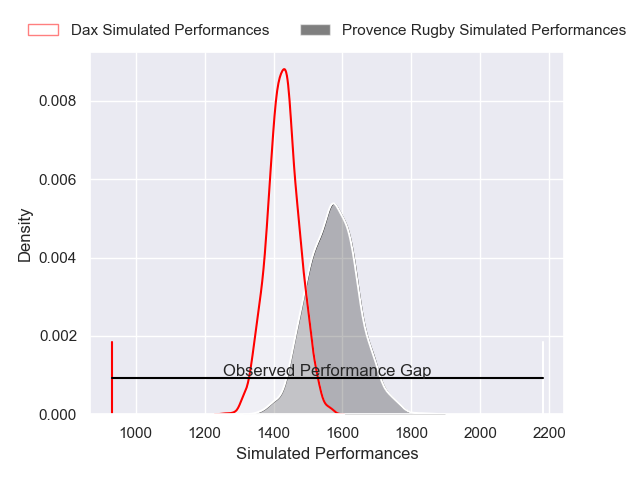
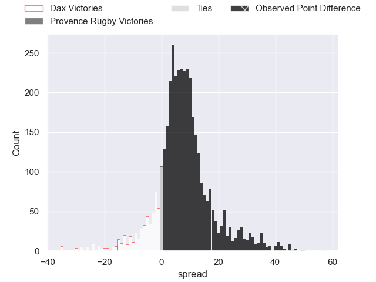
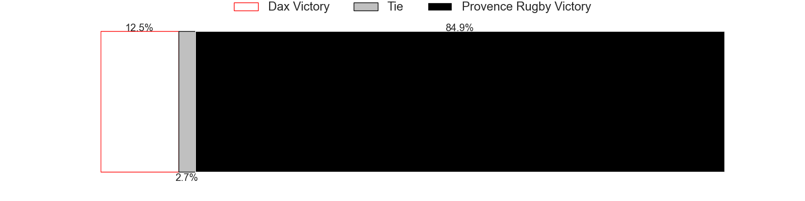
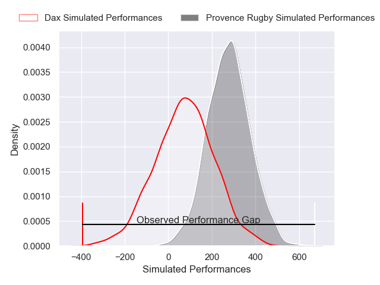
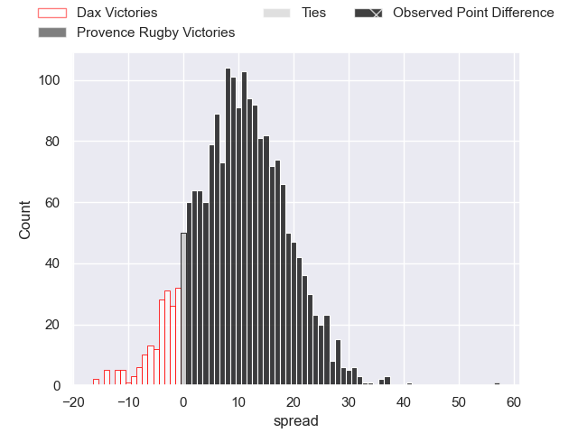
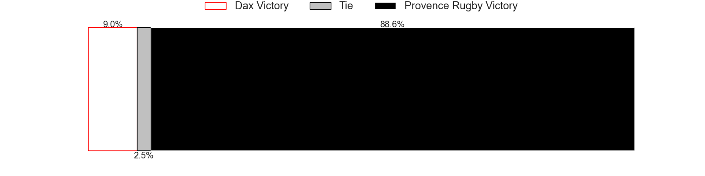

---  
layout: page  
title: Dax at Provence Rugby; 0-57  
date: 2025-04-04 18:00:00 -0500  
categories: "Pro D2 24/25" match review  
---
# Dax at Provence Rugby; 0-57

# Club Level Predictions

The first set of predictions treats a club as the smallest object, as the club develops its members, organizes a gameplan, and deploys its players as needed for each match. This club model has a prediction of 0.695, which translates to predicting Provence Rugby to win by 7.2.

Our Over/Under is 57.5 - and combined with the spread above, we have a predicted scoreline of 25 to 32

Each club has a rating and a rating deviation (similar to a Glicko rating), and expected performances can be generated. This allows for simulated matches and spreads like the ones below.
## Projected Performances - Club Model

## Projected Spreads - Club Model

## Projected Results - Club Model

# Player Level Predictions

Treating teams instead as an entity made up of the currently active players, I have ratings for each player in an altogether different system. These can be combined to form team ratings once teamsheets are announced, weighting starters a bit higher than the reserves. After the match is played, players can be weighted by their minutes on the field, allowing for an accurate measure of the team's composition. With these compiled team ratings, we can make predictions, measure inaccuracy, and update the individual player ratings.
## Prediction without Player Minutes: Provence Rugby by 15.7

Provence Rugby by 6.0 on a neutral pitch

## Projected Performances - Player Model

## Projected Spreads - Player Model

## Projected Results - Player Model

|   Away Minutes | Away Player          |   Away Percentile |   Number |   Home Percentile | Home Player           |   Home Minutes |
|---------------:|:---------------------|------------------:|---------:|------------------:|:----------------------|---------------:|
|             33 | Dino Casadei         |             40.02 |        1 |             80.51 | Thomas Vernet         |             72 |
|             80 | Louis Barrere        |             20.56 |        2 |             12.77 | Kapeli Pifeleti       |             80 |
|             47 | David Lolohea        |             16.48 |        3 |             86.53 | Paul Mallez           |             57 |
|             40 | Brice Ferrer         |             30.23 |        4 |              2.17 | Andres Zafra Tarazona |             80 |
|             80 | Étienne Loiret       |             34.37 |        5 |             82.02 | Izack Rodda           |             61 |
|             71 | Arnaud Aletti        |             34.63 |        6 |             72.01 | Teimana Harrison      |             80 |
|             80 | Logan Dubois         |             32.83 |        7 |             82.73 | Charly Gambini        |             68 |
|             80 | Ratu Nacika          |             46.17 |        8 |             15.32 | Tornike Jalagonia     |             80 |
|             13 | Paul Ravier          |             81.59 |        9 |             23.65 | Arthur Coville        |             51 |
|             72 | Hugo Cerisier        |             52.99 |       10 |             58.76 | Jules Plisson         |             23 |
|             80 | Diego Miranda        |             36.74 |       11 |             91.44 | Nadir Bouhedjeur      |              9 |
|             54 | Jale Vatubua         |              0.41 |       12 |             84.52 | Kaveinga Finau        |             67 |
|             57 | Hugo Fourquet        |             76.17 |       13 |             99.39 | George North          |             23 |
|             63 | Viliame Tutuvili     |             26.43 |       14 |             11.05 | Adrien Lapegue-Lafaye |              8 |
|             17 | Guillaume Bouche     |             62.02 |       15 |             78.38 | Jules Soulan          |             31 |
|             80 | Théo Duprat          |             50.3  |       16 |            nan    | nan                   |            nan |
|             40 | Paul Laperne         |             42.12 |       17 |            nan    | nan                   |            nan |
|              0 | Thibaud Dréan        |             53.33 |       18 |            nan    | nan                   |            nan |
|             65 | Amine Maala          |            nan    |       19 |            nan    | nan                   |            nan |
|             80 | Jean Despiau         |             14.8  |       20 |            nan    | nan                   |            nan |
|              5 | Sylvère Reteau       |             64.53 |       21 |            nan    | nan                   |            nan |
|             53 | Romuald Séguy        |             52.16 |       22 |            nan    | nan                   |            nan |
|             80 | Diogo Hasse Ferreira |             23.77 |       23 |            nan    | nan                   |            nan |

