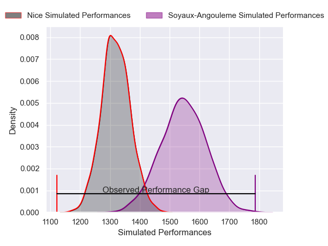
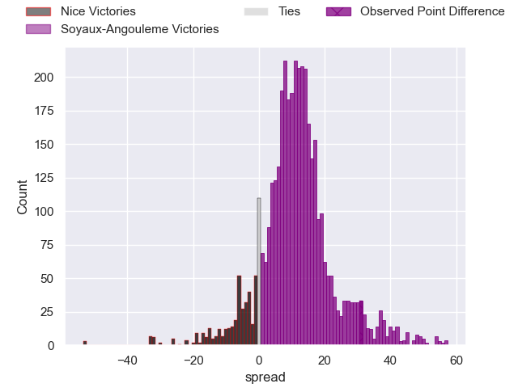
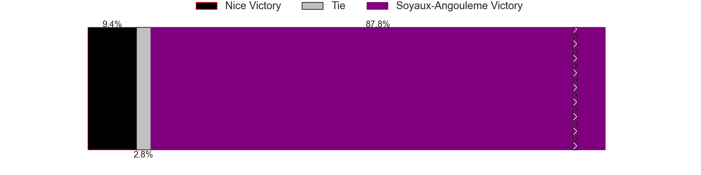
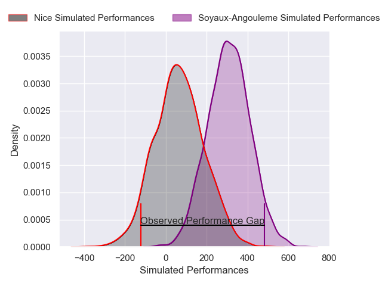
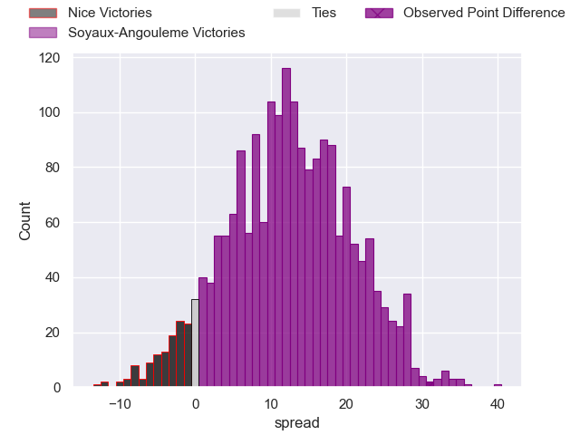
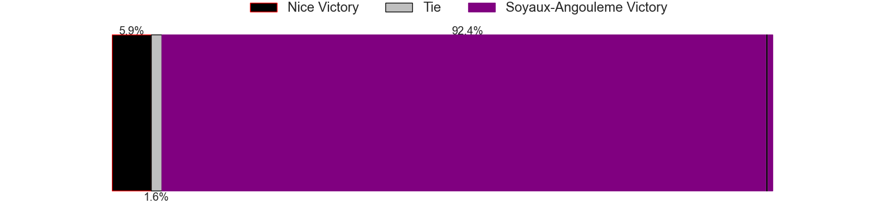

---  
layout: page  
title: Nice at Soyaux-Angouleme; 14-45  
date: 2025-04-04 18:00:00 -0500  
categories: "Pro D2 24/25" match review  
---
# Nice at Soyaux-Angouleme; 14-45

# Club Level Predictions

The first set of predictions treats a club as the smallest object, as the club develops its members, organizes a gameplan, and deploys its players as needed for each match. This club model has a prediction of 0.78, which translates to predicting Soyaux-Angouleme to win by 11.1.

Our Over/Under is 66.5 - and combined with the spread above, we have a predicted scoreline of 28 to 39

Each club has a rating and a rating deviation (similar to a Glicko rating), and expected performances can be generated. This allows for simulated matches and spreads like the ones below.
## Projected Performances - Club Model

## Projected Spreads - Club Model

## Projected Results - Club Model

# Player Level Predictions

Treating teams instead as an entity made up of the currently active players, I have ratings for each player in an altogether different system. These can be combined to form team ratings once teamsheets are announced, weighting starters a bit higher than the reserves. After the match is played, players can be weighted by their minutes on the field, allowing for an accurate measure of the team's composition. With these compiled team ratings, we can make predictions, measure inaccuracy, and update the individual player ratings.
## Prediction without Player Minutes: Soyaux-Angouleme by 15.5

Soyaux-Angouleme by 10.0 on a neutral pitch

## Projected Performances - Player Model

## Projected Spreads - Player Model

## Projected Results - Player Model

|   Away Minutes | Away Player           |   Away Percentile |   Number |   Home Percentile | Home Player        |   Home Minutes |
|---------------:|:----------------------|------------------:|---------:|------------------:|:-------------------|---------------:|
|             53 | Fabio Gonzalez        |             53.72 |        1 |             82.88 | Georgy Balakarev   |           14   |
|             33 | Sacha Idoumi          |              7.46 |        2 |             13.27 | Motu Matu'u        |           22   |
|             80 | Luvuyo Pupuma         |              7.53 |        3 |             43.26 | Yassine Boutemane  |           31.5 |
|             29 | Thibault Rey          |              1.98 |        4 |             77.97 | Enzo Morand-Bruyat |           80   |
|              0 | Clément Chartier      |              4.52 |        5 |             93.79 | Sikeli Nabou       |           80   |
|              1 | Bastien Berenguel     |              0.57 |        6 |             86.62 | Germain Burgaud    |           80   |
|             80 | Louis Suaud           |             85.39 |        7 |             16.51 | Matt Beukeboom     |            4   |
|             71 | Jordan Taufua         |             80.24 |        8 |             53.43 | Alexander Masibaka |           26   |
|             20 | Jules Gimbert         |              2.36 |        9 |             75.68 | Manu Saubusse      |           71   |
|             21 | Mathis Viard          |             66.19 |       10 |             71.34 | Corentin Glenat    |           80   |
|             80 | Alexis Bouton         |             36.83 |       11 |             56.45 | Eoghan Barrett     |           80   |
|             31 | Baptiste Lafond       |             11.91 |       12 |             62.02 | François Carlo Mey |            9   |
|             15 | Luca Cutayar          |             34.32 |       13 |              8.35 | Arthur Proult      |            8   |
|             28 | David Odiete          |             90.98 |       14 |             78.55 | Matthys Gratien    |           75   |
|             31 | Paul Auradou          |              3.43 |       15 |             10.51 | Massimo Ortolan    |           14   |
|             74 | Alban Conduche        |              1.73 |       16 |            nan    | Mamoudou Meite     |           49   |
|             50 | Pierre Strippoli      |             18.57 |       17 |             84.95 | Ben Botica         |           80   |
|             66 | Tom Murday            |             98.02 |       18 |             80.6  | Maxence Lemardelet |           65   |
|             80 | Corentin Penc'hoat    |             65.47 |       19 |              5.57 | Adrien Bau         |           17   |
|             80 | Tanguy Ménoret        |             24.12 |       20 |             51.83 | Franck Giraudeau   |           15   |
|             72 | Julien Beaufils       |            nan    |       21 |             79.64 | Karl Sorin         |           23   |
|              9 | Tom Ross              |              3.8  |       22 |             97.78 | Sami Zouhair       |           23   |
|             80 | Joris Sylvestre Simon |             22.2  |       23 |             52.85 | Hubert Texier      |           24   |

