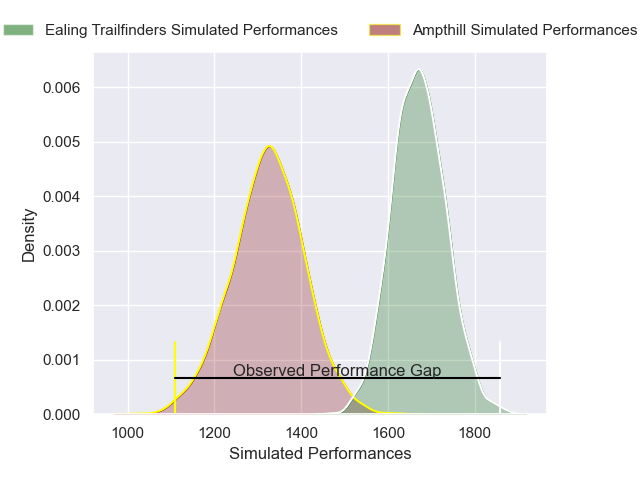
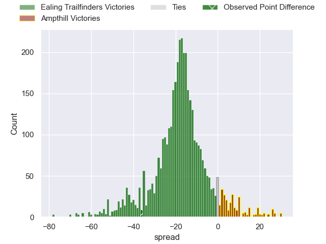
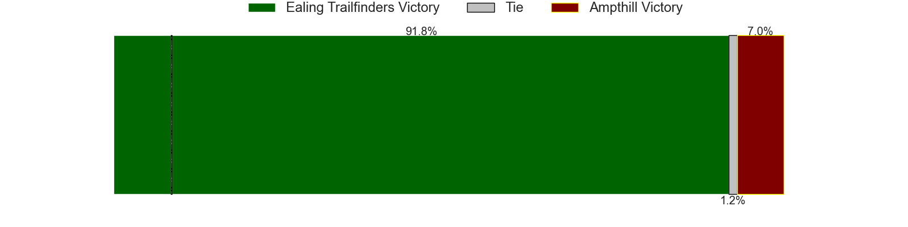
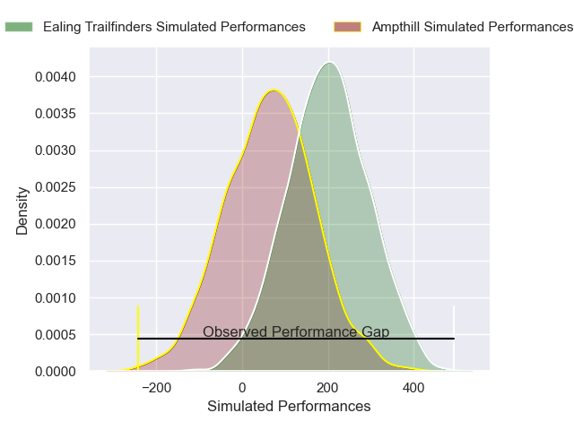
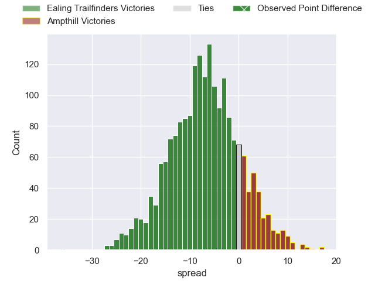

---  
layout: page  
title: Ealing Trailfinders at Ampthill; 53-17  
date: 2025-04-05 18:00:00 -0500  
categories: "RFU Championship 24/25" match review  
---
# Ealing Trailfinders at Ampthill; 53-17

# Club Level Predictions

The first set of predictions treats a club as the smallest object, as the club develops its members, organizes a gameplan, and deploys its players as needed for each match. This club model has a prediction of 0.123, which translates to predicting Ealing Trailfinders to win by 17.4.

Our Over/Under is 57.5 - and combined with the spread above, we have a predicted scoreline of 37 to 20

Each club has a rating and a rating deviation (similar to a Glicko rating), and expected performances can be generated. This allows for simulated matches and spreads like the ones below.
## Projected Performances - Club Model

## Projected Spreads - Club Model

## Projected Results - Club Model

# Player Level Predictions

Treating teams instead as an entity made up of the currently active players, I have ratings for each player in an altogether different system. These can be combined to form team ratings once teamsheets are announced, weighting starters a bit higher than the reserves. After the match is played, players can be weighted by their minutes on the field, allowing for an accurate measure of the team's composition. With these compiled team ratings, we can make predictions, measure inaccuracy, and update the individual player ratings.
## Prediction without Player Minutes: Ealing Trailfinders by 18.2

Ealing Trailfinders by 21.7 on a neutral pitch

## Projected Performances - Player Model

## Projected Spreads - Player Model

## Projected Results - Player Model

|   Away Minutes | Away Player         |   Away Percentile |   Number |   Home Percentile | Home Player                 |   Home Minutes |
|---------------:|:--------------------|------------------:|---------:|------------------:|:----------------------------|---------------:|
|           80   | Elliott Chilvers    |             38.24 |        1 |             49.76 | Harrison Courtney           |           80   |
|           26   | Mike Willemse       |             83.11 |        2 |             16.56 | Luke Thompson               |           76   |
|           10.5 | Biyi Alo            |             96.58 |        3 |              4.61 | Callum Norrie               |           40   |
|           80   | Bobby de Wee        |             97.93 |        4 |             43.36 | Kennedy Sylvester           |           40   |
|           18   | Matas Jurevicius    |             29.41 |        5 |             11.5  | Aidan King                  |           80   |
|           66   | Rob Farrar          |             92.04 |        6 |              8.43 | Lekima Ravuvu               |           80   |
|           80   | Jordy Reid          |             84.64 |        7 |              9.08 | Charles Rylands             |           53   |
|            0   | Josh Taylor         |             58.74 |        8 |              5.69 | Tino Mapapalangi            |           59   |
|           26   | Micheal Stronge     |             16.36 |        9 |             16.02 | Rory Morgan                 |           18   |
|            0   | Dan Jones           |             87.09 |       10 |              6.35 | Josh Barton                 |           30.5 |
|           37   | Tom Collins         |             99.17 |       11 |              9.83 | Vereimi Qorowale            |           80   |
|           18   | Jordan Holgate      |             96.44 |       12 |             74.54 | Fraser James Kevin Strachan |           18   |
|           10.5 | Reuben Bird-Tulloch |             85.03 |       13 |             32.89 | Sione Va'enuku              |           62   |
|           80   | Ben Harris          |             71.61 |       14 |             23.65 | Mason Cullen                |           80   |
|           80   | Michael Dykes       |             84.08 |       15 |             22.45 | Evan Mitchell               |           51   |

