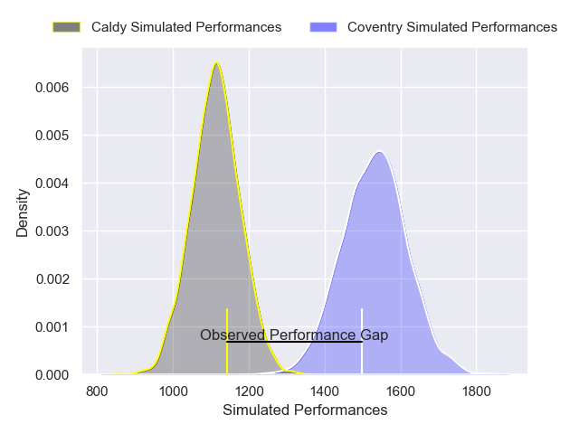
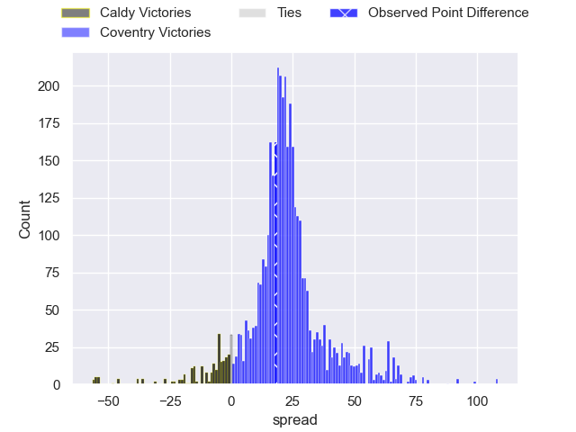
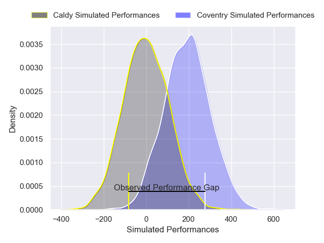
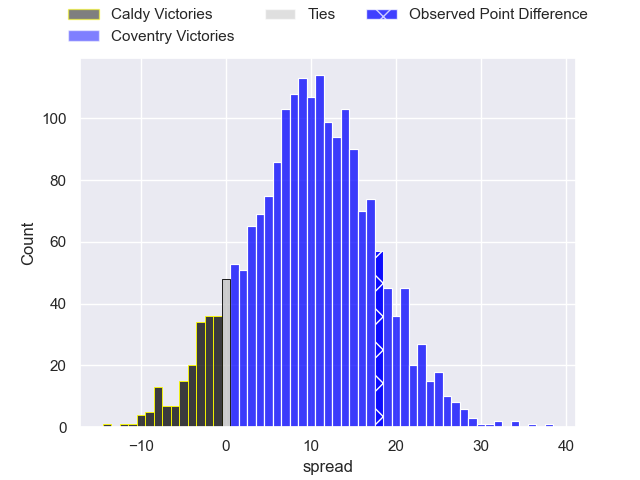
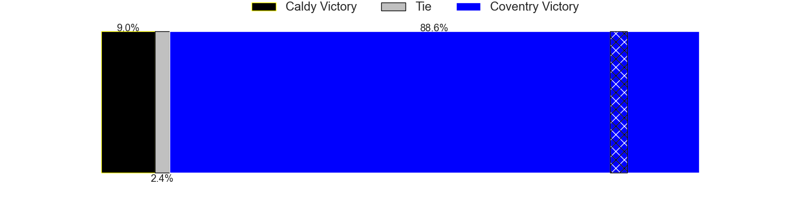

---  
layout: page  
title: Caldy at Coventry; 31-49  
date: 2025-04-05 18:00:00 -0500  
categories: "RFU Championship 24/25" match review  
---
# Caldy at Coventry; 31-49

# Club Level Predictions

The first set of predictions treats a club as the smallest object, as the club develops its members, organizes a gameplan, and deploys its players as needed for each match. This club model has a prediction of 0.914, which translates to predicting Coventry to win by 21.0.

Our Over/Under is 63.5 - and combined with the spread above, we have a predicted scoreline of 21 to 42

Each club has a rating and a rating deviation (similar to a Glicko rating), and expected performances can be generated. This allows for simulated matches and spreads like the ones below.
## Projected Performances - Club Model

## Projected Spreads - Club Model

## Projected Results - Club Model

# Player Level Predictions

Treating teams instead as an entity made up of the currently active players, I have ratings for each player in an altogether different system. These can be combined to form team ratings once teamsheets are announced, weighting starters a bit higher than the reserves. After the match is played, players can be weighted by their minutes on the field, allowing for an accurate measure of the team's composition. With these compiled team ratings, we can make predictions, measure inaccuracy, and update the individual player ratings.
## Prediction without Player Minutes: Coventry by 13.9

Coventry by 10.2 on a neutral pitch

## Projected Performances - Player Model

## Projected Spreads - Player Model

## Projected Results - Player Model

|   Away Minutes | Away Player      |   Away Percentile |   Number |   Home Percentile | Home Player        |   Home Minutes |
|---------------:|:-----------------|------------------:|---------:|------------------:|:-------------------|---------------:|
|             80 | Monty Weatherby  |             63.83 |        1 |             12    | Jevaughn Warren    |             55 |
|             80 | Matt Gallagher   |             29.26 |        2 |             18.56 | Will Biggs         |             55 |
|             80 | Joe Sproston     |              5.48 |        3 |             82.27 | Vilikesa Nairau    |             47 |
|             35 | Alex Groves      |             74.18 |        4 |             58.34 | Dan Green          |             80 |
|             21 | Thomas Sanders   |             34.78 |        5 |             98.68 | Senitiki Nayalo    |             45 |
|             35 | Callum Ridgway   |             11.7  |        6 |             92.51 | Tom Ball           |             80 |
|             62 | Jordan Jones     |             29.59 |        7 |             35.11 | Aaron Hinkley      |             71 |
|             67 | Josiah Dickinson |             15.65 |        8 |             32.11 | Chester Owen       |             59 |
|             25 | Ollie Wynn       |             25.3  |        9 |             24.28 | Sam Maunder        |             69 |
|             35 | Lewis Barker     |             10.25 |       10 |             67.42 | Tommy Mathews      |             72 |
|             21 | William Robinson |              8.16 |       11 |             94.06 | James Martin       |             21 |
|             40 | Michael Barlow   |             16.9  |       12 |             64.87 | Thomas Hitchcock   |             54 |
|             80 | Connor Wilkinson |              7.54 |       13 |             51.02 | Dafydd-Rhys Tiueti |             54 |
|             80 | Nick Royle       |             21.71 |       14 |             36.09 | Jacob Henry        |             65 |
|             65 | Matt Kilcourse   |             16.53 |       15 |             30.41 | Charlie Robson     |             80 |

