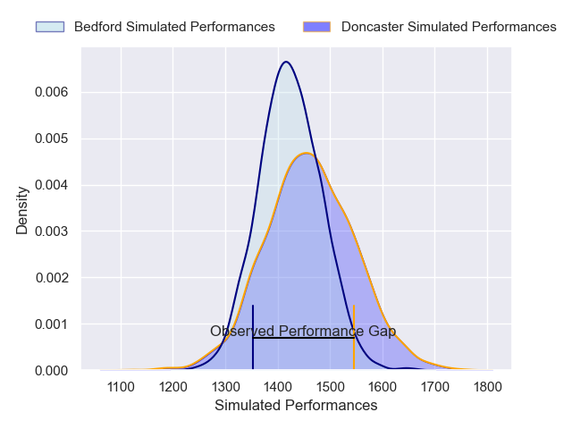
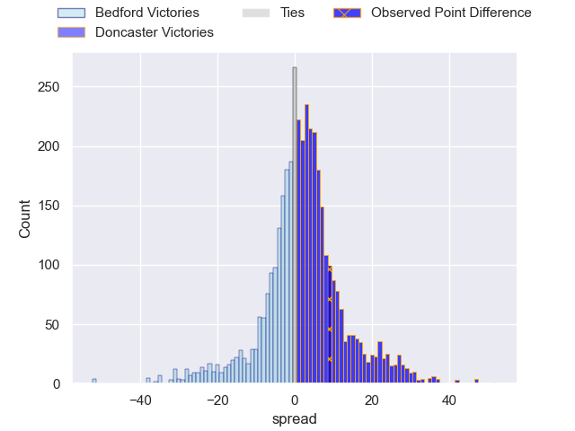
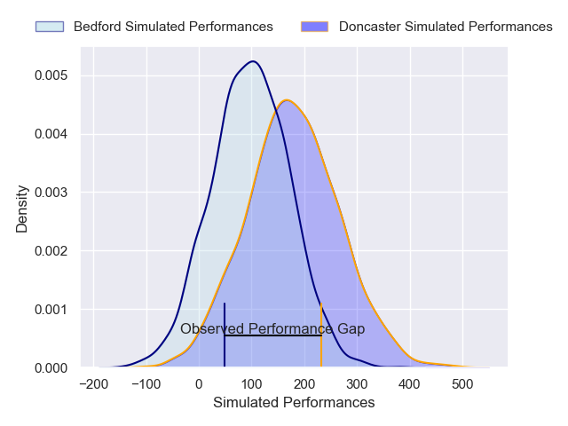
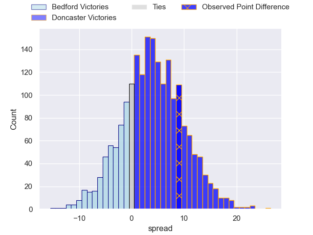
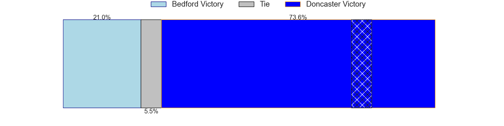

---  
layout: page  
title: Bedford at Doncaster; 32-41  
date: 2025-04-05 18:00:00 -0500  
categories: "RFU Championship 24/25" match review  
---
# Bedford at Doncaster; 32-41

# Club Level Predictions

The first set of predictions treats a club as the smallest object, as the club develops its members, organizes a gameplan, and deploys its players as needed for each match. This club model has a prediction of 0.55, which translates to predicting Doncaster to win by 1.8.

Our Over/Under is 61.5 - and combined with the spread above, we have a predicted scoreline of 30 to 32

Each club has a rating and a rating deviation (similar to a Glicko rating), and expected performances can be generated. This allows for simulated matches and spreads like the ones below.
## Projected Performances - Club Model

## Projected Spreads - Club Model

## Projected Results - Club Model

# Player Level Predictions

Treating teams instead as an entity made up of the currently active players, I have ratings for each player in an altogether different system. These can be combined to form team ratings once teamsheets are announced, weighting starters a bit higher than the reserves. After the match is played, players can be weighted by their minutes on the field, allowing for an accurate measure of the team's composition. With these compiled team ratings, we can make predictions, measure inaccuracy, and update the individual player ratings.
## Prediction without Player Minutes: Doncaster by 1.4

Bedford by 3.4 on a neutral pitch

## Projected Performances - Player Model

## Projected Spreads - Player Model

## Projected Results - Player Model

|   Away Minutes | Away Player          |   Away Percentile |   Number |   Home Percentile | Home Player       |   Home Minutes |
|---------------:|:---------------------|------------------:|---------:|------------------:|:------------------|---------------:|
|             21 | Jamie Jack           |             34.39 |        1 |             11.73 | Conor Davidson    |             40 |
|              7 | James Fish           |             50.75 |        2 |             28.03 | George Roberts    |             30 |
|             49 | Oisin Heffernan      |             90.49 |        3 |             95.96 | Logovi'i Mulipola |             15 |
|             20 | Ed Prowse            |             63.56 |        4 |             56.59 | Ben Murphy        |             80 |
|             40 | Alex Woolford        |             69.4  |        5 |             62.05 | Adam Hopkinson    |             80 |
|             40 | Archie Benson        |             33.4  |        6 |             34.16 | Arthur Green      |             54 |
|             30 | Joe Howard           |             14.04 |        7 |             30.83 | Rhys Tait         |             71 |
|             50 | Freddie Tuilagi      |              9.88 |        8 |             29.44 | Morgan Strong     |             80 |
|             19 | Alex Day             |             91.89 |        9 |             47.64 | Alex Dolly        |             41 |
|             15 | William Maisey       |             91.13 |       10 |             94.43 | Russell Bennett   |             23 |
|             18 | Dean Adamson         |             90.24 |       11 |             21.36 | Jordan Olowofela  |              0 |
|             80 | Michael Le Bourgeois |             65.07 |       12 |             11.41 | Zach Kerr         |             13 |
|             46 | Lucas Titherington   |             74.34 |       13 |              5.5  | George Wacokecoke |             49 |
|             18 | Alfie Garside        |             78.08 |       14 |             90.79 | Semesa Rokoduguni |             40 |
|             80 | Louis James          |             49.49 |       15 |             98.38 | Telusa Veainu     |             49 |

