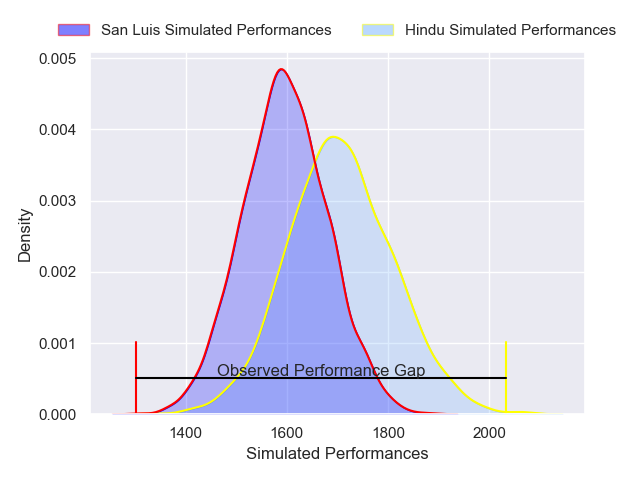
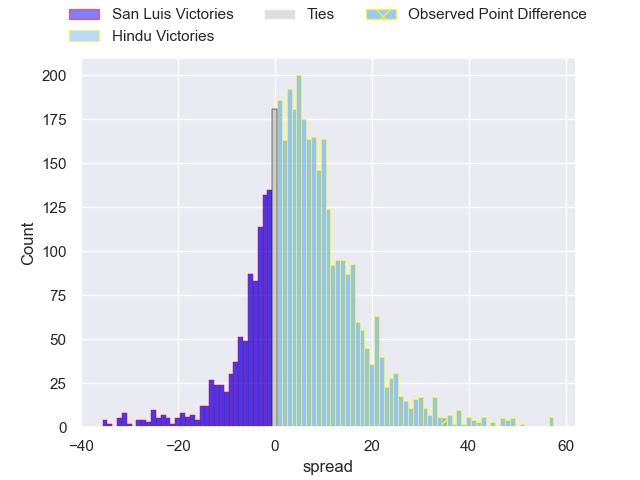
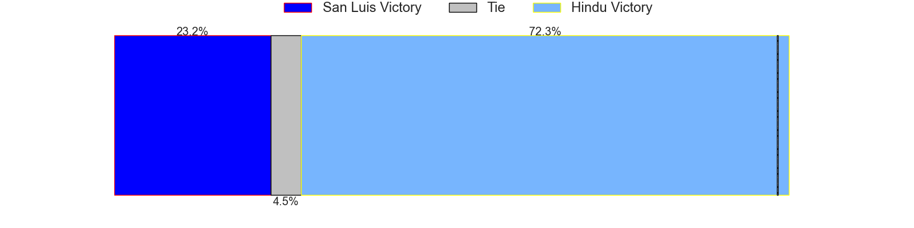
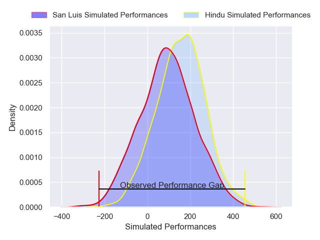
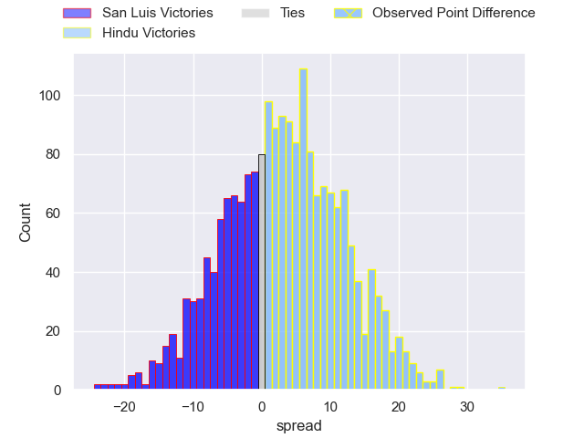
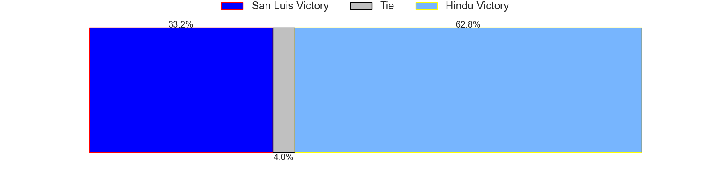

---  
layout: page  
title: San Luis at Hindu; 13-48  
date: 2025-04-05 18:00:00 -0500  
categories: "URBA Top 13 2025" match review  
---
# San Luis at Hindu; 13-48

# Club Level Predictions

The first set of predictions treats a club as the smallest object, as the club develops its members, organizes a gameplan, and deploys its players as needed for each match. This club model has a prediction of 0.651, which translates to predicting Hindu to win by 5.6.

Our Over/Under is 59.5 - and combined with the spread above, we have a predicted scoreline of 27 to 33

Each club has a rating and a rating deviation (similar to a Glicko rating), and expected performances can be generated. This allows for simulated matches and spreads like the ones below.
## Projected Performances - Club Model

## Projected Spreads - Club Model

## Projected Results - Club Model

# Player Level Predictions

Treating teams instead as an entity made up of the currently active players, I have ratings for each player in an altogether different system. These can be combined to form team ratings once teamsheets are announced, weighting starters a bit higher than the reserves. After the match is played, players can be weighted by their minutes on the field, allowing for an accurate measure of the team's composition. With these compiled team ratings, we can make predictions, measure inaccuracy, and update the individual player ratings.
## Prediction without Player Minutes: Hindu by 3.6

San Luis by 2.1 on a neutral pitch

## Projected Performances - Player Model

## Projected Spreads - Player Model

## Projected Results - Player Model

|   Away Minutes | Away Player           |   Away Percentile |   Number |   Home Percentile | Home Player                |   Home Minutes |
|---------------:|:----------------------|------------------:|---------:|------------------:|:---------------------------|---------------:|
|             56 | Santiago Bonavento    |             50.48 |        1 |             50.24 | Juan Ignacio Martinez Sosa |             40 |
|             80 | Mateo Caffaro         |             17.06 |        2 |              5.52 | Agustin Capurro            |             38 |
|             56 | Mateo Calistro        |             19.4  |        3 |             13.75 | Nicolas Leiva              |             54 |
|             62 | Marco Morimanno       |             31.95 |        4 |             65.98 | Santiago Pacheco           |             80 |
|             70 | Santiago Canal        |             39.4  |        5 |             19.89 | Juan Ignacio Comolli       |             68 |
|             80 | Franco Gnecco         |             41.48 |        6 |              7.02 | Santino Amayav             |             80 |
|             80 | Felipe Piatti         |             20.13 |        7 |             67.88 | Victor Franco              |             80 |
|             80 | Santiago Gibert       |             17.68 |        8 |             67.89 | Nicolas Amaya              |             80 |
|             68 | Martin Aereboe        |             15.01 |        9 |             95.28 | Felipe Ezcurra             |             26 |
|             80 | Isidro Lazzarini      |             13.32 |       10 |             73.57 | Joaquin Diaz Bonilla       |             80 |
|             66 | Felipe Hernandez      |             30.8  |       11 |             67.07 | Ivo Markvart               |             80 |
|             61 | Segundo Fresco        |             61.41 |       12 |             52.34 | Ramon Fernandez Miranda    |             30 |
|             61 | Facundo Gibert        |             27.6  |       13 |             73.52 | Federico Graglia           |             80 |
|             80 | Eduardo Ruesta        |             24.12 |       14 |             13.36 | Lisandro Rodriguez         |             80 |
|             70 | Valentino Quattrocchi |             21.02 |       15 |             58.78 | Pascal Senillosa           |             65 |

