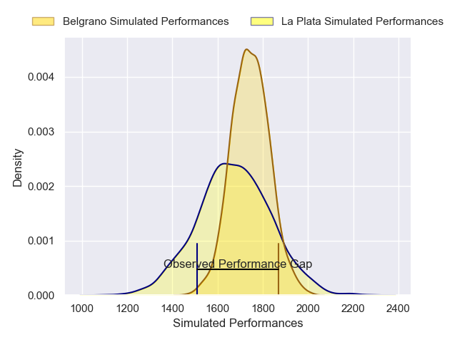
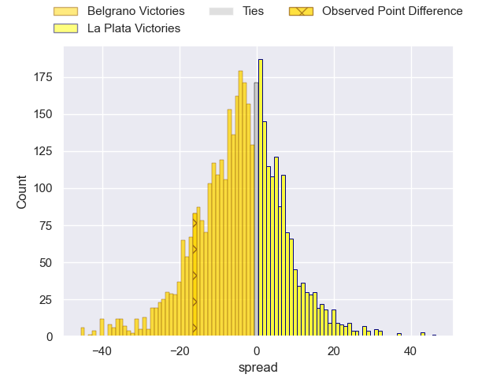
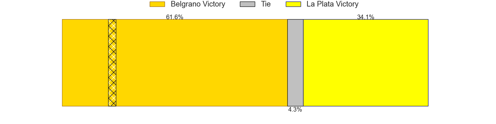
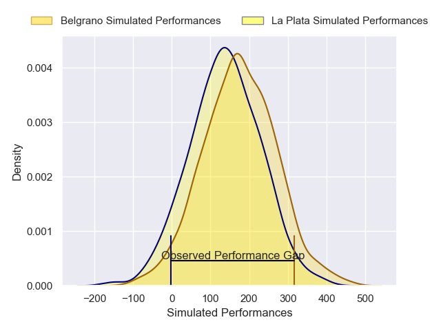
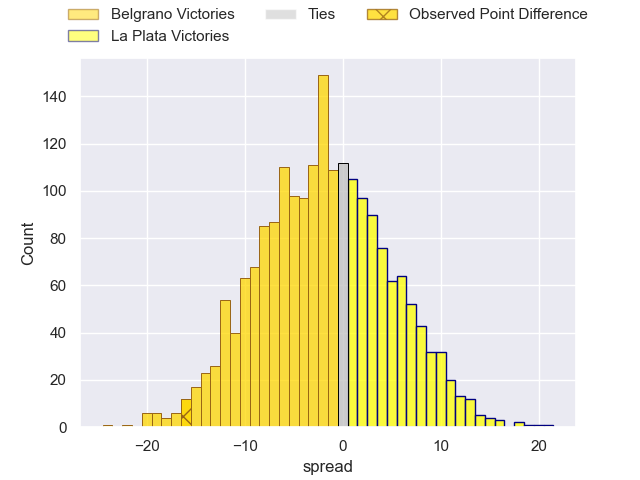
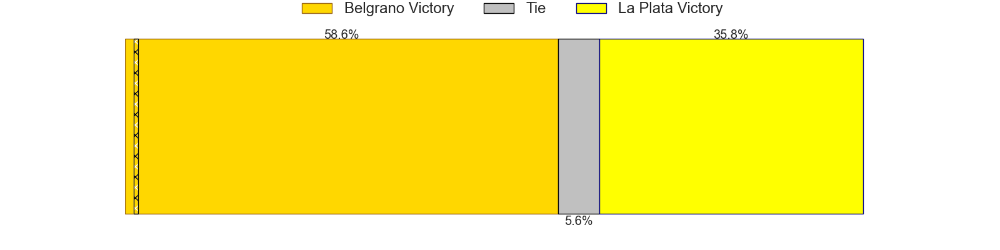

---  
layout: page  
title: Belgrano at La Plata; 44-28  
date: 2025-04-05 18:00:00 -0500  
categories: "URBA Top 13 2025" match review  
---
# Belgrano at La Plata; 44-28

# Club Level Predictions

The first set of predictions treats a club as the smallest object, as the club develops its members, organizes a gameplan, and deploys its players as needed for each match. This club model has a prediction of 0.404, which translates to predicting Belgrano to win by 3.5.

Our Over/Under is 53.5 - and combined with the spread above, we have a predicted scoreline of 29 to 25

Each club has a rating and a rating deviation (similar to a Glicko rating), and expected performances can be generated. This allows for simulated matches and spreads like the ones below.
## Projected Performances - Club Model

## Projected Spreads - Club Model

## Projected Results - Club Model

# Player Level Predictions

Treating teams instead as an entity made up of the currently active players, I have ratings for each player in an altogether different system. These can be combined to form team ratings once teamsheets are announced, weighting starters a bit higher than the reserves. After the match is played, players can be weighted by their minutes on the field, allowing for an accurate measure of the team's composition. With these compiled team ratings, we can make predictions, measure inaccuracy, and update the individual player ratings.
## Prediction without Player Minutes: Belgrano by 8.2

Belgrano by 12.8 on a neutral pitch

## Projected Performances - Player Model

## Projected Spreads - Player Model

## Projected Results - Player Model

|   Away Minutes | Away Player            |   Away Percentile |   Number |   Home Percentile | Home Player            |   Home Minutes |
|---------------:|:-----------------------|------------------:|---------:|------------------:|:-----------------------|---------------:|
|             57 | Francisco Ferronato    |             96.03 |        1 |             14.85 | Ariel Del Cerro        |             73 |
|             80 | Santiago Villegas      |             65.28 |        2 |             27.05 | Facundo Scarpinelli    |             80 |
|              7 | Lisandro Garcia Dragui |             74.34 |        3 |             39    | Ignacio Luna           |             15 |
|             80 | Augusto Vaccarino      |             88.89 |        4 |             19.28 | Bautista Ozog          |             63 |
|             80 | Mickael Blond Quesada  |             61.25 |        5 |             45.77 | Tomas Bernasconi       |             65 |
|             33 | Joaquin de la Serna    |             93.63 |        6 |             28.46 | Juan Abriola           |             80 |
|              0 | Julian Rebussone       |             87.83 |        7 |             40.92 | Francisco Humbert Lan  |             20 |
|             80 | Franco Leon Vega       |             62.2  |        8 |             26.22 | Nicolas Chiappani      |             80 |
|             28 | Theo Blaksley          |             27.32 |        9 |             38.95 | Joaquin Guimaraynz     |             34 |
|             34 | Juan Aparicio          |             79.25 |       10 |             24.07 | Francisco Suarez Folch |             80 |
|             23 | Pedro Arana            |             48.75 |       11 |            nan    | nan                    |            nan |
|             30 | Martin Arana           |             75.48 |       12 |            nan    | nan                    |            nan |
|             80 | Tomas Etchepare        |             86.47 |       13 |            nan    | nan                    |            nan |
|             23 | Ignacio Diaz           |             84.34 |       14 |            nan    | nan                    |            nan |
|             52 | Juan Lando             |             93.63 |       15 |            nan    | nan                    |            nan |

