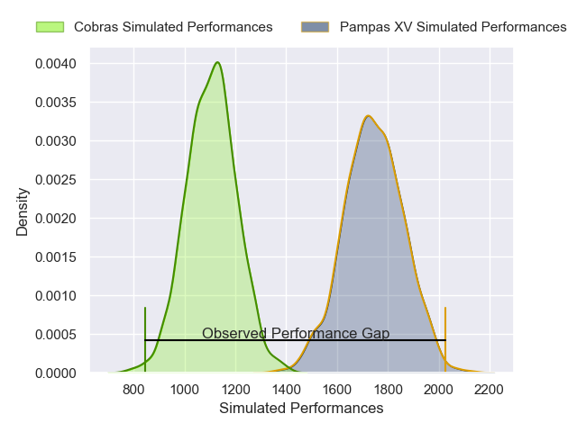
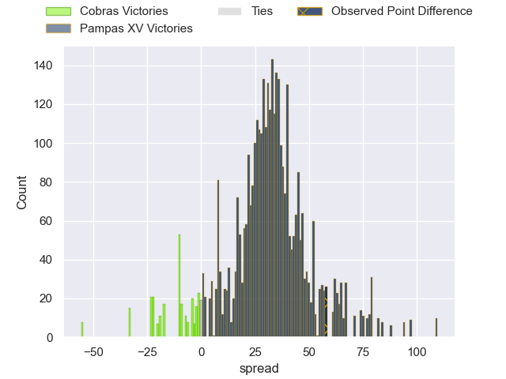
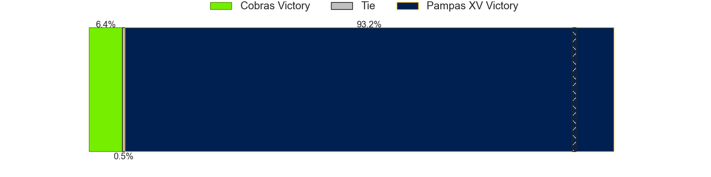
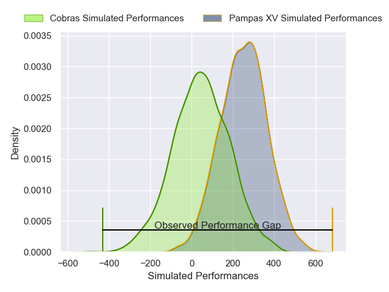
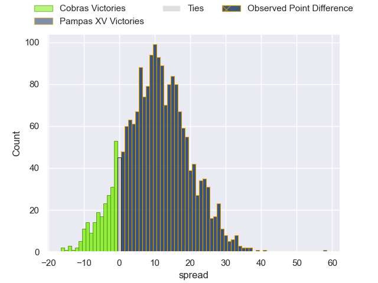

---  
layout: page  
title: Cobras at Pampas XV; 14-72  
date: 2025-04-05 18:00:00 -0500  
categories: "Super Rugby Americas 2025" match review  
---
# Cobras at Pampas XV; 14-72

# Club Level Predictions

The first set of predictions treats a club as the smallest object, as the club develops its members, organizes a gameplan, and deploys its players as needed for each match. This club model has a prediction of 0.971, which translates to predicting Pampas XV to win by 32.0.

Our Over/Under is 59.5 - and combined with the spread above, we have a predicted scoreline of 14 to 46

Each club has a rating and a rating deviation (similar to a Glicko rating), and expected performances can be generated. This allows for simulated matches and spreads like the ones below.
## Projected Performances - Club Model

## Projected Spreads - Club Model

## Projected Results - Club Model

# Player Level Predictions

Treating teams instead as an entity made up of the currently active players, I have ratings for each player in an altogether different system. These can be combined to form team ratings once teamsheets are announced, weighting starters a bit higher than the reserves. After the match is played, players can be weighted by their minutes on the field, allowing for an accurate measure of the team's composition. With these compiled team ratings, we can make predictions, measure inaccuracy, and update the individual player ratings.
## Prediction without Player Minutes: Pampas XV by 9.7

Pampas XV by 7.4 on a neutral pitch

## Projected Performances - Player Model

## Projected Spreads - Player Model

## Projected Results - Player Model

|   Away Minutes | Away Player               |   Away Percentile |   Number |   Home Percentile | Home Player               |   Home Minutes |
|---------------:|:--------------------------|------------------:|---------:|------------------:|:--------------------------|---------------:|
|             80 | Brendon Alves             |             16.22 |        1 |             27.11 | Javier Corvalan           |             10 |
|             40 | Henrique Ribeiro Ferreira |              9.36 |        2 |             58.86 | Ramiro Gurovich           |             54 |
|             51 | Javier Angel Coronel      |             51.51 |        3 |             73.05 | Emir Gael Galvan          |             29 |
|             80 | Adrio Melo                |             38.17 |        4 |             88.69 | Juan Penoucos             |             80 |
|             80 | Gabriel Oliveira          |             13.76 |        5 |             20.36 | Federico Ignacio Lavanini |             21 |
|              8 | Matheus Claudio           |              7.58 |        6 |             75.66 | Manuel Bernstein          |             51 |
|             28 | Renato Santos             |             41.95 |        7 |             77.62 | Joaquin Moro              |             52 |
|             18 | Manuel Todaro             |             63.62 |        8 |             80.49 | Juan Pedro Bernasconi     |             72 |
|             80 | Felipe Goncalves Cunha    |             41.99 |        9 |             38.28 | Eliseo Morales Abraham    |             60 |
|             14 | Augusto Guillamondegui    |             25    |       10 |             23.36 | Estanislao Renthel        |             66 |
|             20 | Moises Duque              |              6.49 |       11 |             37.94 | Francisco Quinn           |             80 |
|             17 | Fernando Dario Luna       |             24.64 |       12 |             90.63 | Justo Piccardo            |             54 |
|             80 | Widson Nascimento         |             24.95 |       13 |             72.61 | Bruno Heit                |             54 |
|             80 | Andrei Santana            |             34.14 |       14 |             57.24 | Nahuel Clausen            |             59 |
|             80 | Nicolas Azevedo           |             23.67 |       15 |             24.69 | Jeronimo Solveyra         |             39 |
|             29 | Lorenzo Temer Massari     |             29.53 |       16 |             89.13 | Ignacio Bottazzini        |             59 |
|             80 | Thiago Oviedo             |            nan    |       17 |             74.93 | Franco Carrera            |             18 |
|             70 | Aquiles Schulter          |             43.32 |       18 |             90.48 | Leo Mazzini               |             16 |
|             62 | Endy Willian              |             13.04 |       19 |             86    | Mateo Albanese            |             21 |
|             80 | Cleber Dias               |              6.41 |       20 |             76.87 | Nicolas Damorim           |             80 |
|             71 | Rodolfo Martins           |             35.98 |       21 |             82.03 | Tomas Rapetti             |             80 |
|             80 | Vicente Galvao            |             41.18 |       22 |             67.79 | Ignacio Inchauspe         |             59 |
|             59 | Rodrigo Santos            |             43.84 |       23 |             73.24 | Francisco Lusarreta       |             64 |

