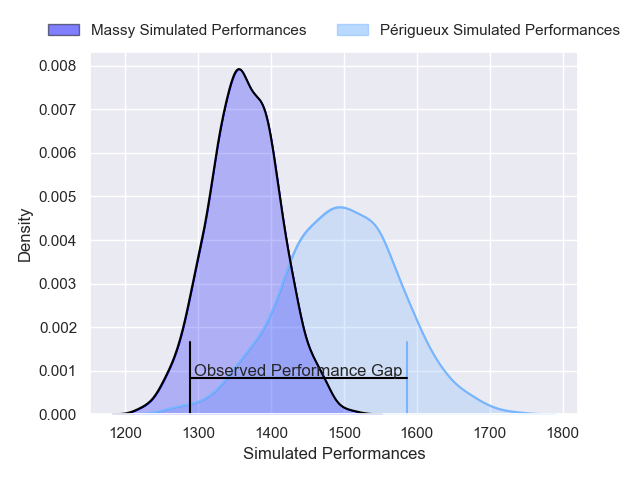
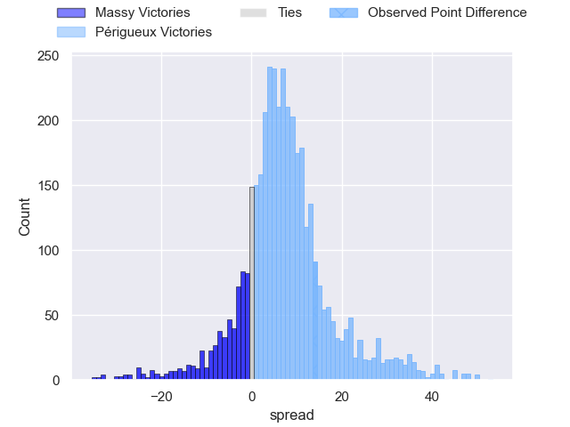
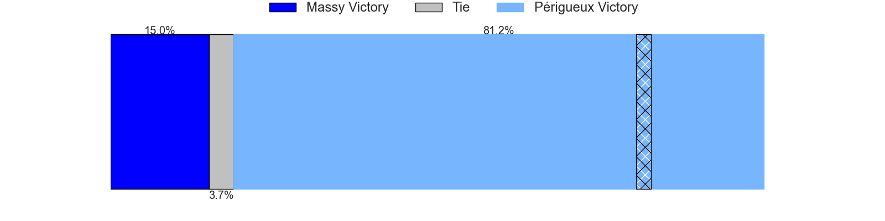
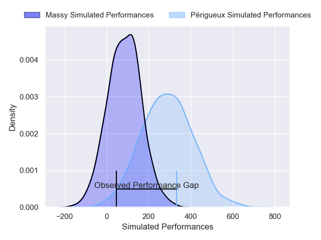
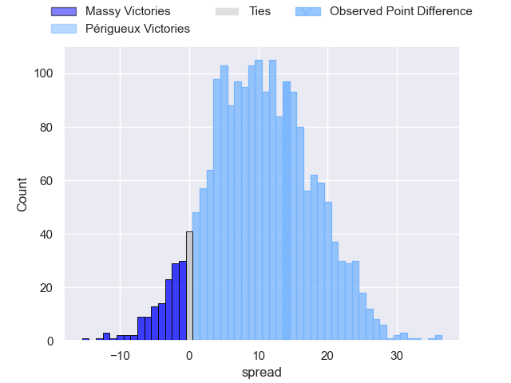
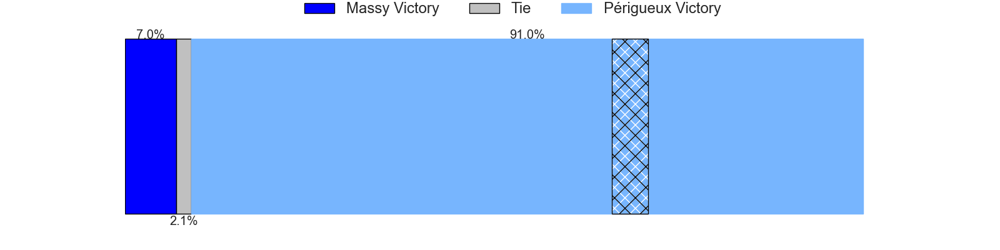

---  
layout: page  
title: Massy at Perigueux; 23-37  
date: 2025-04-05 18:00:00 -0500  
categories: "Nationale 24/25" match review  
---
# Massy at Perigueux; 23-37

# Club Level Predictions

The first set of predictions treats a club as the smallest object, as the club develops its members, organizes a gameplan, and deploys its players as needed for each match. This club model has a prediction of 0.679, which translates to predicting Périgueux to win by 6.6.

Our Over/Under is 39.5 - and combined with the spread above, we have a predicted scoreline of 17 to 23

Each club has a rating and a rating deviation (similar to a Glicko rating), and expected performances can be generated. This allows for simulated matches and spreads like the ones below.
## Projected Performances - Club Model

## Projected Spreads - Club Model

## Projected Results - Club Model

# Player Level Predictions

Treating teams instead as an entity made up of the currently active players, I have ratings for each player in an altogether different system. These can be combined to form team ratings once teamsheets are announced, weighting starters a bit higher than the reserves. After the match is played, players can be weighted by their minutes on the field, allowing for an accurate measure of the team's composition. With these compiled team ratings, we can make predictions, measure inaccuracy, and update the individual player ratings.
## Prediction without Player Minutes: Périgueux by 4.2

Périgueux by 1.2 on a neutral pitch

## Projected Performances - Player Model

## Projected Spreads - Player Model

## Projected Results - Player Model

|   Away Minutes | Away Player            |   Away Percentile |   Number |   Home Percentile | Home Player       |   Home Minutes |
|---------------:|:-----------------------|------------------:|---------:|------------------:|:------------------|---------------:|
|             10 | Robin Poipy            |             56.52 |        1 |             75.52 | Emilien Borges    |             80 |
|             23 | Pierre Trassoudaine    |             93.81 |        2 |              0.84 | Manu Leiataua     |             30 |
|              4 | Nicolas Ferrer         |             84.18 |        3 |             63.91 | Kalaveti Tawake   |             75 |
|             24 | Saba Pesvianidze       |             79.55 |        4 |             67.2  | Clement Lanen     |             80 |
|             13 | Andrei Mahu            |             49.67 |        5 |             21.58 | Jaco Willemse     |             64 |
|             80 | Hugo Boutin            |             49.25 |        6 |             65.54 | Karl Lambert      |             40 |
|             28 | Clément Vidoni         |             62.45 |        7 |             97.47 | Afaesetiti Amosa  |             80 |
|             23 | Alexandre Loubiere     |             77.44 |        8 |             75.41 | Masivesi Dakuwaqa |             62 |
|             18 | Lucas Rubio            |             49.07 |        9 |             35.75 | Max Green         |             49 |
|             57 | Gonzalo Lopez Bontempo |             43.85 |       10 |             74.59 | Greg Hutley       |             59 |
|             31 | Ilian El Yahyaoui      |             60.39 |       11 |             83.67 | Tim Giresse       |             61 |
|             20 | Arthur Seigneuret      |             81.57 |       12 |             87.58 | Cyril Couturier   |             50 |
|             34 | Anthony Favier         |             53.05 |       13 |             67.21 | Dorian Lavernhe   |             18 |
|             50 | Giorgi Gogoladze       |             20.59 |       14 |             92.58 | Fred Hickes       |             40 |
|             50 | Alexandre Borie        |             62.86 |       15 |             62.45 | Yon Camou         |             21 |
|             42 | Fernandez Correa       |              2.62 |       16 |             29.57 | Jason Tindiliere  |             80 |
|             28 | Nolan Pienaar          |             49.52 |       17 |            nan    | Louis Martin      |             54 |
|             62 | Tijde Visser           |             79.57 |       18 |             78.38 | Anthony Pelmard   |             80 |
|             20 | Noa Rolnin             |            nan    |       19 |             66.73 | Richard Fourcade  |             56 |
|             31 | Tony Tissot            |             33.15 |       20 |             57.11 | Nahum Merigan     |             80 |
|             13 | Julien Blanc           |             72.68 |       21 |             29.01 | Nicolas Faltrept  |             40 |
|             64 | Diego Pinheiro Ruiz    |             61.42 |       22 |             34.73 | Nicolas Piaton    |             75 |
|            nan | nan                    |            nan    |       23 |             42.01 | Anderson Neisen   |             52 |

