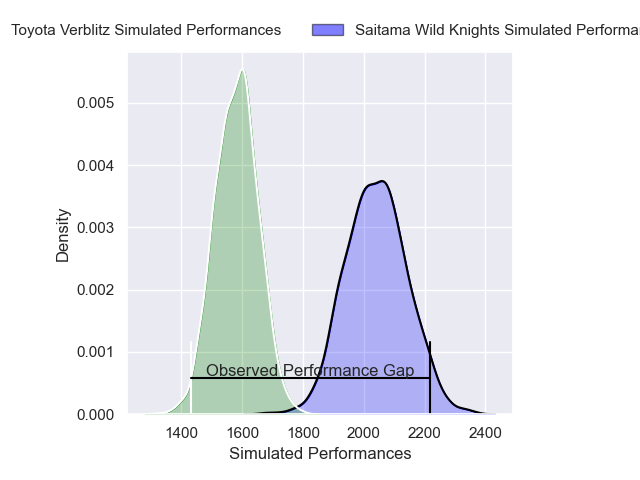
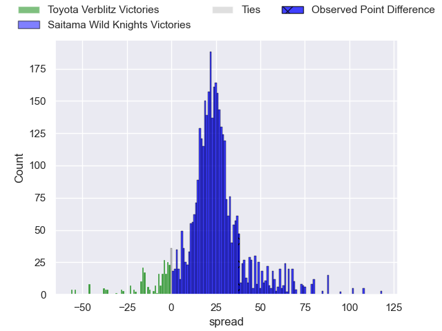
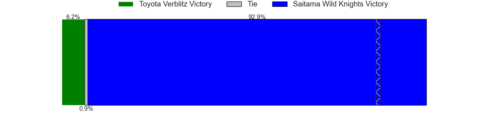
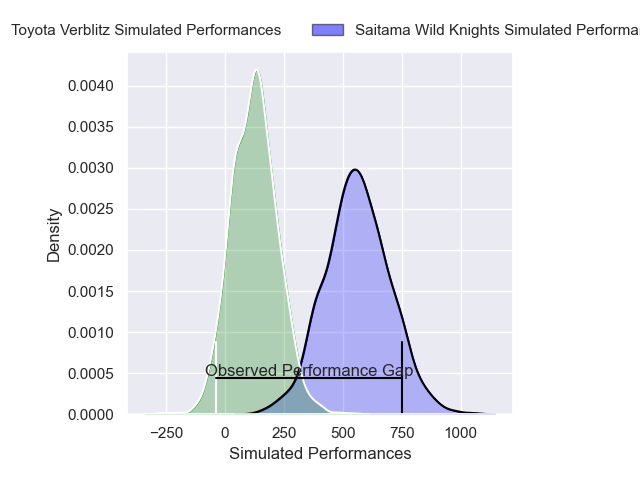
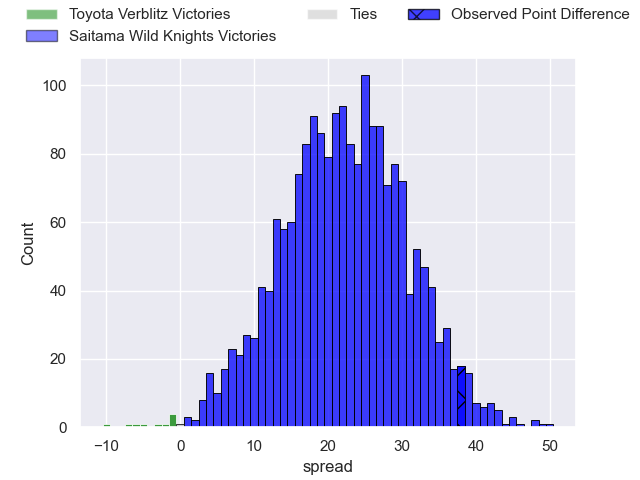
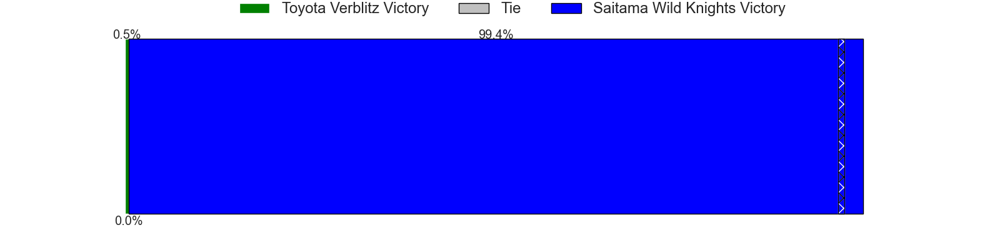

---  
layout: page  
title: Toyota Verblitz at Saitama Wild Knights; 17-55  
date: 2025-04-05 18:00:00 -0500  
categories: "Japan Rugby League One 24/25" match review  
---
# Toyota Verblitz at Saitama Wild Knights; 17-55

# Club Level Predictions

The first set of predictions treats a club as the smallest object, as the club develops its members, organizes a gameplan, and deploys its players as needed for each match. This club model has a prediction of 0.929, which translates to predicting Saitama Wild Knights to win by 22.8.

Our Over/Under is 58.5 - and combined with the spread above, we have a predicted scoreline of 18 to 41

Each club has a rating and a rating deviation (similar to a Glicko rating), and expected performances can be generated. This allows for simulated matches and spreads like the ones below.
## Projected Performances - Club Model

## Projected Spreads - Club Model

## Projected Results - Club Model

# Player Level Predictions

Treating teams instead as an entity made up of the currently active players, I have ratings for each player in an altogether different system. These can be combined to form team ratings once teamsheets are announced, weighting starters a bit higher than the reserves. After the match is played, players can be weighted by their minutes on the field, allowing for an accurate measure of the team's composition. With these compiled team ratings, we can make predictions, measure inaccuracy, and update the individual player ratings.
## Prediction without Player Minutes: Saitama Wild Knights by 18.3

Saitama Wild Knights by 13.7 on a neutral pitch

## Projected Performances - Player Model

## Projected Spreads - Player Model

## Projected Results - Player Model

|   Away Minutes | Away Player         |   Away Percentile |   Number |   Home Percentile | Home Player       |   Home Minutes |
|---------------:|:--------------------|------------------:|---------:|------------------:|:------------------|---------------:|
|             61 | Shogo Miura         |             87.44 |        1 |             62.56 | Daniel Perez      |             62 |
|             26 | Yoshikatsu Hikosaka |             87.63 |        2 |             88.8  | Atsushi Sakate    |             51 |
|             15 | Yusuke Kizu         |             68.68 |        3 |             52.78 | Lisala Finau      |             80 |
|             25 | Richie Gray         |             81.15 |        4 |             98.4  | Jack Cornelsen    |             29 |
|             34 | Josh Dickson        |             35.82 |        5 |             69.37 | Esei Ha'angana    |             80 |
|              0 | Keito Aoki          |             26.22 |        6 |             51.5  | Shota Fukui       |             62 |
|             19 | Michael Hooper      |             99.44 |        7 |             93.91 | Ben Gunter        |             80 |
|             80 | Akito Okui          |             19.72 |        8 |             93.9  | Itsuki Onishi     |             54 |
|             25 | Kaito Shigeno       |             10.46 |        9 |             94.1  | Taiki Koyama      |             80 |
|             43 | Shinya Komura       |             33.2  |       10 |             40.57 | Takaya Saito      |             24 |
|             30 | Viliame Tuidraki    |             85.53 |       11 |             95.08 | Marika Koroibete  |             52 |
|             54 | Nicholas McCurran   |             75.87 |       12 |             99.49 | Damian de Allende |             80 |
|              7 | Siosaia Fifita      |              0.51 |       13 |             58.55 | Vince Aso         |             80 |
|             22 | Joseph Manu         |             14.38 |       14 |             96.57 | Koki Takeyama     |             68 |
|             80 | Taichi Takahashi    |             78.78 |       15 |             96.94 | Ryuji Noguchi     |             80 |
|             28 | Aaron Smith         |             95.11 |       16 |            nan    | Taniyama Hayata   |             77 |
|             10 | Daichi Akiyama      |             60.13 |       17 |             96.32 | Lood de Jager     |             80 |
|             64 | Shunsuke Asaoka     |             28.54 |       18 |            nan    | Craig Millar      |             80 |
|             16 | Dick Wilson         |              8.78 |       19 |             87.09 | Liam Mitchell     |             23 |
|             46 | Ryunosuke Momoji    |             16.06 |       20 |             98.25 | Asaeli Ai Valu    |             65 |
|             26 | Matt McGahan        |             69.06 |       21 |            nan    | Yuta Takagi       |             72 |
|             80 | Taiga Kawasaki      |            nan    |       22 |              1.76 | Joshua Nohra      |             20 |
|             80 | Kosei Miki          |             47.19 |       23 |             19.23 | Kenji Sato        |             67 |

