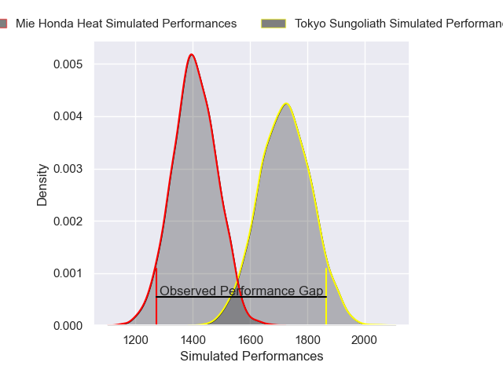
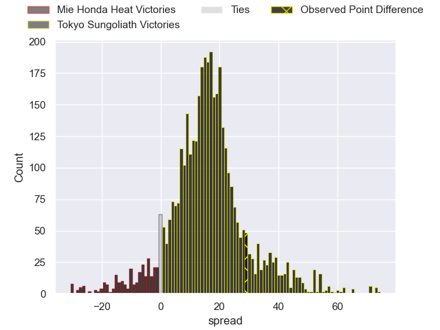
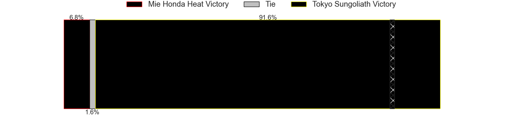
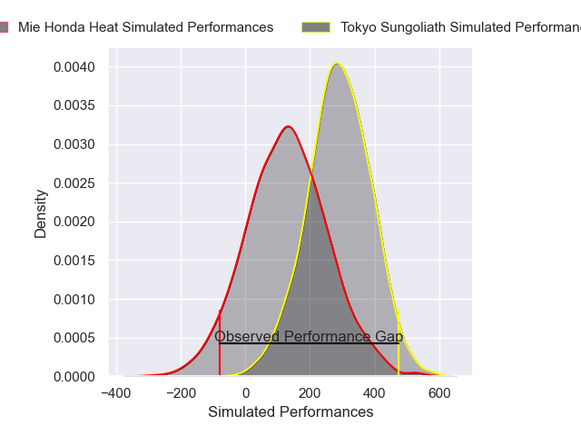
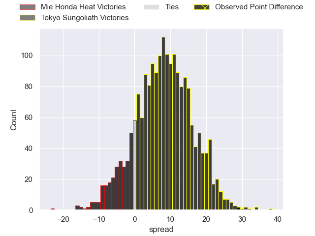

---  
layout: page  
title: Mie Honda Heat at Tokyo Sungoliath; 31-60  
date: 2025-04-05 18:00:00 -0500  
categories: "Japan Rugby League One 24/25" match review  
---
# Mie Honda Heat at Tokyo Sungoliath; 31-60

# Club Level Predictions

The first set of predictions treats a club as the smallest object, as the club develops its members, organizes a gameplan, and deploys its players as needed for each match. This club model has a prediction of 0.855, which translates to predicting Tokyo Sungoliath to win by 15.9.

Our Over/Under is 69.5 - and combined with the spread above, we have a predicted scoreline of 27 to 43

Each club has a rating and a rating deviation (similar to a Glicko rating), and expected performances can be generated. This allows for simulated matches and spreads like the ones below.
## Projected Performances - Club Model

## Projected Spreads - Club Model

## Projected Results - Club Model

# Player Level Predictions

Treating teams instead as an entity made up of the currently active players, I have ratings for each player in an altogether different system. These can be combined to form team ratings once teamsheets are announced, weighting starters a bit higher than the reserves. After the match is played, players can be weighted by their minutes on the field, allowing for an accurate measure of the team's composition. With these compiled team ratings, we can make predictions, measure inaccuracy, and update the individual player ratings.
## Prediction without Player Minutes: Tokyo Sungoliath by 19.6

Tokyo Sungoliath by 14.6 on a neutral pitch

## Projected Performances - Player Model

## Projected Spreads - Player Model

## Projected Results - Player Model

|   Away Minutes | Away Player            |   Away Percentile |   Number |   Home Percentile | Home Player       |   Home Minutes |
|---------------:|:-----------------------|------------------:|---------:|------------------:|:------------------|---------------:|
|             80 | Matthys Basson         |             16.93 |        1 |             77.58 | Kenta Kobayashi   |             50 |
|              0 | Ikuma Yamada           |             55.02 |        2 |             66.56 | Kosuke Horikoshi  |             42 |
|             60 | Feinga Kihe Lotu Fakai |              6.2  |        3 |             31.48 | Kan Nakano        |             80 |
|             70 | Mark Abbott            |             15.27 |        4 |             41.85 | Trevor Hosea      |             80 |
|             52 | Franco Mostert         |             89.35 |        5 |             98.59 | Harry Hockings    |             67 |
|             80 | Ryota Kobayashi        |              2.72 |        6 |             74.81 | Ryuga Hashimoto   |             68 |
|             22 | Ryo Furuta             |              3    |        7 |             28.37 | Kai Yamamoto      |             12 |
|             13 | Talifolofola Tangipa   |             35.16 |        8 |             97.15 | Sean McMahon      |             20 |
|             80 | Azuma Doei             |             50.76 |        9 |             77.4  | Yutaka Nagare     |             20 |
|              0 | Gwangtee Oh            |             15.98 |       10 |             65.78 | Mikiya Takamoto   |             28 |
|             38 | Larry Steven Sulunga   |             77.64 |       11 |             99.54 | Cheslin Kolbe     |             30 |
|             80 | Manu Vunipola          |             51.73 |       12 |              8.66 | Shogo Nakano      |              3 |
|             13 | Dawid Kellerman        |             11.2  |       13 |             64.56 | Isaiah Punivai    |             56 |
|              8 | Naoki Motomura         |             25.32 |       14 |             92.86 | Seiya Ozaki       |             23 |
|             80 | Tom Banks              |             77.14 |       15 |             93.88 | Kotaro Matsushima |              8 |
|             51 | Ryoma Nishimura        |             85.49 |       16 |             79.68 | Kanji Shimokawa   |             28 |
|             54 | Koki Hida              |             30.94 |       17 |             72.01 | Kenta Fukuda      |             28 |
|             52 | Janko Swanepoel        |             87.94 |       18 |             95.85 | Sam Jeffries      |             26 |
|             80 | Hayata Nakao           |             85.04 |       19 |             92.21 | Yukio Morikawa    |             26 |
|             12 | Shogo Nezuka           |             12.48 |       20 |             18.73 | Tatsuya Miyazaki  |             80 |
|             65 | Tevita Li              |             95.36 |       21 |             95.93 | Ryoto Nakamura    |             15 |
|             80 | Tatsuhiko Tsurukawa    |             11.05 |       22 |             21.63 | Ryosuke Kawase    |             15 |
|             55 | Taiki Yoshioka         |             21.94 |       23 |             38.71 | Kotaro Hosoki     |             80 |

