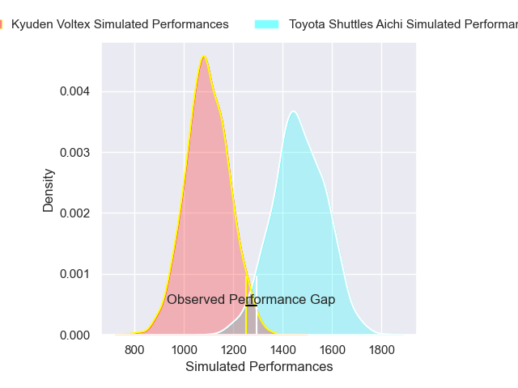
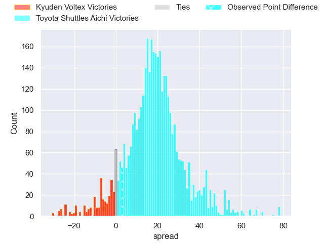
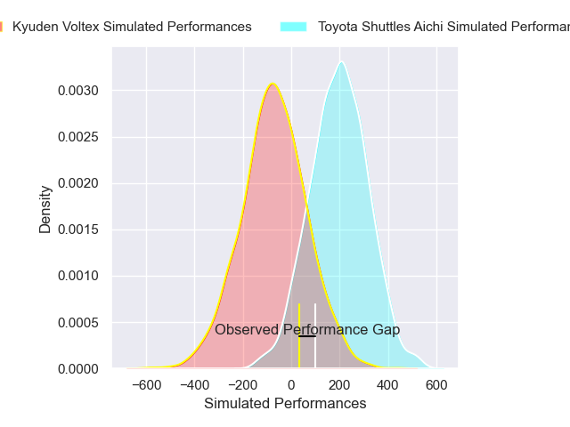
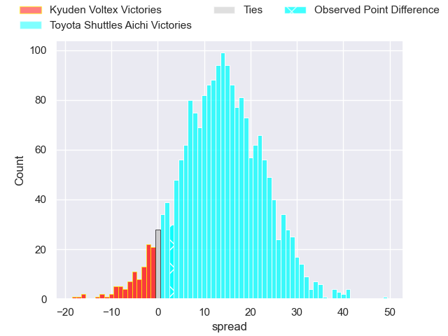
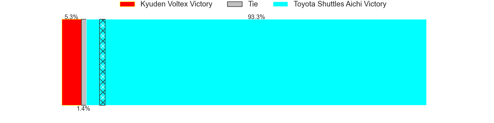

---  
layout: page  
title: Kyuden Voltex at Toyota Shuttles Aichi; 23-26  
date: 2025-04-05 18:00:00 -0500  
categories: "Japan Rugby League One D2 24/25" match review  
---
# Kyuden Voltex at Toyota Shuttles Aichi; 23-26

# Club Level Predictions

The first set of predictions treats a club as the smallest object, as the club develops its members, organizes a gameplan, and deploys its players as needed for each match. This club model has a prediction of 0.887, which translates to predicting Toyota Shuttles Aichi to win by 18.6.

Our Over/Under is 68.5 - and combined with the spread above, we have a predicted scoreline of 25 to 44

Each club has a rating and a rating deviation (similar to a Glicko rating), and expected performances can be generated. This allows for simulated matches and spreads like the ones below.
## Projected Performances - Club Model

## Projected Spreads - Club Model

## Projected Results - Club Model

# Player Level Predictions

Treating teams instead as an entity made up of the currently active players, I have ratings for each player in an altogether different system. These can be combined to form team ratings once teamsheets are announced, weighting starters a bit higher than the reserves. After the match is played, players can be weighted by their minutes on the field, allowing for an accurate measure of the team's composition. With these compiled team ratings, we can make predictions, measure inaccuracy, and update the individual player ratings.
## Prediction without Player Minutes: Toyota Shuttles Aichi by 11.2

Toyota Shuttles Aichi by 7.4 on a neutral pitch

## Projected Performances - Player Model

## Projected Spreads - Player Model

## Projected Results - Player Model

|   Away Minutes | Away Player          |   Away Percentile |   Number |   Home Percentile | Home Player          |   Home Minutes |
|---------------:|:---------------------|------------------:|---------:|------------------:|:---------------------|---------------:|
|             21 | Yasuo Saruwatari     |             13.28 |        1 |             41.26 | Tomoki Yamaguchi     |             45 |
|              8 | Hiroki Murakawa      |             47.99 |        2 |             73.91 | Takuma Oyama         |             27 |
|             62 | Kosuke Oike          |             21.14 |        3 |             55.33 | Nobuyuki Takahashi   |             40 |
|             18 | Masahiro Eriguchi    |             60.7  |        4 |             26.77 | Seta Naivaluwaga     |             40 |
|             80 | Sean Robinson        |             10.93 |        5 |             50.52 | James Gaskell        |             25 |
|             50 | Yuuki Yamada         |             25.47 |        6 |             79.59 | Tama Kapene          |             80 |
|             34 | Keisuke Yamzoe       |             39.79 |        7 |             73.41 | Chang Chao Yi        |             80 |
|             29 | Aaron Carroll        |             89.43 |        8 |             96.34 | Taleni Seu           |             16 |
|             63 | Shunta Takenouchi    |             39.12 |        9 |             67.62 | Atsushi Yumoto       |             80 |
|             80 | Kichi Uezato         |             55.53 |       10 |             11.07 | James Mollentze      |             80 |
|             80 | Kenji Hayata         |              1.48 |       11 |             32.37 | Go Nakano            |             72 |
|             80 | Hayato Kojo          |             27.8  |       12 |              1.63 | Tiaan Thomas-Wheeler |             64 |
|             80 | Sam Vaka             |              6.31 |       13 |              8.96 | Jone Kerevi          |             80 |
|             45 | Goki Saito           |             82    |       14 |              6.31 | Hiroaki Saito        |             80 |
|             59 | Kohei Kire           |             48.16 |       15 |             71.02 | Takumi Suzuki        |             80 |
|             80 | Makoto Kato          |              1.84 |       16 |             94.06 | Freddie Burns        |             80 |
|             55 | Ryosuke Kagoshima    |            nan    |       17 |            nan    | Takumi Sue           |             40 |
|             16 | Taro Uesugi          |             41.65 |       18 |             67.39 | Akito Fujinami       |             30 |
|             80 | Yusaku Kanda         |            nan    |       19 |             25.68 | Ryota Fukamura       |             80 |
|             21 | Kyungmun Wang        |              1.51 |       20 |            nan    | Kavaia Tagivetaua    |             19 |
|             79 | Colby Fainga'a       |              4.21 |       21 |            nan    | Isi Manu             |             19 |
|             80 | Sione Likuata Teaupa |             53.77 |       22 |            nan    | nan                  |            nan |
|             65 | Yoshihiro Sononaka   |             11.03 |       23 |            nan    | nan                  |            nan |

