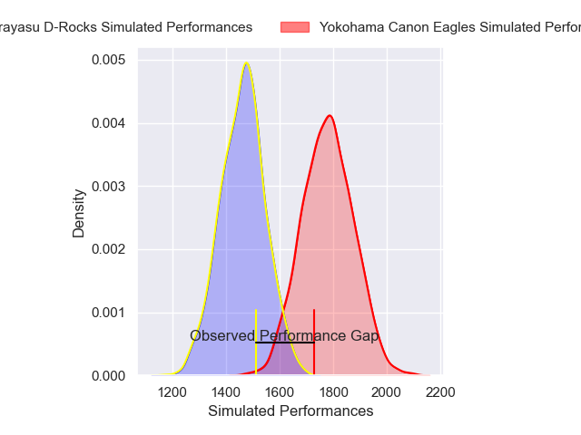
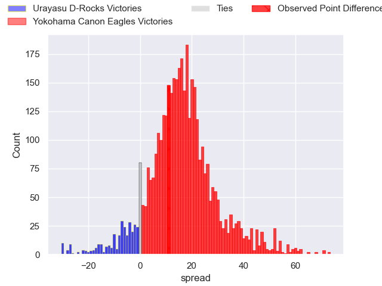
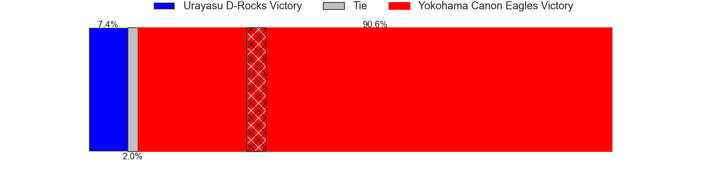
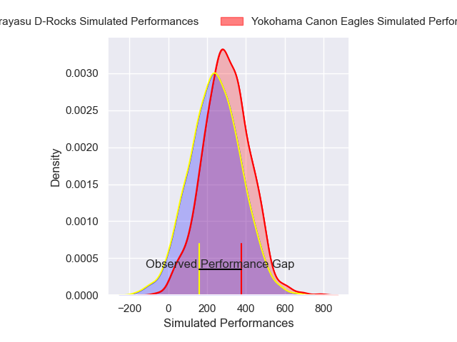
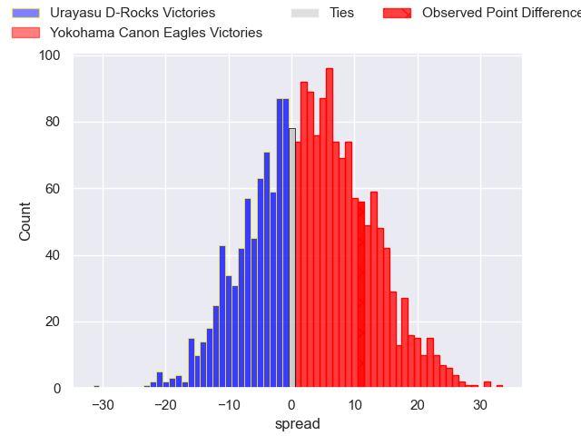
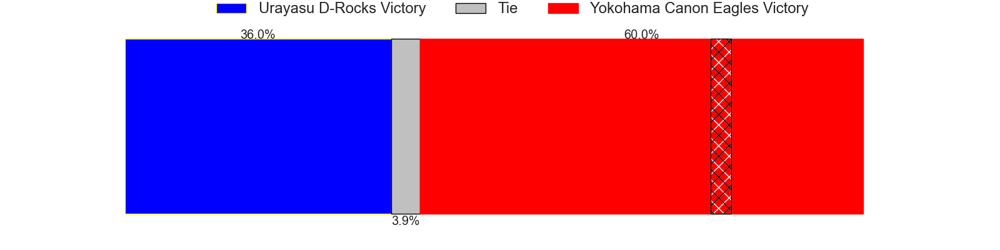

---  
layout: page  
title: Urayasu D-Rocks at Yokohama Canon Eagles; 22-33  
date: 2025-04-05 18:00:00 -0500  
categories: "Japan Rugby League One 24/25" match review  
---
# Urayasu D-Rocks at Yokohama Canon Eagles; 22-33

# Club Level Predictions

The first set of predictions treats a club as the smallest object, as the club develops its members, organizes a gameplan, and deploys its players as needed for each match. This club model has a prediction of 0.856, which translates to predicting Yokohama Canon Eagles to win by 16.0.

Our Over/Under is 56.5 - and combined with the spread above, we have a predicted scoreline of 20 to 36

Each club has a rating and a rating deviation (similar to a Glicko rating), and expected performances can be generated. This allows for simulated matches and spreads like the ones below.
## Projected Performances - Club Model

## Projected Spreads - Club Model

## Projected Results - Club Model

# Player Level Predictions

Treating teams instead as an entity made up of the currently active players, I have ratings for each player in an altogether different system. These can be combined to form team ratings once teamsheets are announced, weighting starters a bit higher than the reserves. After the match is played, players can be weighted by their minutes on the field, allowing for an accurate measure of the team's composition. With these compiled team ratings, we can make predictions, measure inaccuracy, and update the individual player ratings.
## Prediction without Player Minutes: Yokohama Canon Eagles by 9.8

Yokohama Canon Eagles by 5.4 on a neutral pitch

## Projected Performances - Player Model

## Projected Spreads - Player Model

## Projected Results - Player Model

|   Away Minutes | Away Player        |   Away Percentile |   Number |   Home Percentile | Home Player       |   Home Minutes |
|---------------:|:-------------------|------------------:|---------:|------------------:|:------------------|---------------:|
|             17 | Hidetomo Nabeshima |              6.26 |        1 |             96.75 | Takato Okabe      |             80 |
|             25 | Ryuji Fujimura     |             25.21 |        2 |             68.66 | Yusuke Niwai      |             17 |
|              0 | Shuhei Takeuchi    |              4.99 |        3 |             58.8  | Ryosuke Iwaihara  |             17 |
|             40 | James Moore        |              0.09 |        4 |              3.67 | Liaki Moli        |             12 |
|             47 | Lourens Erasmus    |             66.2  |        5 |             20.9  | Matt Philip       |             25 |
|             40 | Hendrik Tui        |             15.94 |        6 |             50.38 | Billy Harmon      |             55 |
|             72 | Tetta Shigemitsu   |             36.05 |        7 |             14.9  | Naoto Shimada     |             55 |
|             80 | Tone Tukufuka      |             91.73 |        8 |             93.95 | Amanaki Mafi      |             80 |
|             50 | Ren Iinuma         |             48.65 |        9 |             45.1  | Kafazumi Yamasuga |             25 |
|             80 | Otere Black        |             44.33 |       10 |             80.62 | Yu Tamura         |             80 |
|             63 | Takuhei Yasuda     |             84.99 |       11 |             69.06 | Chihito Matsui    |             80 |
|             80 | Samu Kerevi        |             95.52 |       12 |             71.18 | Naoya Minamihashi |             74 |
|             80 | Shane Gates        |             20.67 |       13 |             96.95 | Jesse Kriel       |             16 |
|             80 | Soma Matsumoto     |             58.01 |       14 |             31.4  | Kippei Ishida     |             54 |
|             80 | Israel Folau       |             10.71 |       15 |             86.06 | Brendan Owen      |             80 |
|             17 | Kim Ryom           |             53.49 |       16 |             77.61 | Shunta Nakamura   |             63 |
|             54 | Sekonaia Pole      |            nan    |       17 |             98.18 | Jumpei Ogura      |             70 |
|             45 | Tom Parsons        |             70.9  |       18 |             87.94 | Viliame Takayawa  |             64 |
|              6 | Norifumi Hashimoto |              1.35 |       19 |              6.58 | Tatsuro Sugimoto  |             80 |
|             80 | Yu Tamura          |             80.62 |       20 |             26.94 | Masato Furukawa   |             67 |
|             25 | Shokei Kin         |            nan    |       21 |             37.16 | Tomoki Minami     |             80 |
|             74 | Shingo Nakashima   |             90.49 |       22 |             58.66 | Cormac Daly       |             25 |
|             80 | Brody MacAskill    |            nan    |       23 |            nan    | Toshiki Amano     |              8 |

