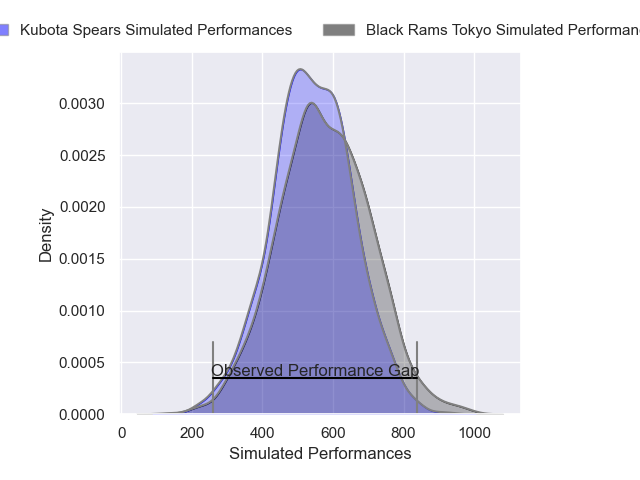
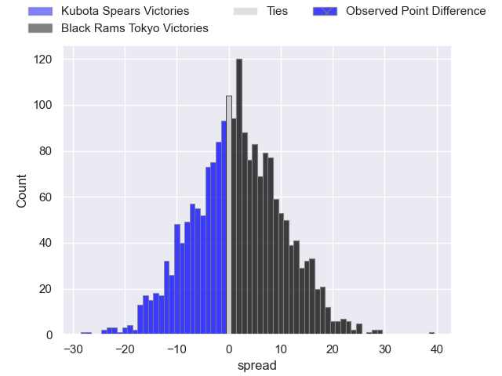
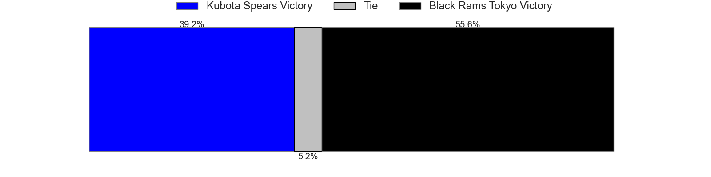

---  
layout: page  
title: Kubota Spears at Black Rams Tokyo; 42-14  
date: 2025-04-06 18:00:00 -0500  
categories: "Japan Rugby League One 24/25" match review  
---
# Kubota Spears at Black Rams Tokyo; 42-14

# Club Level Predictions

The first set of predictions treats a club as the smallest object, as the club develops its members, organizes a gameplan, and deploys its players as needed for each match. This club model has a prediction of 0.308, which translates to predicting Kubota Spears to win by 7.2.

Our Over/Under is 60.5 - and combined with the spread above, we have a predicted scoreline of 34 to 27

Each club has a rating and a rating deviation (similar to a Glicko rating), and expected performances can be generated. This allows for simulated matches and spreads like the ones below.
## Projected Performances - Club Model

## Projected Spreads - Club Model

## Projected Results - Club Model

# Player Level Predictions

Treating teams instead as an entity made up of the currently active players, I have ratings for each player in an altogether different system. These can be combined to form team ratings once teamsheets are announced, weighting starters a bit higher than the reserves. After the match is played, players can be weighted by their minutes on the field, allowing for an accurate measure of the team's composition. With these compiled team ratings, we can make predictions, measure inaccuracy, and update the individual player ratings.
## Prediction without Player Minutes: Kubota Spears by 10.9

Kubota Spears by 15.1 on a neutral pitch

## Projected Performances - Player Model

## Projected Spreads - Player Model

## Projected Results - Player Model

|   Away Minutes | Away Player         |   Away Percentile |   Number |   Home Percentile | Home Player       |   Home Minutes |
|---------------:|:--------------------|------------------:|---------:|------------------:|:------------------|---------------:|
|             15 | Yota Kamimori       |             77.98 |        1 |             34.02 | Taishi Tsumura    |             30 |
|             80 | Malcolm Marx        |            100    |        2 |             61.54 | Shin Ouchi        |             54 |
|             80 | Opeti Helu          |             95.47 |        3 |             98.89 | Paddy Ryan        |             71 |
|             80 | Opeti Helu          |             95.47 |        3 |             98.89 | Paddy Ryan        |             61 |
|             80 | Opeti Helu          |             95.47 |        3 |             98.89 | Paddy Ryan        |             80 |
|             80 | Ruan Botha          |             99.91 |        4 |             31.48 | Reijiro Yamamoto  |             80 |
|             30 | David Bulbring      |             89.82 |        5 |             17.72 | Harrison Fox      |             80 |
|             34 | Tyler Paul          |             98.5  |        6 |              1.69 | Mike Stolberg     |             29 |
|             22 | Takeo Suenaga       |             95.22 |        7 |             75.75 | Liam Gill         |             26 |
|             22 | Faulua Makisi       |             85.57 |        8 |             33.74 | Brodi McCurran    |             68 |
|             64 | Shinobu Fujiwara    |             87.02 |        9 |             97.13 | TJ Perenara       |             26 |
|             31 | Bernard Foley       |             99.59 |       10 |             31.76 | Ichigo Nakakusu   |             19 |
|             34 | Koga Nezuka         |             93.32 |       11 |             36.64 | Semisi Tupou      |             26 |
|             30 | Harumichi Tatekawa  |             92.26 |       12 |             47.86 | Yuki Ikeda        |             28 |
|             48 | Rikus Pretorius     |             67.01 |       13 |             35.03 | Penieli Jr Latu   |             39 |
|             48 | Halatoa Vailea      |             90.91 |       14 |             28.76 | Tomoya Yamamura   |              7 |
|             48 | Atsushi Oshikawa    |             77.96 |       15 |             59.59 | Taira Main        |              0 |
|             80 | Bryn Hall           |             96.96 |       16 |             60.7  | Masaaki Onishi    |             49 |
|             52 | Kota Kaishi         |             93.64 |       17 |              5.89 | Amato Fakatava    |             80 |
|             80 | Keijiro Tamefusa    |             81.16 |       18 |             66.29 | Ryohei Isoda      |             54 |
|             49 | Reo Matsushita      |            nan    |       19 |             46.1  | Kazuma Nishi      |             73 |
|             63 | Merwe Olivier       |             75.19 |       20 |            nan    | Daigo Sasagawa    |             61 |
|             80 | Lappies Labuschagne |             94.76 |       21 |             33.67 | Kotaro Ito        |             80 |
|              5 | Rikuto Fukuda       |             68.56 |       22 |             69.01 | Shuhei Matsuhashi |             46 |
|             70 | Yuya Hirose         |             67.41 |       23 |             68.3  | Toshiya Takahashi |             61 |

