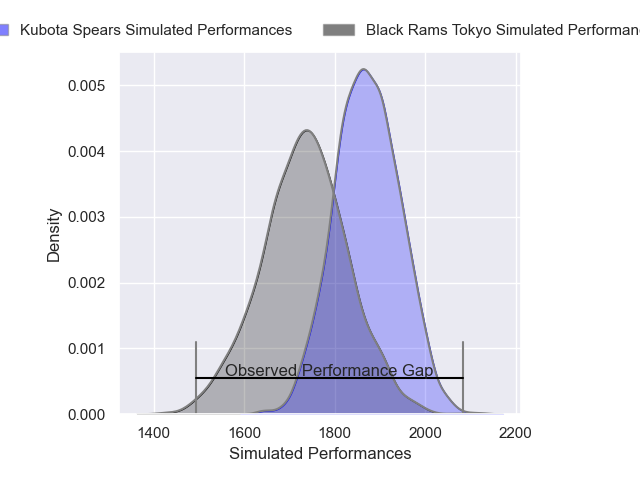
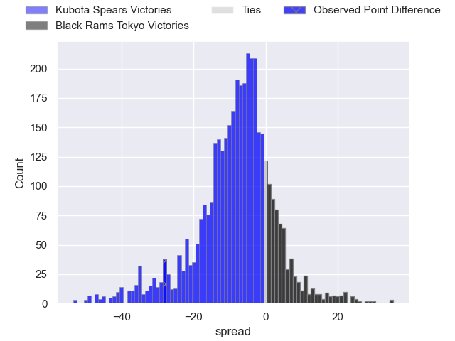
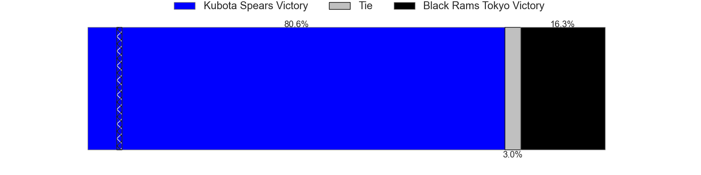

---  
layout: page  
title: Kubota Spears at Black Rams Tokyo; 42-14  
date: 2025-04-06 18:00:00 -0500  
categories: "Japan Rugby League One 24/25" match review  
---
# Kubota Spears at Black Rams Tokyo; 42-14

# Club Level Predictions

The first set of predictions treats a club as the smallest object, as the club develops its members, organizes a gameplan, and deploys its players as needed for each match. This club model has a prediction of 0.308, which translates to predicting Kubota Spears to win by 7.2.

Our Over/Under is 56.5 - and combined with the spread above, we have a predicted scoreline of 32 to 25

Each club has a rating and a rating deviation (similar to a Glicko rating), and expected performances can be generated. This allows for simulated matches and spreads like the ones below.
## Projected Performances - Club Model

## Projected Spreads - Club Model

## Projected Results - Club Model

