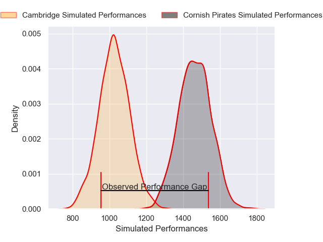
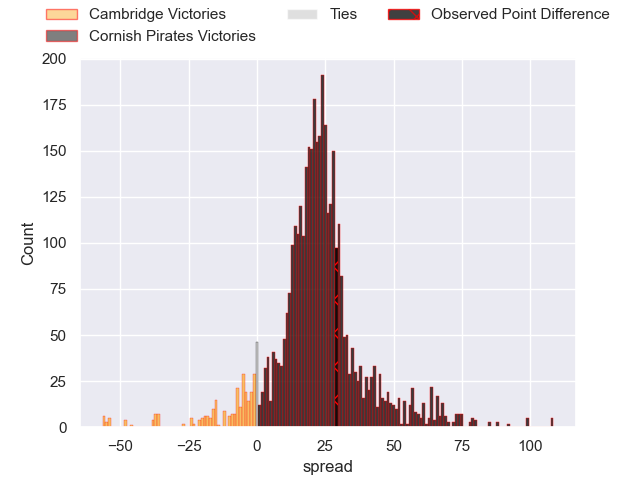

---  
layout: page  
title: Cambridge at Cornish Pirates; 35-64  
date: 2025-04-06 18:00:00 -0500  
categories: "RFU Championship 24/25" match review  
---
# Cambridge at Cornish Pirates; 35-64

# Club Level Predictions

The first set of predictions treats a club as the smallest object, as the club develops its members, organizes a gameplan, and deploys its players as needed for each match. This club model has a prediction of 0.918, which translates to predicting Cornish Pirates to win by 21.7.

Our Over/Under is 59.5 - and combined with the spread above, we have a predicted scoreline of 19 to 41

Each club has a rating and a rating deviation (similar to a Glicko rating), and expected performances can be generated. This allows for simulated matches and spreads like the ones below.
## Projected Performances - Club Model

## Projected Spreads - Club Model

## Projected Results - Club Model

