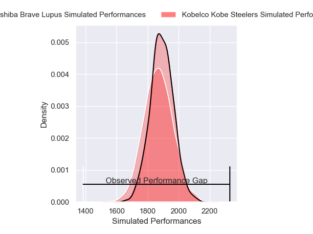
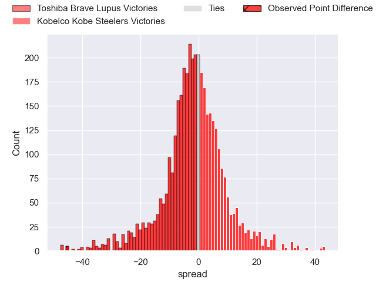
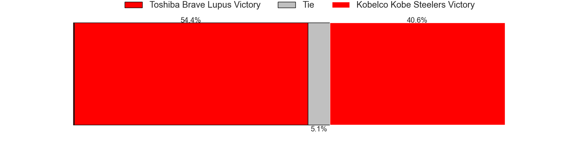
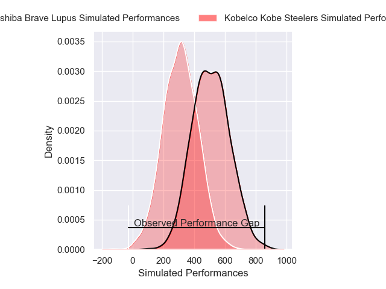
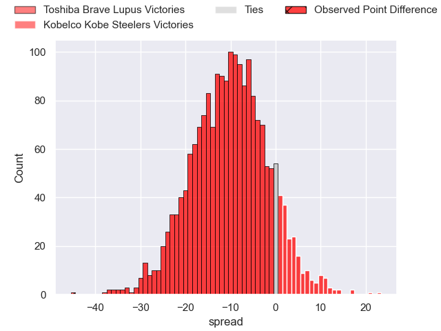
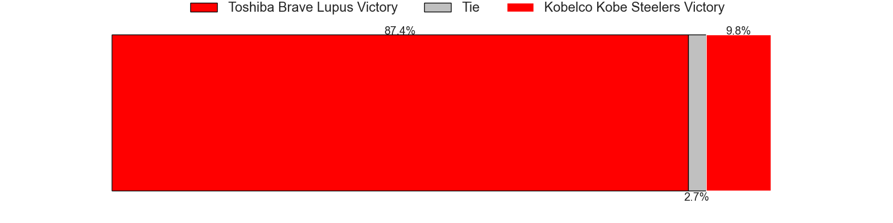

---  
layout: page  
title: Toshiba Brave Lupus at Kobelco Kobe Steelers; 73-28  
date: 2025-04-06 18:00:00 -0500  
categories: "Japan Rugby League One 24/25" match review  
---
# Toshiba Brave Lupus at Kobelco Kobe Steelers; 73-28

# Club Level Predictions

The first set of predictions treats a club as the smallest object, as the club develops its members, organizes a gameplan, and deploys its players as needed for each match. This club model has a prediction of 0.477, which translates to predicting Toshiba Brave Lupus to win by 0.8.

Our Over/Under is 75.5 - and combined with the spread above, we have a predicted scoreline of 38 to 38

Each club has a rating and a rating deviation (similar to a Glicko rating), and expected performances can be generated. This allows for simulated matches and spreads like the ones below.
## Projected Performances - Club Model

## Projected Spreads - Club Model

## Projected Results - Club Model

# Player Level Predictions

Treating teams instead as an entity made up of the currently active players, I have ratings for each player in an altogether different system. These can be combined to form team ratings once teamsheets are announced, weighting starters a bit higher than the reserves. After the match is played, players can be weighted by their minutes on the field, allowing for an accurate measure of the team's composition. With these compiled team ratings, we can make predictions, measure inaccuracy, and update the individual player ratings.
## Prediction without Player Minutes: Toshiba Brave Lupus by 12.9

Toshiba Brave Lupus by 17.8 on a neutral pitch

## Projected Performances - Player Model

## Projected Spreads - Player Model

## Projected Results - Player Model

|   Away Minutes | Away Player      |   Away Percentile |   Number |   Home Percentile | Home Player          |   Home Minutes |
|---------------:|:-----------------|------------------:|---------:|------------------:|:---------------------|---------------:|
|             22 | Sena Kimura      |             91.97 |        1 |             40.3  | Kauvaka Kaivelata    |             80 |
|             22 | Mamoru Harada    |             93.65 |        2 |             72.58 | Kenta Matsuoka       |             53 |
|             13 | Taufa Latu       |             70.51 |        3 |              3.58 | Koo Ji-won           |             80 |
|             58 | Jacob Pierce     |             99.62 |        4 |             85.3  | Gerard Cowley-Tuioti |             80 |
|             80 | Warner Dearns    |             90.76 |        5 |             19.7  | Naohiro Kotaki       |             80 |
|             24 | Shannon Frizell  |             95.32 |        6 |             78.65 | Tiennan Costley      |             58 |
|             24 | Takeshi Sasaki   |             93.16 |        7 |             61.8  | Solomone Funaki      |             18 |
|             24 | Michael Leitch   |             95.33 |        8 |             60.57 | Amanaki Saumaki      |             25 |
|             22 | Yuhei Sugiyama   |             90.73 |        9 |             42.66 | Itsuki Kamimura      |              6 |
|             80 | Richie Mo'unga   |            100    |       10 |             93.24 | Bryn Gatland         |             24 |
|             32 | Futoshi Mori     |             60.67 |       11 |             66.6  | Kenta Matsunaga      |             80 |
|             10 | Rob Thompson     |             45.42 |       12 |              5.91 | Seungsin Lee         |             19 |
|             39 | Michael Collins  |             97.35 |       13 |             91.55 | Ngani Laumape        |             40 |
|             80 | Jone Naikabula   |             84.97 |       14 |             13.91 | Junta Hamano         |             30 |
|             80 | Takuro Matsunaga |             97.35 |       15 |             67.55 | Ryohei Yamanaka      |              0 |
|             80 | Samuela Anise    |             64.94 |       16 |             82.93 | Waisake Raratubua    |             56 |
|             80 | Teruo Makabe     |            nan    |       17 |             74.48 | Shigure Takao        |             50 |
|              7 | Takahiro Ogawa   |            nan    |       18 |             99.67 | George Turner        |             50 |
|             66 | Daigo Hashimoto  |             84.45 |       19 |             92.07 | Atsushi Hiwasa       |             66 |
|             80 | Shohei Ito       |             58.44 |       20 |             53.5  | Sho Maeda            |             58 |
|             80 | Masataka Mikami  |            nan    |       21 |             85.06 | Inoke Burua          |             24 |
|             40 | Atsuki Kuwayama  |             84.6  |       22 |             60.39 | Timothy Lafaele      |             80 |
|             80 | Shohei Toyoshima |            nan    |       23 |             35.49 | Willie Potgieter     |             24 |

