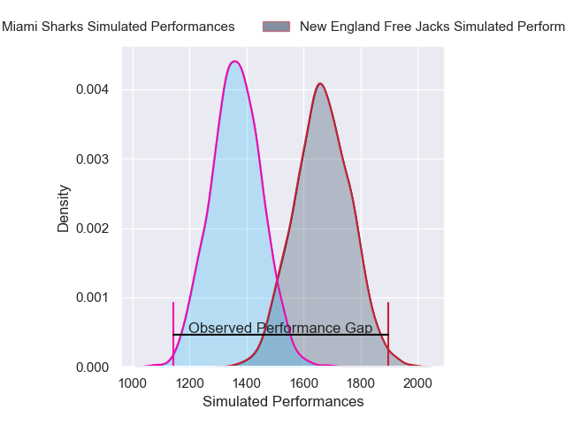
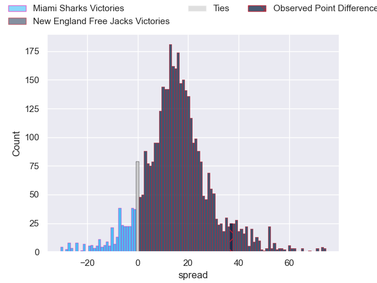
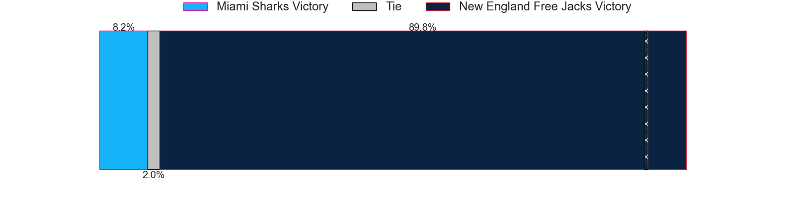
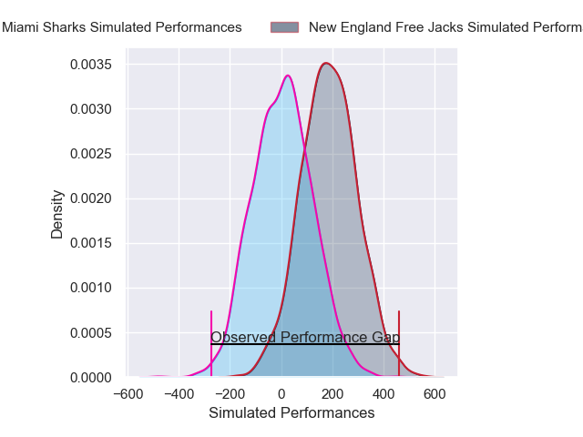
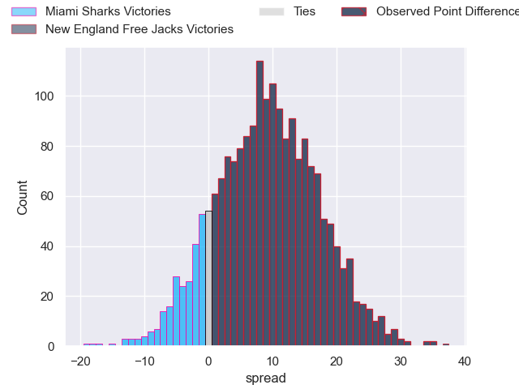
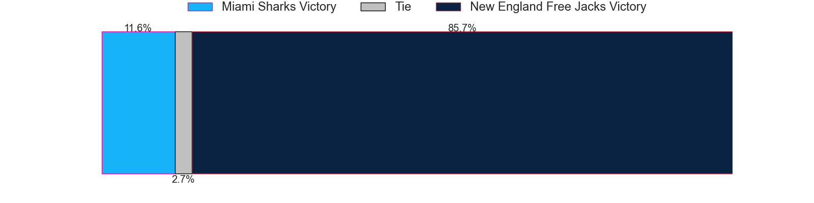

---  
layout: page  
title: Miami Sharks at New England Free Jacks; 6-43  
date: 2025-04-06 18:00:00 -0500  
categories: "Major League Rugby 2025" match review  
---
# Miami Sharks at New England Free Jacks; 6-43

# Club Level Predictions

The first set of predictions treats a club as the smallest object, as the club develops its members, organizes a gameplan, and deploys its players as needed for each match. This club model has a prediction of 0.843, which translates to predicting New England Free Jacks to win by 15.2.

Our Over/Under is 55.5 - and combined with the spread above, we have a predicted scoreline of 20 to 35

Each club has a rating and a rating deviation (similar to a Glicko rating), and expected performances can be generated. This allows for simulated matches and spreads like the ones below.
## Projected Performances - Club Model

## Projected Spreads - Club Model

## Projected Results - Club Model

# Player Level Predictions

Treating teams instead as an entity made up of the currently active players, I have ratings for each player in an altogether different system. These can be combined to form team ratings once teamsheets are announced, weighting starters a bit higher than the reserves. After the match is played, players can be weighted by their minutes on the field, allowing for an accurate measure of the team's composition. With these compiled team ratings, we can make predictions, measure inaccuracy, and update the individual player ratings.
## Prediction without Player Minutes: New England Free Jacks by 11.8

New England Free Jacks by 8.9 on a neutral pitch

## Projected Performances - Player Model

## Projected Spreads - Player Model

## Projected Results - Player Model

|   Away Minutes | Away Player        |   Away Percentile |   Number |   Home Percentile | Home Player             |   Home Minutes |
|---------------:|:-------------------|------------------:|---------:|------------------:|:------------------------|---------------:|
|             25 | Alec McDonnell     |             20.6  |        1 |             73.77 | Tevita Sole             |             24 |
|             40 | Kirby Myhill       |              5.47 |        2 |              7.63 | Andrew Quattrin         |             55 |
|             80 | Reinaldo Piussi    |             36.77 |        3 |             73.85 | Jone Koroiduadua        |             52 |
|             80 | Tomas Casares      |              8.29 |        4 |             63.84 | Piers Von Dadelszen     |              9 |
|             26 | Mauro Rebussone    |             66.48 |        5 |             11.96 | Jeronimo Gomez Vara     |              0 |
|             42 | Manuel Ardao       |              0.76 |        6 |             54.36 | Jed Melvin              |             50 |
|             80 | Benja Bonassoa     |             47.91 |        7 |             89.28 | Joe Johnston            |             52 |
|             58 | Ronan Foley        |             21.37 |        8 |             95.97 | Wian Conradie           |             58 |
|             25 | Tomas Cubelli      |              6.08 |        9 |             41.39 | Cameron Nordli-Kelemeti |             22 |
|             29 | Shane O'Leary      |              3.09 |       10 |             74.02 | Faletoi Peni            |             38 |
|             57 | Guiseppe du Toit   |              4.33 |       11 |              4.24 | Paula Balekana          |             15 |
|              8 | Matias Orlando     |              4.68 |       12 |             92.57 | Le Roux Malan           |             23 |
|             25 | Tomas Inciarte     |             77.29 |       13 |             78.51 | Wayne van der Bank      |             15 |
|             26 | Tomas Malanos      |             74.68 |       14 |             80.66 | Brock Webster           |             80 |
|             34 | Martin Elias       |             93.13 |       15 |             58.18 | Harrison Boyle          |             80 |
|             80 | Sean McNulty       |             39.3  |       16 |             85.41 | Connal McInerney        |             68 |
|             61 | Ma'ake Muti        |             11.33 |       17 |             20.05 | Malakai Hala-Ngatai     |             80 |
|             58 | Alex Tucci         |            nan    |       18 |             86.21 | Kaleb Geiger            |             58 |
|             65 | Braemar Murray     |            nan    |       19 |             71.75 | Conor Keys              |             80 |
|             26 | Marques Fuala'au   |             59.07 |       20 |              3.39 | Josh Larsen             |             80 |
|             20 | Lautaro Soto-Ansay |            nan    |       21 |             20.1  | Oscar Lennon            |             28 |
|             80 | Tomas Bekerman     |            nan    |       22 |             50    | Isaac Olson             |             22 |
|             75 | Josh McAdam        |            nan    |       23 |              9.02 | Jack Reeves             |             65 |

